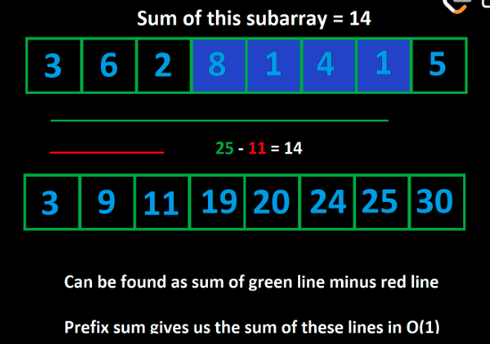
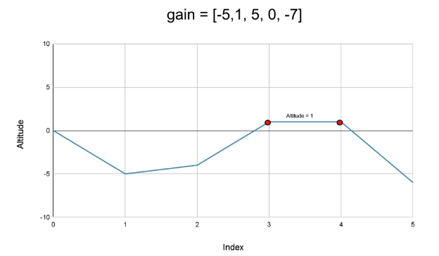

# Psuedocode For Prefix Sum

Prefix sum is a technique that can be used on arrays (of numbers). The idea is to create an array prefix where `prefix[i]` is the sum of all elements up to the index `i` (inclusive). 

```
prefix = [nums[0]]
for (int i = 1; i < nums.length; i++)
    prefix.append(nums[i] + prefix[prefix.length - 1])
```

## Complexity

Prefix sum costs $O(n)$ time and $O(n)$ space to create the prefix array. Once the prefix array is created, we can calculate the sum of any subarray in $O(1)$ time.

<div style="text-align: center;">
    
</div>

Given an array `nums`, to find the sum of the subarray from index `i` to `j`, we can use the formula:

```
prefix[j] - prefix[i] + nums[i]
```

* The `prefix[i]` is the sum of  all elements before index `i`, and `nums[i]` is the element at index `i`

* The `prefix[j]` is the sum of all elements up to and including `j`, and `prefix[i]` is the sum of all elements up to and including `i`. So, `prefix[j] - prefix[i]` is the sum of all elements from index `i` and `j` (not including `nums[i]`).

* Finally, we add `nums[i]` to get the sum of all elements from index `i` and `j` (inclusive).

# Subarray Sum Less than Limit

Given an integer array `nums`, an array `queries` where `queries[i] = [x, y]` and an integer `limit`, return a boolean array that represents the answer to each query. Each query is of the form `queries[i] = [x, y]` where `0 <= x < y < len(nums)`.

## Example

```
Input: nums = [1, 2, 3, 4], queries = [[1, 2], [2, 3]], limit = 6
Output: [true, false]
Explanation: 
    For the first query, the sum of the subarray [2, 3] is 5, which is less than the limit.
    For the second query, the sum of the subarray [3, 4] is 7, which is greater than the limit.
```

## Time Complexity

Without the prefix sum, answer each query would cost $O(n)$ time. If we have `q` queries, the total time complexity would be $O(nq)$. However, with the prefix sum, which takes $O(n)$ to build, we can answer each query in $O(1)$ time. The total time complexity is $O(n + 1 \times q) = O(n + q)$.

## Space Complexity

The space complexity is $O(n)$ to store the prefix sum.  We also use $O(q)$ space to store the result of each query. The total space complexity is $O(n + q)$.

---

# Number of Ways to Split Array

Given an integer array `nums`, find the number of ways to split the array into two parts so that the first section has a sum greater than or equal to the sum of the second section. The second section should have at least one number.

## Time Complexity

The time complexity is $O(n)$ to build the prefix sum. We then iterate through the array to find the number of ways to split the array. The total time complexity is $O(n + n - 1) = O(2n - 1) = O(n)$.

## Space Complexity

The space complexity is $O(n)$ to store the prefix sum.

---

# Running Sum of 1D Array

Given an array `nums`, the running sum of the array is defined as `runningSum[i] = sum(nums[0]…nums[i])`. Return the running sum of `nums`.

## Time Complexity

Because we start at index `1`, we can build the running sum in place. The time complexity is $O(n-1) = O(n)$.

## Space Complexity

The space complexity is $O(1)$ because we build the running sum in place. List in python and vectors in C++ are mutable, so we can update the array in place.

---

# Minimum Value to Get Positive Step by Step Sum

Find the minimum initial positive value (`startValue`) such that for an array of integers `nums`, the running total starting from `startValue` never drops below 1 when sequentially adding the elements of `nums`.

## Example 1

- **Input:** `nums = [-3, 2, -3, 4, 2]`
- **Output:** 5
- **Explanation:** Here's how the running sum calculations pan out starting from `startValue = 5`:
  - **Step 1:** StartValue + (-3) = 5 - 3 = 2
  - **Step 2:** Previous Total + 2 = 2 + 2 = 4
  - **Step 3:** Previous Total + (-3) = 4 - 3 = 1
  - **Step 4:** Previous Total + 4 = 1 + 4 = 5
  - **Step 5:** Previous Total + 2 = 5 + 2 = 7
  - All sums are ≥ 1.
  
## Example 2

- **Input:** `nums = [1, 2]`
- **Output:** 1
- **Explanation:** Starting at 1, the calculations are:
  - **Step 1:** StartValue + 1 = 1 + 1 = 2
  - **Step 2:** Previous Total + 2 = 2 + 2 = 4
  - All sums are ≥ 1.

## Example 3

- **Input:** `nums = [1, -2, -3]`
- **Output:** 5
- **Explanation:** Starting at 5, the calculations show:
  - **Step 1:** StartValue + 1 = 5 + 1 = 6
  - **Step 2:** Previous Total + (-2) = 6 - 2 = 4
  - **Step 3:** Previous Total + (-3) = 4 - 3 = 1
  - All sums are ≥ 1.

## Time Complexity

The time complexity is $O(n)$ to build the running sum and find the minimum value in one go. If we build the running sum and then find the minimum value, the time complexity would be $O(n + n) = O(2n) = O(n)$, which is still $O(n)$. But doing it in one go is more concise.

In both Python and C++, the `max(i, j)` functions does exactly one comparison. Therefore, the overall time complexity is $O(n)$.

## Space Complexity

The space complexity is $O(1)$ because we build the running sum and save the minimum value using variables that does not depend on the size of the input.

---

# K Radius Subarray Averages

The k-radius average for a subarray of `nums` centered at index `i` with the radius `k` is the average of all elements in `nums` between the indices `i - k` and `i + k` (inclusive). If there are less than `k` elements before or after the index `i`, then the k-radius average is `-1`. Build and return an array `avgs` of length `n` where `avgs[i]` is the k-radius average for the subarray centered at index `i`.

<div style="text-align: center;">
    
</div>

In the above example:

1. The k-radius average for index `1` is -1, since there are less then `k = 2` elements before it.
2. The k-radius average for index `2` is 2.5, since the subarray is `[2, 1, 3, 4, 5]` and the average is `(2 + 1 + 3 + 4 + 5) // 5 = 3`.

So on and so forth.

## Time Complexity

### Python3

The time complexity is $O(n)$ to build the prefix sum and calculate the k-radius average for each index. In the second loop, the cost of `min`, `max` (one comparison) and `append` are all $O(1)$; we can really focus on the append as the most important operation in this second loop. The total time complexity with too loops is $O(n + n) = O(2n) = O(n)$.

### C++

The time complexity is $O(n)$ to build the prefix sum. However, in the second loop, because we only iterate through elements that have a valid k-radius range (i.e. from elements `k` to `n - k`), the number of iterations is $O(n - 2k)$. The total time complexity is $O(n + n - 2k) = O(2n - 2k) = O(n - k)$.

## Space Complexity

The space complexity is $O(n)$ to store the prefix sum and the result array. This is true for both Python and C++.

---

# Find the Highest Altitude

A road trip consists of `n + 1` points at different altitudes. The start point is `altitude = 0`. Given an integer array `gain` of length `n` where `gain[i]` is the net gain in altitude between points `i` and `i + 1` for all (`0 <= i < n`), return the highest altitude of a point.

<div style="text-align: center;">
    
</div>

## Examples

The `altitudes` array is the running sum of the `gain` array with the start point `0`. The highest altitude is the maximum value in the `altitudes` array.

```
Input: gain = [-5,1,5,0,-7]
Output: 1
Explanation: The altitudes are [0,-5,-4,1,1,-6]. The highest is 1.
```

```
Input: gain = [-4,-3,-2,-1,4,3,2]
Output: 0
Explanation: The altitudes are [0,-4,-7,-9,-10,-6,-3,-1]. The highest is 0.
```

## Time Complexity

The time complexity is $O(n)$ for both Python and C++. In a single loop, we iterate through each element in the `gain` array to calculate the running sum and update the maximum value.

The addition and comparison operations are $O(1) + O(1) = O(2)$, so the overall time complexity is $O(2n) = O(n)$.

## Space Complexity

The space complexity is constant $O(1)$ because we only use a few variables to store the running sum and the maximum value.

Even though this is solved using a prefix sum, we don't need to store the prefix sum in an array. We can calculate the running sum in place.

---

# Find Pivot Index

Given an integer array `nums`, return the pivot index of the array. The pivot index is the index where the sum of all the elements to the left of the index is equal to the sum of all the elements to the right of the index. If no such index exists, return `-1`.

## Examples

```
Input: nums = [1,7,3,6,5,6]
Output: 3
Explanation:
The pivot index is 3.
Left sum = nums[0] + nums[1] + nums[2] = 1 + 7 + 3 = 11
Right sum = nums[4] + nums[5] = 5 + 6 = 11
```

```
Input: nums = [1,2,3]
Output: -1
Explanation:
There is no index that satisfies the conditions in the problem statement.
```

```
Input: nums = [2,1,-1]
Output: 0
Explanation:
The pivot index is 0.
Left sum = 0 (no elements to the left of index 0)
Right sum = nums[1] + nums[2] = 1 + -1 = 0
```

## Time Complexity

The time complexity is $O(n)$ for both Python and C++. The cost of building the prefix sum is $O(n)$, and the cost of finding the pivot index is also $O(n)$ in the worst case, where the pivot index is at the end of the array.

## Space Complexity

The space complexity is $O(n)$ to store the prefix sum. This is true for both Python and C++.
