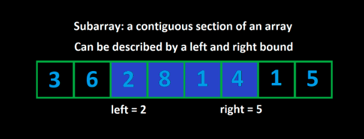

# Psuedocode For Sliding Window

```
function fn(arr):
    left = 0
    for (int right = 0; right < arr.length; right++):
        Do some logic to "add" element at arr[right] to window

        while WINDOW_IS_INVALID:
            Do some logic to "remove" element at arr[left] from window
            left++

        Do some logic to update the answer
```

<div style="text-align: center;">
    
</div>

## Efficiency

For any array withe length `n`, there are 

1. `n` subarrays of length 1
2. `n - 1` subarrays of length 2
3. `n - 2` subarrays of length 3
...
4. `1` subarray of length `n`

The total number of subarrays is:

$$
\sum_{k=1}^{n}k=\frac{n(n+1)}{2}
$$

A sliding window algorithm guarantees a maximum of $2n$ window iterations. The right pointer can move at most `n` times, and the left pointer can move at most `n` times. This means that if the logic inside each window iteration is efficient, $O(1)$, then the total time complexity of the algorithm is $O(n) + O(n) = O(2n) = O(n)$.

This algorithm employs a `for` loop and a nested `while` loop. At first glance, the presence of these loops might suggest a quadratic time complexity, $O\left(n^2\right)$. However, due to the specific behavior of the `while` loop, the actual complexity is linear, $O(n)$. This is because the `while` loop's total number of iterations across the entire algorithm is capped at $n$, not $n$ per for loop iteration.

```
for (int right = 0; right < arr.length; right++):

    Do some logic to "add" element at arr[right] to window

    while WINDOW_IS_INVALID:

        Do some logic to "remove" element at arr[left] from window
        left++
```

The overall complexity of the algorithm is $O(n)$, not $O\left(n^2\right)$, because the key insight of amortized analysis is recognizing that high-cost operations in some iterations (e.g. `while` loop runs $n$ iterations for a single iteration of the `for`) are balanced by lower-cost operations in others (e.g., for all other iterations of `for`, the `while` will not run at all), leading to a lower average cost per operation across the algorithm's total runtime.

--

# Length of Longest Subarray

 Given an array of positive integers `nums` and an integer `k`, find the length of the longest subarray whose sum is less than or equal to `k`. 

## Time Complexity

This algorithm has a time complexity of $O(n)$, because the operations inside the `for` loop and the `while` loop are $O(1)$.

## Space Complexity

The space complexity is constant because we are only using integer variables to store the left and right pointers, the sum of the current window, and the maximum length of the subarray.

---

# Length of Consecutive 1's Single Flip

Given a binary string s (a string containing only "0" and "1"). You may choose up to one "0" and flip it to a "1". Find the length of the longest substring achievable that contains only "1". Another way to look at this problem is to find the longest substring that contains at most one 0. 

For example, given `s = "1101100111"`, the answer is 5. If we flip the element at index 2, the string becomes "1111100111".

Considering this problem as finding the longest substring that contains at most one 0 makes it easy to solve the problem with a sliding window. The constraint metric and numeric restriction combined to be `window.count("0") <= 1`. We can use an integer variable to keep track of how many "0" we currently have in our window.

## Time Complexity

The time complexity of this algorithm is amortized $O(n)$, because the operations inside the `for` loop and the `while` loop are $O(1)$. The while loop will run at most `n` times across the entire algorithm, not `n` times per iteration of the `for` loop.

## Space Complexity

The space complexity is constant because we are using only integer variables to store the pointers, the count of zeros in the current window, and the maximum length of the subarray.
