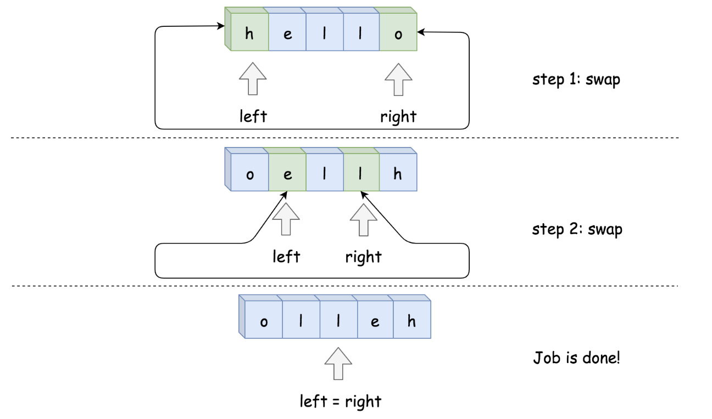
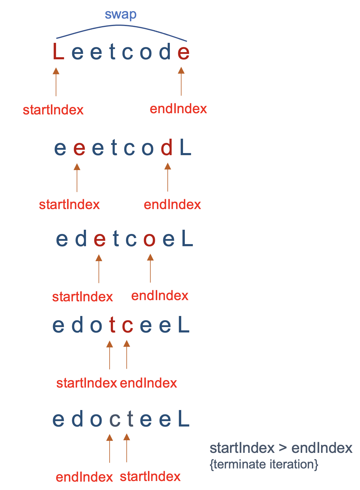
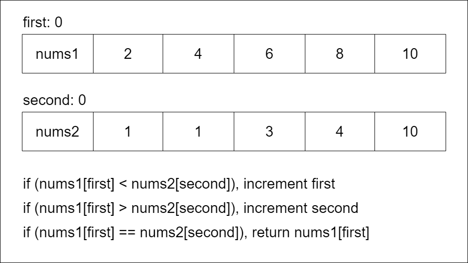

# Psuedocode For Two Pointers

```
function fn(arr):
    left = 0
    right = arr.length - 1

    while left < right:
        Do some logic here depending on the problem
        Do some more logic here to decide on one of the following:
            1. left++
            2. right--
            3. Both left++ and right--
```

```
function fn(arr1, arr2):
    i = j = 0
    while i < arr1.length AND j < arr2.length:
        Do some logic here depending on the problem
        Do some more logic here to decide on one of the following:
            1. i++
            2. j++
            3. Both i++ and j++

    // Step 4: make sure both iterables are exhausted
    // Note that only one of these loops would run
    while i < arr1.length:
        Do some logic here depending on the problem
        i++

    while j < arr2.length:
        Do some logic here depending on the problem
        j++
```

# Palindrome

A palindrome is a word, phrase, number, or other sequence of characters that reads the same forward and backward (ignoring spaces, punctuation, and capitalization). 

## Time Complexity

The time complexity is $O(n)$ because the while loop iterations cost $O(1)$ each, and there can never be more than $O(n)$ iterations of the while loop. The pointers start at a distance of $n$ from each other and move closer by one step each iteration.

## Space Complexity

No matter how big the input is, we always only use two integer variables. Therefore, the space complexity is $O(1)$.

---

# Sorted Two Sum

Given a sorted array of unique integers and a target integer, return true if there exists a pair of numbers that sum to target, false otherwise. This problem is similar to Two Sum. (In Two Sum, the input is not sorted).

The brute force solution would be to iterate over all pairs of integers. Each number in the array can be paired with another number, so this would result in a time complexity of $O\left(n^2\right)$, where $n$ is the length of the array. Because the array is sorted, we can use two pointers to improve to an $O(n)$ time complexity.

```python
nums = [1, 2, 4, 6, 8, 9, 14, 15]
target = 13
```

With two pointers, we start by looking at the first and last number. Their sum is $1+15=16$. Because $16>$ target, we need to make our current sum smaller. Therefore, we should move the right pointer. Now, we have $1+14=15$. Again, move the right pointer because the sum is too large. Now, $1+9=10$. Since the sum is too small, we need to make it bigger, which can be done by moving the left pointer. Then, $2+9=11<$ target, so move it again. Finally, $4+9=13=$ target.

The reason this algorithm works: because the numbers are sorted, moving the left pointer permanently **increases** the value the left pointer points to (nums [left] $=\mathrm{x}$). Similarly, moving the right pointer permanently **decreases** the value the right pointer points to (nums [right] $=y$ ). 

1. If we have $x+y>$ target, then we can never have a solution with $y$ because $x$ can only increase. So if a solution exists, we can only find it by decreasing $y$. 
2. If we have $x+y<$ target, then we can never have a solution with $x$ because $y$ can only decrease. So if a solution exists, we can only find it by increasing $x$.

## Time Complexity

The time complexity is $O(n)$ because the while loop iterations cost $O(1)$ each, and there can never be more than $O(n)$ iterations of the while loop. 

## Space Complexity

No matter how big the input is, we always only use two integer variables. Therefore, the space complexity is $O(1)$.

---

# Combine and Sort

Given two sorted integer arrays `arr1` and `arr2`, return a new array that combines both of them and is also sorted.

The trivial approach would be to first combine both input arrays and then perform a sort. If we have $n=$ arr1.length + arr2.length, then this gives a time complexity of $O(n \cdot \log n)$ (the cost of sorting). This would be a good approach if the input arrays were not sorted, but because they are sorted, we can take advantage of the two pointers technique to improve to $O(n)$.

If we declared $n=$ arr1 length and $m=$ arr2 length, the time complexity of the sorting approach would be $O((n+m) \cdot \log (m+n))$ and the time complexity of combine algorithm would be $O(n+m)$.

## Time Complexity

The time complexity is $O(n+m)$ because the while loop iterations cost $O(1)$ each, and there can never be more than $O(n+m)$ iterations of the while loop.

## Space Complexity

The space complexity is $O(n+m)$ because we are creating a new array of size $n+m$ to store the output. If we don't count the output as extra space, then the space complexity is $O(1)$.

---

# Is Subsequence

Given two strings `s` and `t`, return `true` if `s` is a subsequence of `t`, or `false` otherwise.

A subsequence of a string is a sequence of characters that can be obtained by deleting some (or none) of the characters from the original string, while maintaining the relative order of the remaining characters. For example, "ace" is a subsequence of "abcde" while "aec" is not.

## Time Complexity

The number of iterations needed is dependent on the length of `t` primarily, as `t_index` is incremented in every loop until the end of `t` is reached. The length of `s` affects the number of iterations only insofar as matches are found (which moves `s_index`), but since `t_index` marches to the end of `t`, the length of `t` is the primary driver of time complexity.

The exact nature of the linear relationship depends on the interplay between `s` and `t` but is bounded by the length of `t` in the worst case, hence the linear time complexity, or $O(n)$, where $n$ is the length of `t` in this context.

## Space Complexity

The function only uses a fixed number of variables (`s_index`, `t_index`), irrespective of how large the input strings are. 

---

# Reverse String

Write a function that reverses a string. The input string is given as an array of characters s.

You must do this by modifying the input array in-place with O(1) extra memory.

<div style="text-align: center;">
    
</div>

## Time Complexity

Both pointers traverse the string from opposite ends until they merge. So every character is processed once in this process. Swapping two characters takes constant amount of time. So the overall time complexity is $O(n)$.

## Space Complexity

A character array is used to store the characters of the string. So the space complexity is $O(n)$. If the input to the function is a character array itself or the language supports string mutability, then the space complexity would be $O(1)$, because the algorithm does an in-place reversal of the character array.

---

# Squares of Sorted Array

Given an integer array `nums` sorted in non-decreasing order, return an array of the squares of each number sorted in non-decreasing order.

<div style="text-align: center;">
    
</div>

Since the array is sorted, loosely speaking it has some negative elements with squares in decreasing order, then some non-negative elements with squares in increasing order.

For example, with `[-3, -2, -1, 4, 5, 6]`, we have the negative part `[-3, -2, -1]` with squares `[9, 4, 1]`, and the positive part `[4, 5, 6]` with squares `[16, 25, 36]`. Our strategy is to iterate over the negative part in reverse, and the positive part in the forward direction.

## Time Complexity

The time complexity is $O(n)$ because the while or foor loop iterations can never be more than `n`.

## Space Complexity

The space complexity is $O(n)$ because we are creating a new array of size `n` to store the output. If we don't count the output as extra space, then the space complexity is $O(1)$.

---

# Reverse Words in a String

Given a string `s`, reverse the order of characters in each word within a sentence while still preserving whitespace and initial word order.

We traverse the string and find every word's start and end index. Then, we will reverse each word using the two-pointer approach.

1. Find the start and end index of every word given by startIndex and endindex.
2. Swap the characters in the word pointed by startIndex and endIndex.
3. Increment startIndex by 1 and decrement endIndex by 1.
4. Repeat steps 2 and 3 until startIndex < endIndex.

<div style="text-align: center;">
    
</div>

## Time Complexity

1. **Splitting the string into words**: The 'split()' method in python runs in $O(n)$ time (or loop in c++), where $n$ is the length of the input string `s`. This operation iterates through the entire string to find spaces and create a list (vector) of words.

2. **Reversing each word**: For each word, we perform a reversal using the two-pointer approach. If $m$ represents the average length of a word and $k$ represents the total number of words, the total time for this step is $O(m \cdot k)$. Since $m \cdot k$ is roughly equivalent to $n$ (because all words combined give us the original string without spaces), we can also consider this part as $O(n)$.

Thus, the overall time complexity of the function is $O(n)+O(n)=O(2n)=O(n)$, where $n$ is the length of the input string.

## Space Complexity

1. **List of words**: The space required to store the list of words is $O(k)$, where $k$ is the number of words. This is because each word, on average, takes up space proportional to its length, and all words combined would take up space proportional to the length of the string. However, considering the spaces are removed, the exact space usage might be slightly less than $n$, but in terms of complexity, we consider it $O(n)$.

2. **Temporary variables and word reversal**: For reversing each word, temporary space is required proportional to the length of the word being processed. However, since these are done one at a time and the space is reused for each word, the additional space required is $O(m)$, where $m$ is the length of the longest word in the input string. This does not add to the overall space complexity in terms of the input size $n$.
   
Therefore, the overall space complexity of the function is $O(n)$, where $n$ is the length of the input string, primarily due to the storage of the split words and the output string.

---

# Reverse Only Letters

Given a string `s`, reverse the string according to the following rules:

1. All the characters that are not English letters remain in the same position.
2. All the English letters (lowercase or uppercase) should be reversed.

## Time Complexity

The time complexity of a two-pointer approach in python is $O(n)$, where $n$ is the length of the input string `s`. The step that converts the string to a list of characters is $O(n)$; then, the two-pointer approach takes $O(n)$ time as well. So, $O(n)+O(n)=O(2n)=O(n)$.

In c++, the time complexity is $O(n)$; there is no need to convert the string to a list of characters. At most, the two-pointer approach will iterate through the string once.

## Space Complexity

In python, the space complexity is $O(n)$ if we consider the output because we are converting the string to a list of characters, which requires $O(n)$ space. In c++, the two-pointer approach does not require any additional space if we use `std::swap` or `std::iter_swap` to swap the characters in place. In python, we use the tuple unpacking method to swap the characters, and so there is auxiliary space used for swapping.

---

# Minimum Common Value

Given two integer arrays `nums1` and `nums2`, sorted in non-decreasing order, return the minimum integer common to both arrays. If there is no common integer amongst `nums1` and `nums2`, return `-1`.

Note that an integer is said to be common to `nums1` and `nums2` if both arrays have at least one occurrence of that integer.

<div style="text-align: center;">
    
</div>

## Time Complexity

The time complexity is $O(n+m)$, where $n$ and $m$ are the lengths of `nums1` and `nums2`, respectively. Each pointer can be incremented as many times as `n` or `m`, respectively, meaning we will iterate at most `n+m` times.

## Space Complexity

The space complexity is $O(1)$ because we are only using a fixed number of variables irrespective of the input size.

---

# Move Zeros

Given an integer array `nums`, move all `0`'s to the end of it while maintaining the relative order of the non-zero elements.

## Example 1

Consider an array: `[0, 1, 0, 3, 12]`:

1. Initialization: `lastNonZeroFoundAt = 0, i = 0`
2. Step 1: `i = 0, array[0] = 0`, no swap, just move i.
3. Step 2: `i = 1, array[1] = 1`, swap `array[1]` with `array[lastNonZeroFoundAt]`, array becomes `[1, 0, 0, 3, 12]`, increment `lastNonZeroFoundAt` to `1`.
4. Step 3: `i = 2, array[2] = 0`, no swap, just move `i`.
5. Step 4: `i = 3, array[3] = 3`, swap `array[3]` with `array[lastNonZeroFoundAt]`, array becomes `[1, 3, 0, 0, 12]`, increment `lastNonZeroFoundAt` to `2`.
6. Step 5: `i = 4, array[4] = 12`, swap `array[4]` with `array[lastNonZeroFoundAt]`, array becomes `[1, 3, 12, 0, 0]`, increment `lastNonZeroFoundAt` to `3`.

## Example 2

Consider another array:  `[0, 2, 9, 0, 0, 0, 7, 9]`:

1. **Initialization**: `lastNonZeroFoundAt = 0`, `i = 0`.
2. **Step 1**: At `i = 0`, `array[0] = 0`. No swap, just move `i`.
3. **Step 2**: At `i = 1`, `array[1] = 2`. Swap `array[1]` with `array[lastNonZeroFoundAt]`. Since `array[lastNonZeroFoundAt]` is `0`, the array becomes `[2, 0, 9, 0, 0, 0, 7, 9]`. Increment `lastNonZeroFoundAt` to `1`.
4. **Step 3**: At `i = 2`, `array[2] = 9`. Swap `array[2]` with `array[lastNonZeroFoundAt]`. Since `array[lastNonZeroFoundAt]` is `0`, the array becomes `[2, 9, 0, 0, 0, 0, 7, 9]`. Increment `lastNonZeroFoundAt` to `2`.
5. **Step 4**: At `i = 3`, `array[3] = 0`. No swap, just move `i`.
6. **Step 5**: At `i = 4`, `array[4] = 0`. No swap, just move `i`.
7. **Step 6**: At `i = 5`, `array[5] = 0`. No swap, just move `i`.
8. **Step 7**: At `i = 6`, `array[6] = 7`. Swap `array[6]` with `array[lastNonZeroFoundAt]`. Since `array[lastNonZeroFoundAt]` is `0`, the array becomes `[2, 9, 7, 0, 0, 0, 0, 9]`. Increment `lastNonZeroFoundAt` to `3`.
9. **Step 8**: At `i = 7`, `array[7] = 9`. Swap `array[7]` with `array[lastNonZeroFoundAt]`. Since `array[lastNonZeroFoundAt]` is `0`, the array becomes `[2, 9, 7, 9, 0, 0, 0, 0]`. Increment `lastNonZeroFoundAt` to `4`.

## Time Complexity

The time complexity is $O(n)$ because we iterate through the array once, and the number of iterations is proportional to the length of the array. 

## Space Complexity

The space complexity is $O(1)$ because we are only using a fixed number of variables, namely `lastNonZeroFoundAt` and `i`, irrespective of the input size.

---

# Reverse Word Order

Given an input string `s`, reverse the order of the words.

A word is defined as a sequence of non-space characters. The words in `s` will be separated by at least one space.

Return a string of the words in reverse order concatenated by a single space.

Note that `s` may contain leading or trailing spaces or multiple spaces between two words. The returned string should only have a single space separating the words. Do not include any extra spaces.

## Time Complexity

### Python First Approach

The first approach uses three operations:

1. **Strip leading and trailing spaces**: The `strip()` method in python runs in $O(n)$ time, where $n$ is the length of the input string `s`. This operation iterates through the string to find leading and trailing spaces and removes them.
2. **Splitting the string**: The `split()` method in python runs in $O(n)$ time, where $n$ is the length of the input string `s`. This operation iterates through the entire string to find spaces and create a list of words.
3. **Two-pointer approach**: The two-pointer approach to reverse the words runs in $O(n)$ time, where $n$ is the length of the input string `s`. This is because the two pointers traverse the string from opposite ends until they merge. So every character is processed once in this process. Swapping two characters takes a constant amount of time.
4. **Joining the words**: The `join()` method in python runs in $O(n)$ time, where $n$ is the length of the input string `s`. This operation iterates through the entire list of words to concatenate them into a single string.

The total time complexity of the first approach is $O(n)+O(n)+O(n)+O(n)=O(4n)=O(n)$.

### Python Second Approach

The second approach uses the `collections.deque` data structure to store the words. The time complexity of the `deque` operations is $O(1)$. 
Even though there appears to be a nested while loop, the inner while loop is not nested within the outer while loop. The reason is that the inner loop is directly tied to the progress of the outer loop's iterator, $i$.

- Outer Loop: Iterates over each character in the string exactly once. Its purpose is to find the start of a word and then let the inner loop find the end of that word.
- Inner Loop: Once the outer loop identifies the start of a word (any non-space character after a space), the inner loop runs. It advances $i$ until it finds the end of the current word (a space or the end of the string). The key point is that each iteration of the inner loop advances the same iterator (i) that the outer loop uses.

Because of this mechanism, each character in the string is visited exactly once by these combined loops. The outer loop moves $i$ to the start of a word, and the inner loop moves $i$ to the end of that word. After the inner loop completes for a word, the outer loop effectively skips to the next word or the end of the string, depending on what's next.

And finally, we have a `join` operation that runs in $O(n)$ time, where $n$ is the length of the input string `s`.

Thus, the overall time complexity is $O(n)+ O(1) * k + O(n) = O(n)$, where $k$ is the number of words in the string. Since $k$ is less than $n$ and because the $O(1)$ operations inside the loop do not significantly impact the overall complexity relative to $n$, the overall time complexity simplifies to $O(n)$.

### C++ Approach

1. **Vector Construction**: $O(n)$, where `n` is the length of the input string. This complexity arises from examining each character to split the string into words.
2. **Reversing the Vector**: $O(k)$, which is proportional to the number of words in the vector, as the operation involves moving each element in the vector.

## Space Complexity

The space complexity of the first python approach is $O(n)$ because we are creating a list of words, which can be as large as the input string itself. The space complexity of the second approach is also $O(n)$ because we are using a `deque` to store the words, which can be as large as the input string itself.

With c++:

1. **Vector Construction**: $O(k)$ where `k` is the number of words, accounting for the space to store these words in a vector.
2. **Reversing the Vector**: $O(1)$ because the reversal is performed in-place, requiring no extra space beyond the input.

---

# Reverse Prefix

Given a 0-indexed string `word` and a character `ch`, reverse the segment of word that starts at index 0 and ends at the index of the first occurrence of `ch` (inclusive). If the character ch does not exist in word, do nothing.

## Example 1

```
Input: word = "abcdefd", ch = "d"
Output: "dcbaefd"
Explanation: The first occurrence of "d" is at index 3. 
Reverse the part of word from 0 to 3 (inclusive), the resulting string is "dcbaefd".
```

## Example 2

```
Input: word = "abcd", ch = "z"
Output: "abcd"
Explanation: "z" does not exist in word.
You should not do any reverse operation, the resulting string is "abcd".
```

## Time Complexity

### Python Approach

1. First, we convert `word` to a list of characters, which takes $O(n)$ time, where $n$ is the length of the input string `word`.
2. The, we iterate through the list of characters to find the index of the character `ch`. This operation takes $O(n)$ time in the worst case.
3. Finally, if the character `ch` is found, we reverse the segment of the list of characters from index 0 to the index of `ch`. This operation takes $O(n)$ time in the worst case using 
    the two-pointer approach. That is, if the character `ch` is found at the end of the string, we will reverse the entire string.

The total time complexity of the function is $O(n)+O(n)+O(n)=O(3n)=O(n)$.

Another approach is to use the `find` method to find the index of the character `ch` in the string. The `find` method runs in $O(n)$ time, where $n$ is the length of the input string `word`. Then, we use slicing and concatenation to reverse the segment of the string from index 0 to the index of `ch`. Depending on the implementation and optimizations, the concatenation can take polynomial time.

### C++ Approach

1. We use the `std::find_first_of` method to find the index of the character `ch` in the string. The `find_first_of` method runs in $O(n)$ time at worst, where $n$ is the length of the input string `word`.
2. Then, we use the `std::iter_swap` method to swap the characters at the start and end of the segment to reverse the segment. The `iter_swap` method runs in $O(1)$.

The overall time complexity is then $O(n) + O(1) = O(n)$.

## Space Complexity

The space complexity of the python approach is $O(n)$ because we are converting the string to a list of characters, which requires $O(n)$ space. The space complexity of the c++ approach is $O(1)$ because we are not using any extra space beyond the input. All we are using is a fixed number of variables for the pointers.
