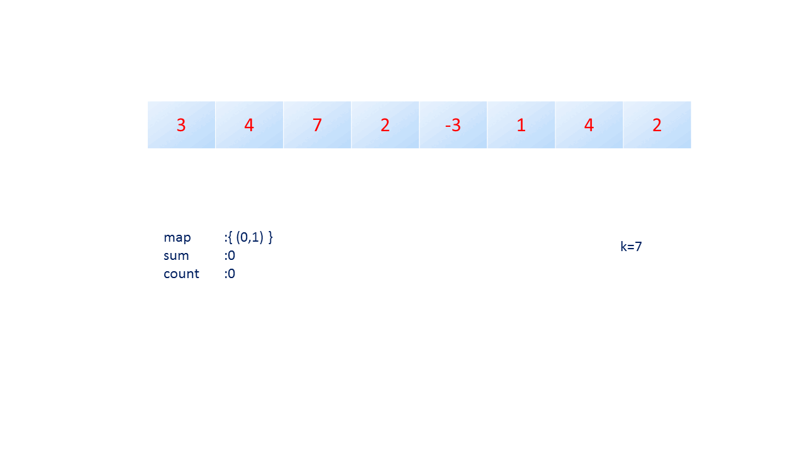

# Longest Substring with At Most K Distinct Characters

Given a string `s` and an integer `k`. Find the length of the longest substring that contains at most `k` distinct characters.

## Time Complexity

We use a dictionary to tracks the frequency of each character within the current sliding window. Operations such as insertion, deletion, and lookup have an average time complexity of $O(1)$.

We use a sliding window. The right pointer expands the window by including new characters, while the left pointer reduces the window when more than $k$ distinct characters are present.

* As the right pointer advances, increment the count of the character in the dictionary, which is $O(1)$ on average.

* If there are more than $k$ distinct characters `(len(counts) > k)`, move the left pointer rightward to reduce the window until the condition is met again. Remove characters from the dictionary when their count drops to zero. Decrementing a count is $O(1)$, and conditionally removing a character from the dictionary (if its count is zero) is also $O(1)$.

The right pointer moves across each character in the string once $O(n)$, and for each movement, the left pointer can move up only once per character ever included in the window. Hence, each character is involved in a constant number of operations (addition, potential decrement, and removal). Therefore, despite the nested loop appearance, the overall time complexity is $O(n)$.

## Space Complexity

The space used by the dictionary depends on the number of distinct characters in the string but is bounded by the size of the alphabet if `k` is not smaller than this size. In the worst case (with all unique characters and `k` equal to this number), the space complexity is $O(\min(k, |\sum|))$, where $|\sum|$ is the alphabet size (26 for lowercase English letters).

---

# Intersection of Multiple Arrays

Given a 2D array `nums` that contains $n$ arrays of distinct integers, return a sorted array containing all the numbers that appear in all `n` arrays.

## Time Complexity

### Python

#### Using `collections.defaultdict`

* We use `np.concatenate(nums, axis=0)` to flatten the 2D array into a 1D array. The time complexity of this operation is $O(n \cdot m)$, where $n$ is the number of arrays and $m$ is the average length of each array. 

* We use a `collections.defaultdict` to store the frequency of each number in the flattened array. The time complexity of building this dictionary is $O(n \cdot m)$.

* We iterate over the dictionary to find the numbers that appear in all $n$ arrays. If all elements in all $n$ arrays are unique, the dictionary will contain $n \cdot m$ elements. The time complexity of this iteration is $O(n \cdot m)$.

* Each individual array contains distinct integers, which means that a number appears $n$ times if and only if it appears in all $n$ arrays. Therefore, the maximum number of elements in the intersection cannot exceed the number of elements in the smallest array, since an intersection of sets cannot have more elements than the smallest contributing set. Assuming the average size of all $n$ array is $m$, the time complexity of sorting the intersection is $O(m \log m)$, where $m$ is the length of the average array. Here we are using $m$ to approximate the size of the smallest array, which is really smaller than $m$.

The overall time complexity is:

$$
\begin{align*}
O(n \cdot m + n \cdot m + n \cdot m + m \log m) &= O(3n \cdot m + m \log m) \\
&= O(n \cdot m + m \log m)
\end{align*}
$$

#### Using `set.intersection_update`

* We first build a set from the first array in `nums`. The time complexity of this operation is $O(m)$, where $m$ is the length of the average array.

* We iterate over the remaining arrays and find the intersection of the current set with the next array. The time complexity of multiple intersections is $O(\text{max}(\text{len}(s_1), \dots ,\text{len}(s_n)))$. Assuming that $m$ is the average length of each array, each intersection costs $O(m)$. Because we carry out this operation consecutively, the time complexity of finding the intersection of all $n$ arrays is $O((n - 1) \cdot m)$.

* Again, we can consider sorting $O(m \log m)$. 
  
The overall time complexity is:

$$
\begin{align*}
O(m + (n - 1) \cdot m + m \log m) &= O((n-1) \cdot m + m \log m) \\ 
&= O(n \cdot m + m \log m)
\end{align*}
$$

We ignore lower-order terms like $m$ and consider the $n-1$ factor as $n$.

### C++

* Constructing the initial set `result` from the first vector involves copying $m$ elements, where $m$ is the length of the average array. The time complexity is $O(m \log m)$ since each insertion into a set is $O(\log m)$. Note: a `std::set` is sorted compared to `std::unordered_set`, and so insertion is not $O(1)$ average.

* For each of the remaining $n-1$ vectors, where $n$ is the total number of vectors:

  - A new set `current` is created for each vector, which has a time complexity of $O(m \log m)$
  - The `std::set_intersection` operation then finds the intersection of `result` and `current`. Assuming $N_1 = m$ represents the size of `result` and $N_2 = m$ (the size of each subsequent vector's set), the complexity of a single `std::set_intersection` is:
  
$$
\begin{align*}
O(2 \cdot (N_1 + N_2) - 1) &= O(2 \cdot (m + m) - 1) \\
&= O(2 \cdot 2m - 1) \\
&= O(4m - 1) \\
&= O(m)
\end{align*}
$$

  - Updating the `result` using `std::set::swap` is $O(1)$

* The total complexity for the intersections is effectively $O((n-1) \cdot (m))$, not including the cost of $1)$ building the set from each vector and $2)$ cost of `std::set::swap`. A more practical upper bound might consider the input size of each set, leading to $O(n \cdot m)$.

* Converting the output set back to a vector involves copying $m$ elements, where $m$ is the number of elements in the final intersection set. Again, this is due to the fact that the output cannot have more elements than the smallest contributing set, approximated by $m$. The time complexity is again $O(m \log m)$.

The major components of the complexity include the initialization and the intersections:

$$
O(m \log m + n \cdot m)
$$

## Space Complexity

If every element is unique, the space complexity of the dictionary is $O(n \cdot m)$, where $n$ is the number of arrays and $m$ is the average length of each array.

---

# Check if All Characters Have Equal Number of Occurrences

Given a string `s`, return `true` if all characters in `s` have the same number of occurrences, or `false` otherwise.

## Time Complexity

### Python

For Python, we can either use `collections.Counter` or `collections.defaultdict` to count the frequency of each character in the string. The time complexity of building the dictionary is $O(n)$, where $n$ is the length of the string.

We then build a set containing all the counts. The time complexity of this operation is $O(n)$.

If all characters have the same counts, the set will contain only one element. The time complexity of checking the size of the set is $O(1)$.

The overall time complexity is $O(n)$.

### C++

For all the approaches below, we build a hash map containing the frequency of each character in the string, which is $O(n)$.

#### Using `std::unordered_set`

This is the same as the Python approach. We build a set containing all the frequencies. The overall time complexity is $O(n + n) = O(2n) = O(n)$.

#### Using `std::all_of`

In this approach, we use `std::all_of` to check if all counts from the second element onward in the hash map are equal to the first element's count. If so, we know that all characters have the same count. The overall time complexity is $O(n + n) = O(2n) = O(n)$.

#### Using `std::minmax_element`

We use the `std::minmax_element` function to find the minimum and maximum counts in the hash map. If the minimum and maximum counts are the same, all characters have the same count.

The `std::minmax_element` function has complexity $O(\text{max}(\frac{3}{2}(n - 1), 0))$:

Therefore, the overall time complexity is:

$$
\begin{align*}
O(n + \frac{3}{2}(n - 1)) &= O(n + \frac{3}{2}n - \frac{3}{2}) \\
&= O(\frac{5}{2}n) \\
&= O(n)
\end{align*}
$$

#### Early Stopping

The early stopping approach has a time complexity of $O(n)$. We build the hash map in $O(n)$ time and then iterate over the hash map to check if all frequencies are the same. The second iteration runs at most $n$ times, which happens when all characters have the same count.

## Space Complexity

For all approaches, we build a hash map containing the frequency of each character in the string. The space complexity of this operation is $O(n)$, where $n$ is the length of the string.

We also build a set containing all the frequencies. If all characters have different counts, then the set will contain $n$ elements. The space complexity of this operation is $O(n)$.

Because `s` is a string consisting of lowercase English letters, we can consider the space complexity to be $O(26)$, which simplifies to $O(1)$.

---

# Subarray Sum Equals K

Given an integer array `nums` and an integer `k`, find the number of subarrays whose sum is equal to `k`.

## Explanation

Let `prefix_sum` be an array where `prefix_sum[i]` is the sum of the first `i` elements of `nums`. 

If the the difference between two cumulative sums up to two indices, `i` and `j` is `k` i.e. `prefix_sum[i] − prefix_sum[j] = k`, then the sum of elements lying between indices `i` and `j` is `k`.

We use a hash map to store the following data: `{prefix_sum[i]: count}`, which is built by traversing `nums`. Each time we encounter a new prefix sum, add it to hashmap as a key. If the same prefix sum occurs again, we increment the count corresponding to that prefix sum in the hashmap. 

For every prefix sum encountered, we also determine the number of times `prefix_sum[i] - k` has occurred already. This count will determine the number of times a subarray with sum `k` has occurred up to the current index `i`. 

We increment the answer by the number of times `prefix_sum[i] - k` has occurred.



In the animation above:

1. `map` is the hash map using prefix sums as keys and the number of times they have occurred as values
2. `sum` is the cumulative sum up to the current index or `prefix_sum[i]`
3. `count` is the number of times `prefix_sum[i] - k` has occurred up to the current index
4. `k` is the integer constraint
5. `sum - k` is the difference between the current sum and `k`, which is used to look up the `count` of the amount of subarrays with sum `k` that have occurred so far

## Time Complexity

The time complexity is $O(n)$, where `n` is the length of the input array `nums`. This is because we traverse the array once and perform constant time operations--- inserting and looking up elements in the hash map--- for each element.

## Space Complexity

The space complexity of this approach is $O(n)$, where `n` is the length of the input array `nums`. This is because the hash map can contain at most `n` distinct prefix sums.

---

# Count Number of Nice Subarrays

Given an array of positive integers `nums` and an integer `k`, find the number of subarrays with exactly `k` odd numbers.

## Example

Consider the array `nums = [3, 2, 4, 5, 6, 7]` and `k = 2`. We want to find the number of subarrays with exactly 2 odd numbers.

| **Iteration** | **num** | **Current Odd Count** | **counts[current_odd_count - k]** | **Update in `counts`**     | **Subarrays with Exactly 2 Odd Numbers**                                       |
| ------------- | ------- | --------------------- | --------------------------------- | -------------------------- | ------------------------------------------------------------------------------ |
| 1             | 3       | 1                     | `counts[1 - 2] = counts[-1]` (0)  | `{0: 1, 1: 1}`             | None                                                                           |
| 2             | 2       | 1                     | `counts[1 - 2] = counts[-1]` (0)  | `{0: 1, 1: 2}`             | None                                                                           |
| 3             | 4       | 1                     | `counts[1 - 2] = counts[-1]` (0)  | `{0: 1, 1: 3}`             | None                                                                           |
| 4             | 5       | 2                     | `counts[2 - 2] = counts[0]` (1)   | `{0: 1, 1: 3, 2: 1}`       | `[3, 2, 4, 5]`                                                                 |
| 5             | 6       | 2                     | `counts[2 - 2] = counts[0]` (1)   | `{0: 1, 1: 3, 2: 2}`       | `[3, 2, 4, 5]`, `[2, 4, 5, 6]`                                                 |
| 6             | 7       | 3                     | `counts[3 - 2] = counts[1]` (3)   | `{0: 1, 1: 3, 2: 2, 3: 1}` | `[3, 2, 4, 5]`, `[2, 4, 5, 6]`, `[4, 5, 6, 7]`, `[5, 6, 7]`, `[2, 4, 5, 6, 7]` |

### Why `counts[current_odd_count - k]`?

Each key of the `counts` dictionary is a count of odd numbers encountered so far (`current_odd_count`), and the value is the number of times this count has occurred.

The `current_odd_count` increases by 1 each time an odd number is encountered. 

When `current_odd_count - k` matches a key recorded in `counts`, it means that between the current position $i$ and a previous position $j$ (i.e. the very first time `current_odd_count - k` was added to the hash map with a count of 1), exactly $k$ odd numbers have been encountered since that point.

Therefore, to get the number of subarrays with exactly `k` odd numbers, we need to find the number of times `current_odd_count - k` has occurred so far. This is the value of `counts[current_odd_count - k]`. 

Adding `counts[current_odd_count - k]` to the answer gives the number of subarrays with exactly `k` odd numbers up to the current position.

## Time Complexity

The cost of building the `counts` dictionary is $O(n)$, and we traverse the array once. 

## Space Complexity

At most, the `counts` dictionary will contain $n$ elements, where $n$ is the length of the input array `nums`. Therefore, the space complexity is $O(n)$.

---

# Find Players With Zero or One Losses

Given an integer array `matches` where `matches[i] = [winner_i, loser_i]` indicates that the player `winner_i` defeated player `loser_i` in a match. Return a list of two lists:
    
1. The first list contains the players who never lose once
2. The second list contains the players who only lost once

## Time Complexity

### Python

Building the `winner_counter` and `loser_counter` dictionaries costs $O(n)$, where `n` is the number of matches.

Using a set comprehension, we iterate over `winner_counter` and `loser_counter` to find the players who never lost and the players who lost once. These operations have a time complexity of $O(n)$.

The sorting operation has a time complexity of $O(n \log n)$.

The overall time complexity is:

$$
\begin{align*}
O(n + (n + n) + n \log n) &= O(3n + n \log n) \\
&= O(n + n \log n)
\end{align*}
$$

### C++

We use a single hash map `lossCount` to store the number of losses for each player. Building this hash map costs $O(n)$.

Next, iterate over `lossCount` to find the players who never lost and the players who lost once. This operation has a time complexity of $O(n)$.

Again, the sorting operation has a time complexity of $O(n \log n)$.

Same as the Python solution, the overall time complexity is:

$$
\begin{align*}
O(n + n \log n) &= O(2n + n \log n) \\
&= O(n + n \log n)
\end{align*}
$$

### Note

In both solutions, finding the players who satisfy the conditions may be less than $n$ if there are fewer players than matches; in other words, some players participate in multiple matches.

In C++, `lossCount` has all unique players as keys, and so `num of players` may be less then `matches.size()`.

Similarly, in Python, `winner_counter` and `loser_counter` have all unique players who have won or lost as keys.

## Space Complexity

### Python

We use:

1. Two dictionaries `winner_counter` and `loser_counter` to store the number of wins and losses for each player
2. Two sets `winners` and `losers` to store the players who never lost and the players who lost once

In the worst case, where all players have unique wins and losses, the space complexity is $O(n)$.

### C++

We use a single hash map `lossCount` to store the number of losses for each player. In the worst case, where all players have unique losses, the space complexity is also $O(n)$.

---

# Largest Unique Number

Given an integer array `nums`, return the largest integer that only occurs once. If no integer occurs once, return `-1`.

## Time Complexity

The time complexity of building the `counter` dictionary is $O(n)$, where `n` is the length of the input array `nums`.

We iterate over the `counter` dictionary to find the largest integer that only occurs once. This operation has a time complexity of $O(n)$.

The overall time complexity is $O(n + n) = O(2n) = O(n)$.

## Space Complexity

The `counter` dictionary contains unique integers from the input array `nums`. In the worst case, where all integers are unique, the space complexity is $O(n)$.

---

# Maximum Number of Target Word

Given a string `text`, use the characters of `text` to form as many instances of the word `target_word` as possible.

Note: Use each character in `text` at most once.

## Time Complexity

### Python

The cost of building `text_counts` and `targets_counts` is $O(n + m)$, where $n$ is the length of `text` and $m$ is the length of `target_word`. 

Iterate over the characters in `target_counts`:

1. The character is not in `text_counts`, in which case the answer is $0$
2. If the character is in `text_counts`, compute `text_counts[char] // target_counts[char]`, which is the potential number of times `target_word` can be formed using the characters in `text` based on this character alone
3. Across all characters, the minimum of these potential numbers is the maximum number of times `target_word` can be formed using the characters in `text`; this is because we cannot form more instances of `target_word` than any character's maximum potential allows

This operation has a time complexity of $O(m)$.

Therefore, the overall time complexity is $O(n + m + m) = O(n + 2m) = O(n + m)$.

### C++

The approach in C++ is similar to that of Python. The cost of building the hash maps is $O(n + m)$.

We use `std::transform_reduce` to find the minimum of the potential number of times `target_word` can be formed using the characters in `text`. 

This function applies a transformation function to elements in a range, and then reduces the transformed elements to a single value using a reduction function. 

```cpp
template< class InputIt, class T, class BinaryOp, class UnaryOp >
T transform_reduce( InputIt first, InputIt last, T init, BinaryOp reduce, UnaryOp transform );
```

* `first`, `last`: Input iterators to the initial and one past the final element of the container
* `init`: Initial value of the accumulator
* `reduce`: Binary operation function object that will be applied to the accumulator and the result of the transformation
* `transform`: Unary operation function object that will be applied to each element in the range

The time complexity of `std::transform_reduce` is $O(m)$.

Similarly, the overall time complexity is $O(n + m)$.

## Space Complexity

The two hash maps for storing the counts of characters in `text` and `target_word` cost $O(n + m)$ (i.e. if all characters are unique).

The rest are constance space variables, so the overall space complexity is $O(n + m)$.

--- 

# Maximum Length of Subarray with Equal Number of 0s and 1s

Given a binary array `nums`, return the maximum length of a contiguous subarray with an equal number of `0` and `1`.

## Explanation

1. **Early Exit**:

   - If the array `nums` has only one element, it's impossible to have a subarray with equal numbers of `0`s and `1`s, so we return `0`.

2. **Initialization**:

   - `max_len` is initialized to `0` to keep track of the maximum length of the desired subarray.

   - `count` is initialized to `0` to keep track of the balance between `0`s and `1`s. It increments by `1` for each `1` and decrements by `1` for each `0`.
- 
   - `hash_map` is a `defaultdict` that will store the first occurrence of each `count` value. It's initialized with `hash_map[0] = -1` to handle the case where the entire subarray from the start has equal numbers of `0`s and `1`s. The formula for the length of a subarray is `index - hash_map[count]`, which becomes `index + 1` when `count` is `0`.

1. **Iterate Through the Array**:

   - For each element in `nums`, update `count`: increment by `1` if the element is `1`, and decrement by `1` if the element is `0`. This is used to keep track of the balance between `0`s and `1`s in the subarray.

2. **Check and Update Maximum Length**:

   - If the current `count` has been seen before in `hash_map`, it means that, since the first occurrence of this `count` up to the current index where this `count` is observed again, the increment and decrement operations perfectly canceled each other out, i.e there has been an equal numbers of `0`s and `1`s. Calculate the length of this subarray as `index - hash_map[count]` and update `max_len` if this length is greater than the current `max_len`.
   - If the current `count` has not been seen before, store the current index in `hash_map` as the first occurrence of this `count`.

## Time Complexity

The initialization of `hash_map[0] = -1` is $O(1)$ and the iteration over the array `nums` is $O(n)$, where `n` is the length of the array. This is because everything inside the loop is $O(1)$:

* Updating `count` is $O(1)$
* Checking if `count` is in `hash_map` is $O(1)$
* Calculating the length of the subarray is $O(1)$
* Updating `max_len` is $O(1)$
* Updating `hash_map` is $O(1)$

## Space Complexity

The space complexity is $O(n)$, where `n` is the length of the array `nums`. This is because the `hash_map` dictionary can contain at most `n` distinct `count` values. This happens when the entire array is either all `0`s or all `1`s.

---

# Sum of Unique Elements

Given an integer array `nums`, return the sum of all unique elements of `nums`.

## Time Complexity

The time complexity of building the `counts` hash map is $O(n)$, where `n` is the length of the input array `nums`.

We iterate over the `counts` hash map to find the sum of all unique elements. At worst, all elements in `nums` are unique, and the time complexity of this operation is $O(n)$.

The overall time complexity is $O(n + n) = O(2n) = O(n)$.

## Space Complexity

The `counts` hash map contains unique elements from the input array `nums`. In the worst case, where all elements are unique, the space complexity is $O(n)$.

--- 

# Count Elements With Maximum Frequency

Given an array `nums` consisting of positive integers, return the total count of the elements in `nums` that appear with the highest frequency. 

## Example

```
Input: nums = [1,2,2,3,1,4]
Output: 4
Explanation: The elements 1 and 2 have a frequency of 2 which is the maximum frequency in the array.
So the number of elements in the array with maximum frequency is 4.
```

## Time Complexity

### Python

`Counter(nums)` costs $O(n)$, where `n` is the length of the input array `nums`.

We find the maximum frequency in the `counter` dictionary, which costs $O(n)$.

Finally, iterate over the `counter` dictionary to add up the elements with the maximum frequency. In the worst case, all elements have the same and thus the maximum frequency, and this operation costs $O(n)$.

The overall time complexity is $O(n + n + n) = O(3n) = O(n)$.

### C++

The time complexity of building the `counts` hash map is $O(n)$, same as in Python.

We use the `std::max_element` function to find the maximum frequency in the `counts` hash map. This function has a time complexity of $O(n - 1)$.

Using `std::accumulate`, we iterate over the `counts` hash map to find the total count of elements with the maximum frequency. This operation has a time complexity of $O(n)$.

Same as the Python solution, the overall time complexity is $O(n + (n - 1) + n) = O(3n - 1) = O(n)$.

## Space Complexity

For both Python and C++, building the hash map costs $O(n)$, where `n` is the length of the input array `nums`.

Everything else is constant space, such as `total_count` in Python and `auto maxIter` iterator in C++.

---

# Find Lucky Integer in an Array

A lucky integer is defined as an integer that has a count equaling its value. Given an array of integers, return the largest lucky integer in the array. 

If there are multiple lucky integers, return the largest of them. If there is no lucky integer, return `-1`.

## Time Complexity

The cost of building a hash map `counts` is $O(n)$, where `n` is the length of the input array.

We iterate over the keys in the `counts` hash map to find the largest lucky integer.

In Python, this is doing using a generator expression inside `max()`, with a default value of `-1` if there are no lucky integers. 

In C++, we use a structured binding to iterate over the hash map and find the largest lucky integer.

In the worst case, all elements in the input array are unique, and we need to check $n$ pairs of `(num, count)` in the hash map for `num == count`. Therefore, this operation has a time complexity of $O(n)$.

The overall time complexity is $O(n + n) = O(2n) = O(n)$.

## Space Complexity

The `counts` hash map contains unique elements from the input array. In the worst case, where all elements are unique, the space complexity is $O(n)$.

All other variables are constant space.

--- 

# Unique Number of Occurrences

Given an array of integers, return true if all elements have unique counts.

## Time Complexity

### Python

The cost of building the `counts` hash map is $O(n)$, where `n` is the length of the input array.

Next, we build a set `set_of_unique_counts` to store the unique counts of elements in the input array. In the worst case, all elements are unique (i.e., each with a count of $1$), there will be `n` unique keys in the `counts` hash map. We would iterate over all `n` keys to build the set.

Checking that the length of the set is equal to the length of the hash map is $O(1)$.

Overall, the time complexity is $O(n + n + 1) = O(2n + 1) = O(n)$.

### C++

The cost of building the hash map is again $O(n)$.

We use `std::transform` and `std::insert_iterator` to build the set `setUniqueCounts`. 

The `std::transform` function has the following signature:

```cpp
template< class InputIt, class OutputIt, class UnaryOperation >
OutputIt transform( InputIt first1, InputIt last1, OutputIt d_first, UnaryOperation unary_op );
```   

* `first1`, `last1`: Input iterators to the initial and one past the final element of the hash map
* `d_first`: Output iterator to the `end` of the set `setUniqueCounts` for insertion
* `unary_op`: Unary operation function applied to each pair of `(num, count)` in the hash map, simply extracting the count

Again, in the worst case, no elements are duplicated, the cost of building this set is $O(n)$.

As in Python, the check for lengths of the hash map and the set is $O(1)$.

The overall time complexity is again $O(n)$.

## Space Complexity

We build two data structures: a hash map and a set: 

1. **hash map**:
   - The hash map contains unique elements from the input array, mapping each element to its count.
   - In the worst case, where there are no duplicates (each element appears exactly once), the hash map will have $n$ unique keys.
   
2. **set**:
   - The set contains all unique counts of elements in the input array.
   - In the worst case, where the counts are as follows:
     - 1 appears 1 time
     - 2 appears 2 times
     - 3 appears 3 times
     - ...
     - $k$ appears $k$ times
   - The set will contain $k$ unique counts.
   - Here, $k$ is the number of unique elements in the input array.

#### Case 1: All Elements are Unique

- **Hash Map**: If all elements are unique, the hash map will have $n$ unique keys.
- **Set**: The set will contain a single unique count of $1$.

In this case, the space complexity is $O(n + 1) = O(n)$.

#### Case 2: Worst Case with $k$ Unique Counts

- **Hash Map**: The hash map will contain $k$ unique keys.
- **Set**: The set will contain $k$ unique counts.

```
nums = [1, 2, 2, 3, 3, 3, 4, 4, 4, 4]
counts = {1: 1, 2: 2, 3: 3, 4: 4}
setUniqueCounts = {1, 2, 3, 4}
```

In this case, the space complexity is $O(k + k) = O(2k) = O(k)$.

#### Overall Space Complexity

The space complexity is $O(n)$ in the worst case, where all elements are unique. This is because $k$ is bounded by $n$.

#### Why is $k$ Bounded by $n$?

To understand why $k$ bounded by $n$, consider the nature of the counts:

1. **Unique Elements**: If each element in the input array is unique, the hash map will have $n$ unique keys, each with a count of $1$. The set in this case will have only one unique count, which is $1$.

2. **Non-Unique Elements**: In a scenario where counts are unique and follow the pattern $1, 2, 3, \ldots, k$:
   - The total number of elements in such a pattern is the sum of the first $k$ natural numbers: $\frac{k \cdot (k + 1)}{2} \le n$.
   - This sum must be less than or equal to $n$ (the total number of elements in the input array). 

We can solve for $k$ after rearranging the equation:

$$
\begin{align*}
k^2 + k & \leq 2n
\end{align*}
$$

Given the quadratic equation $k^2 + k - 2n = 0$, we can solve for $k$ using the quadratic formula with $a=1$, $b=1$, and $c=-2n$:

$$
\begin{align*}
k &= \frac{-b \pm \sqrt{b^2 - 4ac}}{2a} \\ 
&= \frac{-1 \pm \sqrt{1 + 8n}}{2}
\end{align*}
$$

This shows that $k$ is constrained by $n$.

```python
import matplotlib.pyplot as plt
import numpy as np

def compute_roots(n):
    k1 = (-1 - np.sqrt(8 * n + 1)) / 2
    k2 = (-1 + np.sqrt(8 * n + 1)) / 2
    return k1, k2

n_values = np.linspace(0, 10, 400)

k_intervals = [compute_roots(n) for n in n_values]
k1_values = [interval[0] for interval in k_intervals]
k2_values = [interval[1] for interval in k_intervals]

plt.figure(figsize=(10, 6))
plt.plot(n_values, k1_values, label=r'$k_1 = \frac{-1 - \sqrt{8n + 1}}{2}$')
plt.plot(n_values, k2_values, label=r'$k_2 = \frac{-1 + \sqrt{8n + 1}}{2}$')
plt.fill_between(n_values, k1_values, k2_values, color='gray', alpha=0.5)
plt.xlabel('n')
plt.ylabel('k')
plt.title('Interval for k for different values of n')
plt.legend()
plt.grid(True)
plt.show()
```


---

# Sort Characters By Frequency

Given a string `s`, sort it in decreasing order based on the count of its characters. The count of a character is the number of times it appears in the string.

## Time Complexity

### Python

Building the hash map costs $O(n)$, where `n` is the length of the input string `s`.

The `Counter.most_common()` method is essentially sorts the hash map by value in descending order.

```python
sorted(self.items(), key=_itemgetter(1), reverse=True)
```

Given $k$ unique characters, the time complexity of sorting is $O(k \log k)$. In the worst case, $k = n$ (i.e., all characters are unique), and the time complexity is $O(n \log n)$.

In general, given a single character and a count $m$, the `character * count` operation has a time complexity of $O(m)$. In this case, since counts are constant, the complexity of repeated each character by its count can be simplified to $O(1)$. 

We iterate over the list of tuples returned by `Counter.most_common()` to build a list of strings, which of whic is composed of `character * count`; this operation has a time complexity of $O(n)$ if every character is unique.

Finally, the `join` operation has a time complexity of $O(k)$, where $k$ is the number of unique characters. Again, in the worst case, $k = n$, and the time complexity is $O(n)$.

The overall time complexity is $O(n + n \log n + n + n) = O(3n + n \log n) = O(n + n \log n)$.

### C++

Same as Python, building the hash map costs $O(n)$.

We copy each `(charactor, count)` pair from the hash map to a vector of pairs. This operation has a time complexity of $O(k)$, where $k$ is the number of unique characters. In the worst case, $k = n$, and the time complexity is $O(n)$.

Sorting the vector of pairs by the second element of each has a time complexity of $O(n \log n)$ in the worst case.

We iterate over the sorted vector of pairs to build the final string by concatenating strings like `std::string(count, character)` using `+=`, which has a time complexity of $O(n)$ in the worst case.

The overall time complexity is once again $O(n + n + n \log n + n) = O(3n + n \log n) = O(n + n \log n)$.
