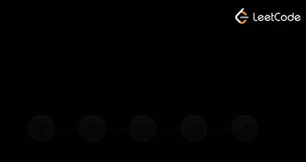

# Fast & Slow Pointers

Psuedo code:

```c++
// Head is the head node of a linked list
function fn(head):
    slow = head
    fast = head

    while fast and fast.next:
        Do something here
        slow = slow.next
        fast = fast.next.next
```

The while loop checks two conditions:

1. `fast` is not `null`

2. `fast.next` is not `null`, because we are accessing `fast.next.next` in the loop, which would result an error 

## Example: Finding the Middle of a Linked List

Given a linked list, `1 -> 2 -> 3 -> 4 -> 5`, the middle of the linked list is `3`.

### C++

```c++
int getMiddle(ListNode* head) {
    ListNode* slow = head;
    ListNode* fast = head;
    while (fast != nullptr && fast->next != nullptr) {
        // Move slow pointer by 1 and fast pointer by 2
        slow = slow->next;
        fast = fast->next->next;
    }

    return slow->val;
}
```

### Python

```python
def get_middle(head):
    slow = head
    fast = head
    while fast and fast.next:
        slow = slow.next
        fast = fast.next.next
    
    return slow.val
```

### Explanation

<center>
    
</center>

---

# Linked List Cycle

Given `head`, the head of a linked list, determine if the linked list has a cycle in it.

There is a cycle in a linked list if there is some node in the list that can be reached again by continuously following the next pointer. Internally, `pos` is used to denote the index of the node that tail's next pointer is connected to. Note that `pos` is not passed as a parameter.

## Explanation

### Cycle Exists

Consider a linked list with the following structure `1 -> 2 -> 3 -> 4 -> 2 (cycle)`:

<center>

| `slow` Position | `fast` Position | While Loop Check `fast` and `fast.next` | Cycle Detected?       |
|-----------------|------------------|----------------------------------------|-----------------------|
| 1               | 1                | True                                   | No                    |
| 2               | 3                | True                                   | No                    |
| 3               | 2                | True                                   | No                    |
| 4               | 4                | True                                   | Yes (loop stops)      |

</center>

### Cycle Does Not Exist

Consider a linked list with the following structure `1 -> 2 -> 3 -> 4 -> 5`:

<center>

| `slow` Position | `fast` Position | While Loop Check `fast` and `fast.next` | Cycle Detected?       |
|-----------------|------------------|----------------------------------------|-----------------------|
| 1               | 1                | True                                   | No                    |
| 2               | 3                | True                                   | No                    |
| 3               | 5                | True                                   | No                    |
| 4               | None             | False (loop stops)                     | No                    |
| 5               | None             | False (loop stops)                     | No                    |

</center>

## Time Complexity

#### Initialization

- Setting `slow` and `fast` pointers to `head` takes $O(1)$ time.

#### Loop Execution

- The `while` loop continues as long as `fast` and `fast.next` are not `None` or `nullptr`.
- Inside the loop:
  - `fast` moves two steps: `fast = fast.next.next`
  - `slow` moves one step: `slow = slow.next`
  - Pointer updates and comparisons take $O(1)$ time per iteration.

### Worst-Case Scenario

#### With a Cycle

Consider a list with no non-cyclic part, followed by a cycle:
`1 -> 2 -> 3 -> 4 -> 5 -> 6 -> 1`

- **Nodes in the list**: $1, 2, 3, 4, 5, 6$
- **Cycle**: The cycle includes all these nodes and points back to the first node.
- The `fast` pointer traverses the first $n$ nodes in $O(\frac{n}{2})$ time because it moves two steps at a time.
- After the `fast` pointer enters the cycle, it takes at most $O(n)$ steps for `slow` and `fast` to meet within the cycle.
- Worst-case time is $O(\frac{n}{2} + n)$, simplified to $O(n)$.

<center>

| Step | `slow` Position | `fast` Position | Cycle Detected?       |
|------|-----------------|------------------|-----------------------|
| 1    | 2               | 3                | No                    |
| 2    | 3               | 5                | No                    |
| 3    | 4               | 1                | No                    |
| 4    | 5               | 3                | No                    |
| 5    | 6               | 5                | No                    |
| 6    | 1               | 1                | Yes (loop stops)      |

</center>

- The `fast` pointer traverses the first $n = 6$ nodes in $3$ steps.
- It then took $3$ more steps for `slow` and `fast` to meet within the cycle.
- Total steps for the loop is $O(3 + 3) = O(6)$.

#### Without a Cycle

Consider a list with no cycle: `1 -> 2 -> 3 -> ... -> n`

- The `fast` pointer moves two steps at a time, reaching the end in $\frac{n}{2}$ steps.
- `slow` moves $\frac{n}{2}$ steps by the time `fast` reaches the end.
- Total steps for the loop is $O(\frac{n}{2})$.

## Space Complexity

The space complexity is $O(1)$ because we only use two pointers, `slow` and `fast`, to traverse the list.

This does not include the space required for the input linked list and node objects.

---

# Middle of the Linked List

Given the `head` of a singly linked list, return the middle node of the linked list. If there are two middle nodes, return the second node.

## Explanation

### Odd Number of Nodes

Consider a linked list with the following structure `1 -> 2 -> 3 -> 4 -> 5`:

<center>

| Iteration | `slow` Position | `fast` Position | While Loop Check `fast` and `fast.next` | Middle Node Reached? |
|-----------------|------------------|-----------------|----------------------------------------|----------------------|
| 1               | 1                | 1               | True                                   | No                   |
| 2               | 2                | 3               | True                                   | No                   |
| 3               | 3                | 5               | False (loop stops)                     | Yes                  |

</center>

### Even Number of Nodes

Consider a linked list with the following structure `1 -> 2 -> 3 -> 4 -> 5 -> 6`:

<center>

| Iteration | `slow` Position | `fast` Position | While Loop Check `fast` and `fast.next` | Middle Node Reached? |
|-----------------|------------------|-----------------|----------------------------------------|----------------------|
| 1               | 1                | 1               | True                                   | No                   |
| 2               | 2                | 3               | True                                   | No                   |
| 3               | 3                | 5               | True                                   | No                   |
| 4               | 4                | None            | False (loop stops)                     | Yes                  |

</center>

## Time Complexity

In the worst-case scenario, the `fast` pointer requires $\frac{n}{2}$ steps to reach the end of the list, i.e., when `fast` becomes `None` or `nullptr`. The `slow` pointer will be at the middle node after $\frac{n}{2}$ steps. The time complexity is $O(\frac{n}{2})$, which is essentially $O(n)$ as $n$ tends to infinity.

## Space Complexity

Again, the space complexity is $O(1)$ because we only use two pointers, `slow` and `fast`, to traverse the list.

---

# Kth Node from the End of a Linked List

Given `head`, the sentinel head node, of a singly linked list and `k`, return the kth node from the end of the linked list. 

## Explanation

Consider a linked list with the following structure `1 -> 2 -> 3 -> 4 -> 5` and `k = 2`:

<center>

| Step | `fast` Position | `slow` Position | While Loop Check `fast` | Kth Node from End |
|------|-----------------|-----------------|-------------------------|-------------------|
| 1    | 1               | 1               | True                    | No                |
| 2    | 2               | 1               | True                    | No                |
| 3    | 3               | 1               | True                    | No                |
| 4    | 4               | 2               | True                    | No                |
| 5    | 5               | 3               | True                    | No                |
| 6    | None            | 4               | False (loop stops)      | Yes               |

</center>

## Time Complexity

Let $n$ be the number of nodes in the singly linked list.

* Initializing the `slow` and `fast` pointers to the sentinel head node takes $O(1)$ time.

* We first move the `fast` pointer to the `k`th node from the beginning of the list. This takes $O(k)$ time as each move of the pointer is $O(1)$. This effectively moves the `fast` pointer $k$ steps ahead of the `slow` pointer.

* We then move both the `slow` and `fast` pointers until the `fast` pointer reaches the end of the list. This takes $O(n - k)$ time as the `fast` pointer is $k$ steps ahead of the `slow` pointer.

The overall time complexity is therefore:

$$
\begin{align*}
O(1) + O(k) + O(n - k) &= O(1 + k + n - k) \\
&= O(1 + n) \\
&= O(n)
\end{align*}
$$

## Space Complexity

With the use of two pointers, `slow` and `fast`, the space complexity is $O(1)$.

---

# Remove Duplicates from Sorted List

Given the `head` of a sorted linked list, delete all duplicates such that each element appears only once. 

## Explanation

### Single Pointer

Consider a sorted linked list with the following structure: `1 -> 1 -> 2 -> 3 -> 3`.

<center>

| Step | `current` Position | `current.data` | `current.next.data` | Action            | List After Step      |
|------|--------------------|----------------|---------------------|-------------------|----------------------|
| 1    | 1                  | 1              | 1                   | Remove duplicate  | `1 -> 2 -> 3 -> 3`   |
| 2    | 1                  | 1              | 2                   | Move to next node | `1 -> 2 -> 3 -> 3`   |
| 3    | 2                  | 2              | 3                   | Move to next node | `1 -> 2 -> 3 -> 3`   |
| 4    | 3                  | 3              | 3                   | Remove duplicate  | `1 -> 2 -> 3`        |
| 5    | 3                  | 3              | None                | End of list       | `1 -> 2 -> 3`        |

</center>

### Fast & Slow Pointers

Again, consider a sorted linked list with the following structure: `1 -> 1 -> 2 -> 3 -> 3`.

<center>

| Step | `slow.data` | `fast.data` | Action                                                      | List After Step    |
|------|-------------|-------------|-------------------------------------------------------------|--------------------|
| 1    | 1           | 1           | - Duplicate found                                           |
|      |             |             | - Remove `fast` node                                        |
|      |             |             | - Set `slow.next` to `fast.next`                            |
|      |             |             | - Move `fast` to `2`                                        | `1 -> 2 -> 3 -> 3` |
| 2    | 1           | 2           | - No duplicate found                                        |
|      |             |             | - Move `slow` to `2`                                        |
|      |             |             | - Move `fast` to `3`                                        | `1 -> 2 -> 3 -> 3` |
| 3    | 2           | 3           | - No duplicate found                                        |
|      |             |             | - Move `slow` to `3`                                        |
|      |             |             | - Move `fast` to `3`                                        | `1 -> 2 -> 3 -> 3` |
| 4    | 3           | 3           | - Duplicate found                                           |
|      |             |             | - Remove `fast` node                                        |
|      |             |             | - Set `slow.next` to `fast.next`                            |
|      |             |             | - Move `fast` to `None`                                     | `1 -> 2 -> 3`      |

</center>

The fast and slow pointer approach uses two pointers:

- The slow pointer keeps track of the last unique node.

- The fast pointer scans ahead to find duplicates.

- Traverse the list using a while loop until the fast pointer reaches the end. In each iteration:

  - If the slow pointer and fast pointer point to nodes with the same data (a duplicate):
    - Update the slow pointer's next node to skip the fast pointer (i.e., `slow.next = fast.next`).
    - Move the fast pointer one step ahead to continue checking for duplicates.

  - If the slow pointer and fast pointer point to nodes with different data (no duplicate):

    - Move both the slow and fast pointers one step ahead.

## Time Complexity

In the worst case, we need $n-1$ comparisons between `current.data` and `current.next.data` to check fo duplicates; therefore, the time complexity is $O(n - 1)$, which tends to $O(n)$ as $n$ tends to infinity.

## Space Complexity

For the single pointer solution, we only use one pointer `current` (i.e., the dummy reference to `head`), so the space complexity is $O(1)$.

Even for the fast and slow pointer solution, the space complexity is $O(1)$ because we only use two pointers, `slow` and `fast`, to traverse the list.

---

#  Delete the Middle Node of a Linked List

Given the `head` of a singly linked list, delete the middle node of the linked list. If there are two middle nodes, delete the second middle node.

## Explanation

Given a linked list with the following structure `1 -> 3 -> 4 -> 7 -> 1 -> 2 -> 6`:


<center>

| Step | `slow` Position | `fast` Position | `prev` Position | Action                         |
|------|-----------------|-----------------|-----------------|-------------------------------|
| Init | 1               | 1               | 1            | Initial positions             |
| 1    | 3               | 4               | 1               | Move `slow` and `fast` forward |
| 2    | 4               | 1               | 3               | Move `slow` and `fast` forward |
| 3    | 7               | 6               | 4               | Move `slow` and `fast` forward |

</center>

## Time Complexity

Given a linked list with $n$ nodes:

* We iterate through the list using the `fast` and `slow` pointers. The `fast` pointer moves two steps at a time, while the `slow` pointer moves one step at a time. The `while` loop continues until the `fast` pointer reaches the end of the list, which takes $\frac{n}{2}$ steps. All operations inside the loop cost $O(1)$.

* The `prev` pointer is used to keep track of the node before the middle node. This pointer points to the node right before the middle node when the fast pointer reaches the end of the list. Removing this node takes $O(1)$ time.

The overall time complexity is $O(\frac{n}{2})$, which is $O(n)$ as $n$ tends to infinity.

## Space Complexity

We only use three pointers:

* `slow` pointer: Moves one step at a time.
* `fast` pointer: Moves at twice the speed of the `slow` pointer.
* `prev` pointer: Keeps track of the node before the `slow` pointer.

The space complexity is const $O(1)$.

---

# Remove Kth Node From End of List

Given the `head` of a singly linked list, remove the `kth` node from the end of the list.

## Explanation

Given a linked list with the following structure `1 -> 2 -> 3 -> 4 -> 5` and `k = 2`:

### Initializing the Pointers

We first initialize all three pointers to the sentinel head node, which contains `None` as the data value.

### Moving Fast Pointer `k` Steps Ahead of Slow Pointer

The `fast` pointer moves `k` steps ahead of the `slow` pointer. In this case, the `fast` pointer moves from `None->1->2` to the node with data value `2`.

### Moving Both Pointers

<center>

| Step | `fast` Position | `slow` Position | `prev` Position | Action                         |
|------|-----------------|-----------------|-----------------|-------------------------------|
| Init | 2               | None            | None            | Initial positions             |
| 1    | 3               | 1               | None            | Move `fast` and `slow` forward |
| 2    | 4               | 2               | 1               | Move `fast` and `slow` forward |
| 3    | 5               | 3               | 2               | Move `fast` and `slow` forward |
| 4    | None            | 4               | 3               | `fast` is `None`, stop loop    |

</center>

### Removing the Kth Node from the End

- The `slow` pointer is now at the kth node from the end (`4`), and the `prev` pointer is at `3`.

- Update `prev.next` to `slow.next`, effectively removing the kth node from the end.

#### Before Removal:

`1 -> 2 -> 3 -> 4 -> 5 -> None`

#### After Removal:

`1 -> 2 -> 3 -> 5 -> None`

## Time Complexity

Given a linked list with $n$ nodes:

* We initialize the `slow`, `fast`, and `prev` pointers to the sentinel head node, which takes $O(1)$ time.

* We move the `fast` pointer $k$ steps ahead of the `slow` pointer, which takes $O(k)$ time since the `fast = fast.next` operation is $O(1)$.

* We then move both the `slow` and `fast` pointers at the same speed until the `fast` pointer reaches the end of the list. This takes $O(n - k)$ time, because, again, iterating the pointers takes $O(1)$ time per iteration.

* The `prev` pointer is used to keep track of the node before the kth node from the end. Removing this node takes $O(1)$ time.

The overall time complexity is therefore:

$$
\begin{align*}
O(1) + O(k) + O(n - k) + O(1) &= O(1 + k + n - k + 1) \\
&= O(1 + n + 1) \\
&= O(n)
\end{align*}
$$

## Space Complexity

Again, the space complexity is $O(1)$ because we only use three pointers, `slow`, `fast`, and `prev`.

---

# Remove Duplicates from Sorted List II

Given the `head` of a sorted linked list, delete all nodes that have duplicate numbers, leaving only distinct numbers from the original list.

## Explanation

Given a sorted linked list with the following structure `1 -> 2 -> 3 -> 3 -> 4 -> 4 -> 5`:

<center>

| Step | `slow` Position | `fast` Position | List State            | Action                             |
|------|-----------------|-----------------|-----------------------|------------------------------------|
| Init | Sentinel (0)    | 1               | [1, 2, 3, 3, 4, 4, 4, 5] | Initial positions                  |
| 1    | 1               | 2               | [1, 2, 3, 3, 4, 4, 4, 5] | Move `slow` to `1`, `fast` to `2`  |
| 2    | 2               | 3               | [1, 2, 3, 3, 4, 4, 4, 5] | Move `slow` to `2`, `fast` to `3`  |
| 3    | 2               | 3 (second 3)      | [1, 2, 3, 3, 4, 4, 4, 5] | `fast` skips duplicates of `3`     |
| 4    | 2               | 4               | [1, 2, 4, 4, 4, 5]       | Update `slow.next` to `4`         |
| 5    | 2               | 4 (third 4)       | [1, 2, 4, 4, 4, 5]       | `fast` skips duplicates of `4`     |
| 6    | 2               | 5               | [1, 2, 5]             | Update `slow.next` to `5`         |
| 7    | 5               | None            | [1, 2, 5]             | `fast` is `None`, outer while loop stops      |

</center>

## Time Complexity

Given a sorted linked list with $n$ nodes:

* We check for two edge cases:
    
    - If the list is empty, i.e., `head.next` is `None`, we return the sentinel head node.
    - If the list has only one node, i.e., `head.next.next` is `None`, we return the sentinel head node.

* We initialize the `slow` and `fast` pointers to the sentinel head node and the first real node, respectively, costing $O(1)$.

* While `fast` is not `None`:

    - Use another `while` loop to scan the `fast` pointer forward, checking two conditions:

        - `fast.next` is not `None`: This ensures that we do not try to access `None.next` inside the loop.
        - `fast.data` is equal to `fast.next.data`: This is `True` when we find a duplicate node.

      As long as the `fast` pointer is pointing to a duplicate node, we keep moving the `fast` pointer forward. When this `while` loop completes, the `fast` pointer is pointing to the last duplicate node with a given duplicated value. **Assuming duplicates are present and there are $m$ duplicates of a given value, this loop takes $O(m)$ time $\forall \;  m \leq n$**. 

      In the case where all nodes have duplicate values, the `fast` pointer moves forward by $n$ nodes inside this loop. In the case where there are no duplicates, this loop does not execute at all.

    - After the inner `while` loop completes, we check if `slow.next == fast`:

        - If `slow.next == fast`, this means that the `fast` pointer did not move forward and is still just one step ahead of `slow`, i.e., there were no duplicates detected. In this case, we move the `slow` pointer forward by one step, which is $O(1)$.

        - If `slow.next != fast`, this means that the `fast` pointer moved forward more than one step to skip duplicates. We update `slow.next` to `fast.next`, effectively removing all duplicates, including the last duplicate node pointed to by the `fast` pointer. This operation is $O(1)$.

    - Finally, we move the `fast` pointer forward by one step, which is $O(1)$. This completes one iteration of the outer `while` loop.

Even though we have nested `while` loops, each node is visited at most twice: once by the `slow` pointer and once by the `fast` pointer. The nodes with duplicate values are only visited by the `fast` pointer; this is because, in the presence of duplicates, the `slow` pointer skips ahead to the next unique node and does not visit the duplicate nodes at all.

As a result, the overall time complexity, ignoring the constant operations outside of the loops, is proportional to the number of nodes in the linked list, i.e., $O(n)$.

## Space Complexity

We use two pointers:

* `slow` pointer: Used to keep track of the last unique node.
* `fast` pointer: Used to scan ahead to find duplicates.

The space complexity is $O(1)$.

---

# Swapping Nodes in a Linked List

Given the `head` node of a linked list and an integer `k`, swap the values of the `kth` node from the start and the `kth` node from the end.

## Explanation

Given a linked list with the following structure `7 -> 9 -> 6 -> 6 -> 7 -> 8 -> 3 -> 0 -> 9 -> 5` and `k = 5`:

<center>

| Step  | `fast` Position | `slow` Position | `kth_from_start` Position | List State                         | Action                                              |
|-------|------------------|-----------------|---------------------------|------------------------------------|-----------------------------------------------------|
| Init  | Sentinel (0)     | Sentinel (0)    |                           | [7, 9, 6, 6, [7, 8], 3, 0, 9, 5]   | Initial positions                                   |
| 1     | 7                | Sentinel (0)    | 7                         |                                    | Move `fast` to 7 in the first loop, keep a reference to this node |
| 2     | 8                | 7               | 7                         |                                    | Move `fast` to 8 and `slow` to 7                    |
| 3     | 3                | 9               | 7                         |                                    | Move `fast` to 3 and `slow` to 9                    |
| 4     | 0                | 6               | 7                         |                                    | Move `fast` to 0 and `slow` to 6                    |
| 5     | 9                | 6               | 7                         |                                    | Move `fast` to 9 and `slow` to 6                    |
| 6     | 5                | 7               | 7                         |                                    | Move `fast` to 5 and `slow` to 7                    |
| 7     | None             | 8               | 7                         |                                    | Move `fast` to None and `slow` to 8 as loop finishes |
| Swap  |                  | 8               | 7                         | [7, 9, 6, 6, [8, 7], 3, 0, 9, 5]   | Swap the values of `kth_from_start` and `slow`      |

</center>

## Time Complexity

Given a linked list with $n$ nodes:

* The only edge case to check is when the list has a single node, which costs $O(1)$.

* We initialize the `slow` and `fast` pointers to the sentinel head node, $O(1)$.

* We move the `fast` pointer $k$ steps ahead of the `slow` pointer, which is $O(k)$.

* We then move both the `slow` and `fast` pointers at the same speed until the `fast` pointer reaches the end of the list. This costs $O(n - k)$.

* We swap the values of the `kth` node from the start and the `kth` node from the end, again, $O(1)$.

The overall time complexity is therefore:

$$
\begin{align*}
O(1) + O(k) + O(n - k) + O(1) &= O(1 + k + n - k + 1) \\
&= O(1 + n + 1) \\
&= O(n)
\end{align*}
$$

## Space Complexity

We only use two pointers, `slow` and `fast`, to traverse the list. The space complexity is $O(1)$.
