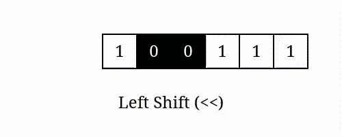

#  Remove Linked List Elements

Given the `head` of a linked list and an integer `data`, remove all the nodes of the linked list that has `data` as its value, and return the new `head`.

## Explanation

Conisder the singly linked list witht the following structure: `head -> 1 -> 2 -> 6 -> 3 -> 4 -> 5 -> 6 -> None`. If we want to remove all the nodes with value `6`, the new linked list should look like this: `head -> 1 -> 2 -> 3 -> 4 -> 5 -> None`:

| Iteration | `prev` | `current` | `current.next` | `current.data` | `data` | Action |
| --- | --- | --- | --- | --- | --- | --- |
| 1 | `head` | `1` | `2` | `1` | `6` | * `1 != 6`    * `prev = 1`   * `current = 2` |
| 2 | `1` | `2` | `6` | `2` | `6` | * `2 != 6`    * `prev = 2`   * `current = 6` |
| 3 | `2` | `6` | `3` | `6` | `6` | * `6 == 6`    * Skip `current` via `prev.next = current.next`   * `current = 3` |
| 4 | `2` | `3` | `4` | `3` | `6` | * `3 != 6`    * `prev = 3`   * `current = 4` |
| 5 | `3` | `4` | `5` | `4` | `6` | * `4 != 6`    * `prev = 4`   * `current = 5` |
| 6 | `4` | `5` | `6` | `5` | `6` | * `5 != 6`    * `prev = 5`   * `current = 6` |
| 7 | `5` | `6` | `None` | `6` | `6` | * `6 == 6`    * Skip `current` via `prev.next = current.next`   * `current = None` |

## Time Complexity

The time complexity of this algorithm is $O(n)$ as we need to traverse the entire linked list to check and remove nodes. All operations inside the `while` loop can be considered $O(1)$.

## Space Complexity

The space complexity is $O(1)$ as we are using a constant amount of extra space, i.e., two pointers `prev` and `current`, regardless of the input size.

---

# Convert Binary Number in a Linked List to Integer

Given the `head` of a singly linked list, whose nodes represent a binary number, return the decimal value of the number in the linked list.

The most significant bit is at the head of the list.

## Left Shift and Bitwise OR

To convert the binary number to decimal, we can iterate through the linked list and calculate the decimal value by left-shifting the current value by 1 bit and then bitwise OR with the current node's value to set the new least significant bit.

### << Operator

    

In general, shifting the left operand by $n$ bits is equivalent to:

$$
\begin{align*}
a << n = a \times 2^n
\end{align*}
$$

### | Operator 

The bit OR operator `|` is used to set a bit to 1 if it is 1 in either of the operands. For example, `1010 | 0010 = 1010`. This operation is used to set the least significant bit to the current node's value.

## Explanation

Consider the linked list `head -> 1 -> 0 -> 1 -> None`. The binary number represented by this linked list is `101`. The decimal value of this binary number is $5$.

| Step | Current Node Value | Decimal Value (Before Shift and OR) | Decimal Value (Binary) (Before Shift and OR) | Decimal Value (After Shift and OR) | Decimal Value (Binary) (After Shift and OR) |
|------|---------------------|-------------------------------------|----------------------------------------------|------------------------------------|---------------------------------------------|
| 1    | 1                   | 0                                   | 000                                          | 1                                  | 001                                         |
| 2    | 0                   | 1                                   | 001                                          | 2                                  | 010                                         |
| 3    | 1                   | 2                                   | 010                                          | 5                                  | 101                                         |

## Time Complexity

The time complexity of this algorithm is $O(n)$ as we need to traverse the entire linked list to calculate the decimal value. All operations inside the `while` loop can be considered $O(1)$.

## Space Complexity

The space complexity is $O(1)$ as we are using a constant amount of extra space, i.e., a single variable `decimal`, regardless of the input size.
