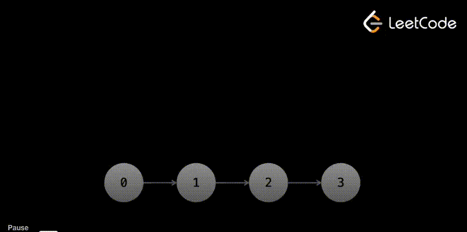

# Reversing a Linked List

<center>
    
</center>

## Python 

```python
def reverse(head: ListNode) -> ListNode:
    prev = None
    current = head.next
    while current:
        next_node = current.next
        current.next = prev
        prev = current
        current = next_node 

    head.next = prev
    return head
```

## C++

```cpp
ListNode::Ptr reverse(const ListNode::Ptr &head)
{
    ListNode::Ptr prev = nullptr;
    ListNode::Ptr current = head->next;
    while (current != nullptr)
    {
        ListNode::Ptr nextNode = current->next;
        current->next = prev;
        prev = current;
        current = nextNode;
    }

    head->next = prev;
    return head;
}
```

## Explanation

Given a singly linked list with $n$ nodes, the algorithm that reverses it is as follows:

1. Initialize two pointers `prev` and `current` to `None` and the start of the linked list, respectively. If the sentinel `head` is used, `current` should be initialized to `head->next` or `head.next`.

2. As long as the `current` pointer is not `None` or `nullptr`, do the following:

    * Store the next node to the right of the `current` pointer in a temporary variable `next_node`. This ensures that the next node is not lost when `next` pointer of the `current` node is updated.

    * Reverse the `next` pointer of the `current` node to point to the `prev` node. Now, the node currently pointed to by `current` is pointing to the node that was previously behind it.

    * Move the `prev` pointer to the `current` node and the `current` pointer to the `next_node` node. This is done to move the pointers one step forward towards the right in the linked list as we reverse each node to point to the previous node.

3. After the loop ends, the `prev` pointer will be pointing to the last node of the original linked list. This is also the first node of the reversed linked list. Update the `next` pointer of the sentinel `head` to point to this node.

4. Return the `head` node of the reversed linked list.

<center>

| Step | List State | `current` | `prev` | `next_node` | Operations |
|------|-------------|-----------|--------|-------------|------------|
| Initial | `head -> 1 -> 2 -> 3 -> 4 -> 5 -> None` | `1` | `None` | `2` | Initialize pointers |
| 1 | `head -> 1 -> None` <br> `2 -> 3 -> 4 -> 5 -> None` | `2` | `1 -> None` | `3` | `current->next = prev` <br> Move `prev` and `current` |
| 2 | `head -> 1 -> None` <br> `2 -> 1 -> None` <br> `3 -> 4 -> 5 -> None` | `3` | `2 -> 1 -> None` | `4` | `current->next = prev` <br> Move `prev` and `current` |
| 3 | `head -> 1 -> None` <br> `2 -> 1 -> None` <br> `3 -> 2 -> 1 -> None` <br> `4 -> 5 -> None` | `4` | `3 -> 2 -> 1 -> None` | `5` | `current->next = prev` <br> Move `prev` and `current` |
| 4 | `head -> 1 -> None` <br> `2 -> 1 -> None` <br> `3 -> 2 -> 1 -> None` <br> `4 -> 3 -> 2 -> 1 -> None` <br> `5 -> None` | `5` | `4 -> 3 -> 2 -> 1 -> None` | `None` | `current->next = prev` <br> Move `prev` and `current` |
| Final | `head -> 1 -> None` <br> `2 -> 1 -> None` <br> `3 -> 2 -> 1 -> None` <br> `4 -> 3 -> 2 -> 1 -> None` <br> `5 -> 4 -> 3 -> 2 -> 1 -> None` | `None` | `5 -> 4 -> 3 -> 2 -> 1 -> None` | `None` | `current->next = prev` <br> Move `prev` and `current` |
| Update | `head -> 5 -> 4 -> 3 -> 2 -> 1 -> None` | `None` | `5 -> 4 -> 3 -> 2 -> 1 -> None` | `None` | Update `head->next` |

</center>

## Time Complexity

The algorithm traverses the linked list once, reversing the `next` pointer of each node. The time complexity is $O(n)$, where $n$ is the number of nodes in the linked list.

## Space Complexity

The algorithm uses a constant amount of extra space. The space complexity is $O(1)$.

---

# Swap Nodes in Pairs

Given a linked list, swap every two adjacent nodes. Only the nodes can be changed and not the values of the nodes.

## Explanation

Given a singly linked list with the following structure `12 -> 27 -> 7 -> 17 -> 77`:

<center>

| Step | List State | `current` | `prev` | Operations |
|------|-------------|-----------|--------|------------|
| Initial | `head -> 12 -> 27 -> 7 -> 17 -> 77 -> None` | `12` | `head` | Initialize pointers |
| 1 | `head -> 27 -> 12 -> 7 -> 17 -> 77 -> None` | `7` | `12` | Swap `12` and `27` <br> Move `prev` to `12` and `current` to `7` |
| 2 | `head -> 27 -> 12 -> 17 -> 7 -> 77 -> None` | `77` | `7` | Swap `7` and `17` <br> Move `prev` to `7` and `current` to `77` |
| Final | `head -> 27 -> 12 -> 17 -> 7 -> 77 -> None` | `None` | `7` | No more pairs to swap |

</center>

## Time Complexity

Given linked list with $n$ nodes:

* We check for two edge cases:

    - If the linked list is empty, which is $O(1)$.

    - If the linked list has only one node, which is $O(1)$.

* As long as there are at least two nodes to swap, we traverse the linked list and carry out the following operations on each pair of `first` and `second` nodes:

    - At the start of each iteration, we have: `prev -> first -> second -> next_first -> next_second`.

        **Swapping operations**:

        - Set `first.next` to `second.next` so `prev -> (first & second) -> next_first -> next_second`.

        - Set `second.next` to `first` so `(prev & second) -> first -> next_first -> next_second`.

        - Set `prev.next` to `second` so `prev -> second -> first -> next_first -> next_second`.

        **Moving pointers**:

        - Move `prev` to `first` so `second -> (prev = first) -> next_first -> next_second`.

        - Move `current` to `first.next` so `second -> (prev = first) -> (current = next_first) -> next_second`.

        The above operations cost at each iteration $O(5) = O(1)$.

Because we traverse the linked list once and perform $O(1)$ operations at each iteration, the time complexity is $O(n)$.

## Space Complexity

Becuase we only use pointers, the space complexity is $O(1)$.
