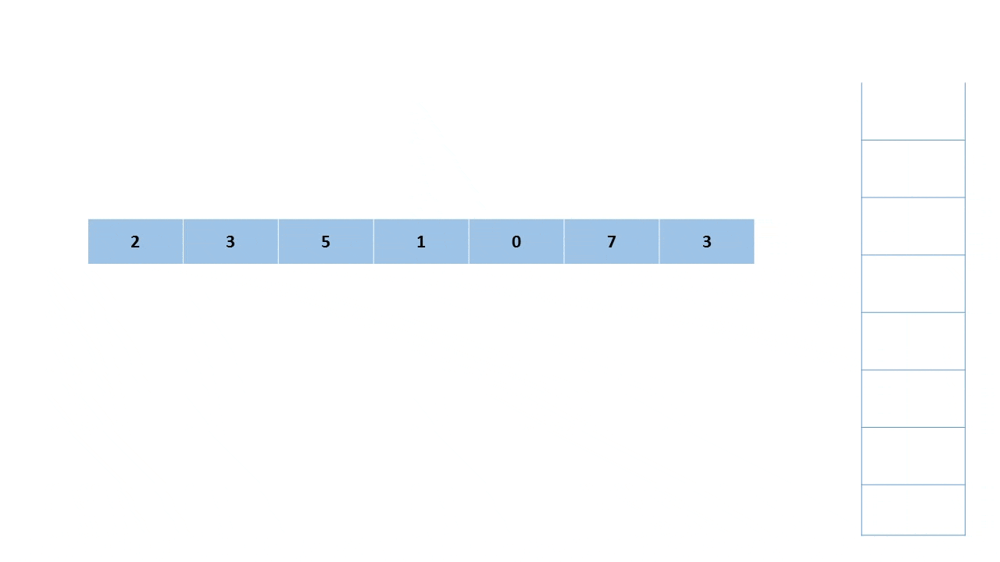

# Daily Temperatures

Given an array of integers `temperatures` representing daily temperatures, return an array `output` where `output[i]` indicates the number of days after the `i`-th day that a warmer temperature occurs. If no such day exists, set `out[i]` to 0.

## Explanation

Given temperatures = `[73, 74, 75, 71, 69, 72, 76, 73]`:

| Day Index Stack | Output Array              | Current Day Index | Previous Day Index | Condition Check                                       | Action                                                       |
|:---------------:|:-------------------------:|:-----------------:|:------------------:|:---------------------------------------------------:|:------------------------------------------------------------:|
| []              | [0, 0, 0, 0, 0, 0, 0, 0]  | 0                 | -1                 | Stack is empty                                      | Initialize the stack and output array                        |
| [0]             | [0, 0, 0, 0, 0, 0, 0, 0]  | 1                 | 0                  | Temperature 74 > 73                                 | Pop stack (previous day index 0) and set `output[0] = 1`     |
| [1]             | [1, 0, 0, 0, 0, 0, 0, 0]  | 2                 | 1                  | Temperature 75 > 74                                 | Pop stack (previous day index 1) and set `output[1] = 1`     |
| [2]             | [1, 1, 0, 0, 0, 0, 0, 0]  | 3                 | -1                 | Temperature 71 <= 75                                | Push current day index 3 onto the stack                      |
| [2, 3]          | [1, 1, 0, 0, 0, 0, 0, 0]  | 4                 | -1                 | Temperature 69 <= 71                                | Push current day index 4 onto the stack                      |
| [2, 3, 4]       | [1, 1, 0, 0, 0, 0, 0, 0]  | 5                 | 4, 3               | Temperature 72 > 69, Temperature 72 > 71            | Pop stack (previous day index 4, 3) and update `output[4]` and `output[3]` |
| [2, 5]          | [1, 1, 0, 2, 1, 0, 0, 0]  | 6                 | 5, 2               | Temperature 76 > 72, Temperature 76 > 75            | Pop stack (previous day index 5, 2) and update `output[5]` and `output[2]` |
| [6]             | [1, 1, 4, 2, 1, 1, 0, 0]  | 7                 | -1                 | Temperature 73 <= 76                                | Push current day index 7 onto the stack                      |

The output array is `[1, 1, 4, 2, 1, 1, 0, 0]`.

## Time Complexity

Given $n$ days of temperatures, the algorithm processes each day as follows:

1. **While Loop**: As long as the stack is not empty and the current temperature is greater than the temperature at the top of the stack:

   - Pop the top of the stack and update the output array in $O(1)$ times.

2. **Push Operation**: If the current temperature is less than or equal to the temperature at the top of the stack, or after the stack becomes empty, we push the current day index onto the stack in $O(1)$ time.

Each day's index is pushed and popped from the stack at most once. In the worst-case scenario, such as when temperatures are strictly increasing (e.g., `[30, 35, 53, 62, 70, 90]`), every index from 0 to $n - 1$ is pushed and then popped.

Thus, the overall time complexity is $O(2n)$, which simplifies to $O(n)$.

## Space Complexity

Not considering the space required to store the output array, which is $O(n)$, the algorithm uses a stack to store the day indices. The stack's space complexity is $O(n)$, as it can store at most $n$ day indices. 

The worst case occurs when the temperatures are in decreasing order, and the stack stores all $n$ day indices. For example, given temperatures = `[80, 76, 75, 52, 43, 38, 32]`, the stack would store `[0, 1, 2, 3, 4, 5, 6]`.

---

# Sliding Window Maximum

Given an array of integers `nums` and a sliding window of size `k`, this function processes the array by sliding the window from the left to the right. At each position, the window contains `k` consecutive elements from `nums`. Find the maximum element in each window and return an array of these maximum values.

## Explanation

Given `nums = [1, 3, -1, -3, 5, 3, 6, 7]` and `k = 3`:

| Index | Deque    | Window     | Max | Output               | Action                                                                                                                                                                                                                                          |
|-------|----------|------------|-----|----------------------|-------------------------------------------------------------------------------------------------------------------------------------------------------------------------------------------------------------------------------------------------|
| 0     | [0]      | [1]        | NA  | NA                   | <ul><li>Deque is empty, push index 0 onto the deque.</li></ul>                                                                                                                                                                                                  |
| 1     | [1]      | [1, 3]     | NA  | NA                   | <ul><li>`3 > 1`: </li><ul><li>Pop index 0 from the deque.</li><li>Push index 1 onto the deque.</li></ul>                                                                                                                                                  |
| 2     | [1, 2]   | [1, 3, -1] | 3   | [3]                  | <ul><li>`-1 < 3`: </li><ul><li>Push index 2 onto the deque.</li><li>Window size reached (`2 >= 2`): </li><ul><li>Check if `num_deque[-1] - num_deque[0] == k` (i.e., `2 - 1 != 3`).</li><li>Push `nums[1] = 3` to output.</li></ul></ul></ul>                                           |
| 3     | [1, 2, 3]| [3, -1, -3]| 3   | [3, 3]               | <ul><li>`-3 < -1`: </li><ul><li>Push index 3 onto the deque.</li><li>Window size reached (`3 >= 2`): </li><ul><li>Check if `num_deque[-1] - num_deque[0] == k` (i.e., `3 - 1 != 3`).</li><li>Push `nums[1] = 3` to output.</li></ul></ul></ul>                                           |
| 4     | [4]      | [-1, -3, 5]| 5   | [3, 3, 5]            | <ul><li>`5 > -3`: </li><ul><li>Pop index 3 from the deque.</li><li>`5 > -1`: </li><ul><li>Pop index 2 from the deque.</li><li>`5 > 3`: </li><ul><li>Pop index 1 from the deque.</li><li>Push index 4 onto the deque.</li></ul></ul><li>Window size reached (`4 >= 2`): </li><ul><li>Check if `num_deque[-1] - num_deque[0] == k` (i.e., `4 - 4 != 3`).</li><li>Push `nums[4] = 5` to output.</li></ul></ul></ul> |
| 5     | [4, 5]   | [-3, 5, 3] | 5   | [3, 3, 5, 5]         | <ul><li>`3 < 5`: </li><ul><li>Push index 5 onto the deque.</li><li>Window size reached (`5 >= 2`): </li><ul><li>Check if `num_deque[-1] - num_deque[0] == k` (i.e., `5 - 4 != 3`).</li><li>Push `nums[4] = 5` to output.</li></ul></ul></ul>                                           |
| 6     | [6]      | [5, 3, 6]  | 6   | [3, 3, 5, 5, 6]      | <ul><li>`6 > 3`: </li><ul><li>Pop index 5 from the deque.</li><li>`6 > 5`: </li><ul><li>Pop index 4 from the deque.</li><li>Push index 6 onto the deque.</li></ul><li>Window size reached (`6 >= 2`): </li><ul><li>Check if `num_deque[-1] - num_deque[0] == k` (i.e., `6 - 6 != 3`).</li><li>Push `nums[6] = 6` to output.</li></ul></ul></ul> |
| 7     | [7]      | [3, 6, 7]  | 7   | [3, 3, 5, 5, 6, 7]   | <ul><li>`7 > 6`: </li><ul><li>Pop index 6 from the deque.</li><li>Push index 7 onto the deque.</li><li>Window size reached (`7 >= 2`): </li><ul><li>Check if `num_deque[-1] - num_deque[0] == k` (i.e., `7 - 7 != 3`).</li><li>Push `nums[7] = 7` to output.</li></ul></ul></ul> |

The output array is `[3, 3, 5, 5, 6, 7]`.

## Time Complexity

Given $n$ elements in the input array `nums`, the algorithm processes each element as follows:

1. **While Loop**: As long as the deque is not empty and the current element is greater than the element at the back of the deque:

   - Pop the back of the deque in $O(1)$ time.

2. **Push Operation**: Push the current index onto the deque in $O(1)$ time.

3. **Window Size Check**: Check if window size has been reached, i.e., `i > k - 1`, costing $O(1)$:

   -  Check if the difference between the front and back of the deque is equal to `k` in $O(1)$

      - If the difference is `k`, then the front of the deque is outside the window; pop it in $O(1)$.

   - Push the maximum element, i.e., `nums[deque[0]]`, to the output array in $O(1)$ time.

In the worst case, i.e. when the input array is **strictly increasing**, each element is pushed to the deque once, and before pushing a new element, the previous element in the deque is popped (since the new element breaks the non-increasing monotonicity).

   - Each index is pushed once and can be popped at most once. This means there are at most $n$ push operations and $n$ pop operations, leading to $O(2n) = O(n)$ time.

The maximum element for each window is determined by the front index of the deque. There are `n - k + 1` windows where the maximum needs to be output.

   - Each index `deque[0]` and `output.push_back()` operations take $O(1)$ time, and since there are $n - k + 1$ such operations, this part contributes $O(n - k + 1)$ to the complexity.

The total time complexity is therefore:

$$
\begin{aligned}
O(n) + O(n - k + 1) &= O(2n - k + 1) \\
&= O(n)
\end{aligned}
$$

## Space Complexity

In the worst case, the deque stores all indices from the last window, i.e., $åk$ indices. This happens when the input array is **monotonically non-increasing**, which means there are no pop operations except for those used to maintain the window size. The space complexity is therefore $O(k)$.

---

# Longest Continuous Subarray With Absolute Diff Less Than or Equal to Limit

Given an array of integers `nums` and an integer `limit`, return the size of the longest non-empty subarray such that the absolute difference between any two elements of this subarray is less than or equal to `limit`.

## Explanation

Given `nums = [1, 5, 6, 7, 8, 10, 6, 5, 6]` and `limit = 4`:

| Left | Right | Window          | Monotonic Increasing           | Monotonic Decreasing           | Action                                                                                     |
|------|-------|-----------------|--------------------------------|--------------------------------|--------------------------------------------------------------------------------------------|
| 0    | 0     | [1]             | [1]                            | [1]                            | - Added 1 to both deques.   - Updated window size to 1 (right - left + 1 = 0 - 0 + 1).  |
| 0    | 1     | [1, 5]          | [1, 5]                         | [5]                            | - Popped 1 from decreasing deque because 1 < 5. - Added 5 to both deques. - Updated window size to 2 (right - left + 1 = 1 - 0 + 1). |
| 1    | 2     | [5, 6]          | [5, 6]                         | [6]                            | - Popped 5 from decreasing deque because 5 < 6. - Added 6 to both deques. - Window size is invalid because 6 - 1 > 4.   - Popped 1 from front of increasing deque because it's equal to the leftmost element. - Moved left to 1. Window is now [5, 6]. - Updated window size to 2 (right - left + 1 = 2 - 1 + 1). |
| 1    | 3     | [5, 6, 7]       | [5, 6, 7]                      | [7]                            | - Popped 6 from decreasing deque because 6 < 7. - Added 7 to both deques. - Updated window size to 3 (right - left + 1 = 3 - 1 + 1). |
| 1    | 4     | [5, 6, 7, 8]    | [5, 6, 7, 8]                   | [8]                            | - Popped 7 from decreasing deque because 7 < 8. - Added 8 to both deques. - Updated window size to 4 (right - left + 1 = 4 - 1 + 1). |
| 2    | 5     | [6, 7, 8, 10]   | [6, 7, 8, 10]                  | [10]                           | - Popped 8 from decreasing deque because 8 < 10. - Added 10 to both deques. - Window size is invalid because 10 - 5 > 4.   - Popped 5 from front of increasing deque because it's equal to the leftmost element. - Moved left to 2. Window is now [6, 7, 8, 10]. - Updated window size to 4 (right - left + 1 = 5 - 2 + 1). |
| 2    | 6     | [6, 7, 8, 10, 6] | [6, 6]                         | [10, 6]                        | - Popped 10 from increasing deque because 10 > 6.   - Popped 8 from increasing deque because 8 > 6.   - Popped 7 from increasing deque because 7 > 6. - Added 6 to both deques. - Updated window size to 5 (right - left + 1 = 6 - 2 + 1). |
| 6    | 7     | [6, 5]          | [5]                            | [6, 5]                         | - Popped 6 from increasing deque because 6 > 5.   - Popped 6 from increasing deque because 6 > 5. - Added 5 to both deques. - Window size is invalid because 10 - 5 > 4. - Moved left to 3. Window is now [7, 8, 10, 6, 5]. - Window size is invalid because 10 - 5 > 4. - Moved left to 4. Window is now [8, 10, 6, 5]. - Window size is invalid because 10 - 5 > 4. - Moved left to 5. Window is now [10, 6, 5]. - Window size is invalid because 10 - 5 > 4.   - Popped 10 from front of decreasing deque because it's equal to the leftmost element. - Moved left to 6. Window is now [6, 5]. - Updated window size to 5 (right - left + 1 = 7 - 6 + 1). |
| 6    | 8     | [6, 5, 6]       | [5, 6]                         | [6, 6]                         | - Popped 5 from decreasing deque because 5 < 6. - Added 6 to both deques. - Updated window size to 5 (right - left + 1 = 8 - 6 + 1). |

The longest continuous subarray with an absolute difference less than or equal to 4 is `[7, 7, 8, 10, 6]` with a size of 5.

## Time Complexity

Let $n$ be the number of elements in the input array `nums`. The algorithm iterates through each index of the array and performs the following operations:

1. **First Two While Loops**: The first two while loops are used to maintain the monotonicity of the increasing and decreasing deques. They are mutually exclusive in that:

   - If the input array is **strictly increasing**, every element will be pushed and popped from the decreasing deque repeatedly while only being pushed to the increasing deque.

   - If the input array is **strictly decreasing**, every element will be pushed and popped from the increasing deque repeatedly while only being pushed to the decreasing deque.

   In the sense, each element is pushed and popped at most $O(3n)$ times during these while loops in the worst case, contributing $O(n)$ to the total time complexity.

2. **Window Size Check**: In the worst case, with `limit = 0` and the gaps between each element in the input array being greater than zero (e.g. `[1, 3, 5, 7, 9, 11]` or `[17, 12, 7, 2]`), the window becomes invalid after each element is added. 

   - All work done inside the third `while` loop (i.e., comparison of two integers, popping the front of the deques) can be considered $O(1)$.
   - For an input of size $n$, there would be $n - 1$ comparisons between each pair of elements, leading to $O(n - 1) = O(n)$ pop operations to either the increasing (if the input is strictly decreasing) or decreasing deque (if the input is strictly increasing).

With both parts combined, the total time complexity can be modeled as $O(3n) + O(n) = O(4n) = O(n)$.

## Space Complexity

In the worst case, in which the input array remains constant (e.g., `[12, 12, 12, 12, 12]`), all elements are pushed to both deques and no pop operations are carried out. The space complexity is therefore $O(n + n) = O(2n) = O(n)$.

---

# Next Greater Element I 

Given two distinct integer arrays `nums_1` and `nums_2` where `nums_1` is a subset of `nums_2`, find the array `output` such that for each element `nums_1[i]`, `output[i]` contains the next greater element of `nums_1[i]` in `nums_2`. If no such element exists, `output[i]` will be -1.

## Explanation

The algorithm uses a stack to store the elements in increasing order and a hash map to store the next greater element for each element in `nums_2`.

    

 

Given `nums_1 = [5, 7, 1]` and `nums_2 = [2, 3, 5, 1, 0, 7, 3]`:

* Hash map: `{2: 3, 3: 5, 0: 7, 1: 7, 5: 7, 3: -1, 7: -1}`

The output array is `[7, -1, 7]`.

## Time Complexity

Let $n$ be the number of elements in `nums_2` and $m$ be the number of elements in `nums_1`. The algorithm carries out the following operations:

1. Iterate over the elements in `nums_2`:

   - While the stack is not empty and the current element is greater than the element at the top of the stack, pop the top element and update the hash map in both in $O(1)$ time. 

   - Push the current element onto the stack in $O(1)$ time.

   Each element can be pushed and popped *at most once*, leading to $O(2n) = $O(n)$ time complexity.

2. Iterate over the elements in `nums_1`:

   - Lookup the next greater element for each element in $O(1)$ time.

The time complexity of the algorithm is $O(n + m)$.

## Space Complexity

In the worst case, where `nums_2` is strictly decreasing, the stack stores all elements from `nums_2` since there would be no pop operations. The space complexity of the stack is $O(n)$. Adding the space required for the hash map, which is $O(n)$, the total space complexity is $O(2n) = O(n)$.

If we also consider the space required to store the output array, which is $O(m)$, the total space complexity becomes $O(n + m)$.

---

# Online Stock Span

Design an algorithm to calculate the span of a stock's price for the current day based on daily price quotes. The span is the number of consecutive days (including today) where the price was less than or equal to the current price.

**Example:**
- Prices: `[7, 2, 1, 2]`, Today's price: `2` → Span: `4`
- Prices: `[7, 34, 1, 2]`, Today's price: `8` → Span: `3`

**Implement the `StockSpanner` class:**
- `StockSpanner()`: Initializes the class instance.
- `int next(int price)`: Returns the span for today's price.

## Explanation

We use a montonic decreasing stack to store pair of `(price, span)` for each day. The stack is used to calculate the span for the current day based on the previous days' prices.

Given the example `[100, 80, 60, 70, 60, 75, 85]`:

| Step | Current Price | Action | Stack State | Span |
|------|---------------|--------|-------------|------|
| 1    | 100           | Initialized span to 1 | `[]` |   |
| 2    |               | Append (100, 1) to the stack | `[(100, 1)]` | 1 |
| 3    | 80            | Initialized span to 1 | `[(100, 1)]` |   |
| 4    |               | Append (80, 1) to the stack | `[(100, 1), (80, 1)]` | 1 |
| 5    | 60            | Initialized span to 1 | `[(100, 1), (80, 1)]` |   |
| 6    |               | Append (60, 1) to the stack | `[(100, 1), (80, 1), (60, 1)]` | 1 |
| 7    | 70            | Initialized span to 1 | `[(100, 1), (80, 1), (60, 1)]` |   |
| 8    |               | The pair (60, 1) will be popped since its price (60) is lower than 70 | `[(100, 1), (80, 1)]` |   |
| 9    |               | Append (70, 2) to the stack | `[(100, 1), (80, 1), (70, 2)]` | 2 |
| 10   | 60            | Initialized span to 1 | `[(100, 1), (80, 1), (70, 2)]` |   |
| 11   |               | Append (60, 1) to the stack | `[(100, 1), (80, 1), (70, 2), (60, 1)]` | 1 |
| 12   | 75            | Initialized span to 1 | `[(100, 1), (80, 1), (70, 2), (60, 1)]` |   |
| 13   |               | The pair (60, 1) will be popped since its price (60) is lower than 75 | `[(100, 1), (80, 1), (70, 2)]` |   |
| 14   |               | The pair (70, 2) will be popped since its price (70) is lower than 75 | `[(100, 1), (80, 1)]` |   |
| 15   |               | Append (75, 4) to the stack | `[(100, 1), (80, 1), (75, 4)]` | 4 |
| 16   | 85            | Initialized span to 1 | `[(100, 1), (80, 1), (75, 4)]` |   |
| 17   |               | The pair (75, 4) will be popped since its price (75) is lower than 85 | `[(100, 1), (80, 1)]` |   |
| 18   |               | The pair (80, 1) will be popped since its price (80) is lower than 85 | `[(100, 1)]` |   |
| 19   |               | Append (85, 6) to the stack | `[(100, 1), (85, 6)]` | 6 |

The spans for the given prices are `[1, 1, 1, 2, 1, 4, 6]`.

## Time Complexity

During each call to the `next` function, the algorithm performs the following operations:

* Initialize the span to 1 in $O(1)$ time

* `While` the stack is non-empty and the current price is greater than the price at the top of the stack:

  - Pop the top of the stack in $O(1)$ time and use the stored span on that day to update the current day's span.

* Push the current price and span onto the stack in $O(1)$ time.

On any given day, assuming that the stack has $n$ pairs of `(price, span)` accumulated from previous days, the algorithm performs at most $O(n)$ pop operations if the current price is greater than all previously stored prices. 

For example, if the prices are as follows `[100, 80, 60, 40, 30, 13, 102]`, the stack will contain the following pairs right before the last price is processed: `[(100, 1), (80, 1), (60, 1), (40, 1), (30, 1), (13, 1)]`. 

When the price `102` is processed, the stack will be emptied, leading to $O(n)$ pop operations.

Therefore, the worst case time complexity is $O(n)$ for the `next` function.

## Space Complexity

Considering the space required to store pairs of `(price, span)` in the stack, the space complexity is $O(n)$, where $n$ is the number of days for which the span is calculated. This occurs if the prics are strictly decreasing during the entire period of calculation.

For instance, if the prices are `[100, 80, 60, 40, 30, 13, 10]`, all pairs will be stored in the stack.

---

# Final Prices With a Special Discount in a Shop

The integer array `prices` is such that `prices[i]` represents the price of the ith item in a shop

For each item, if a later item has a price less than or equal to the current item's price, a discount is applied. The discount is equal to the price of the first such item found. If no such item exists, no discount is applied.

Return an integer array `output`, where `output[i]` is the final price after applying the discount, if applicable.

## Explanation

Consider the example `prices = [8, 4, 6, 2, 3]`:

| Index | Stack | Current Price | Condition Check | Action | Prices |
|-------|-------|---------------|-----------------|--------|------------------------|
| 0     | []    | 8             | -               | Push index 0 onto the stack | [8, 4, 6, 2, 3]        |
| 1     | [0]   | 4             | 4 < 8           | - Pop index 0 from the stack and apply discount   - Push index 1 onto the stack | [8 - 4 = 4, 4, 6, 2, 3]        |
| 2     | [1]   | 6             | 6 > 4           | - Push index 2 onto the stack | [4, 4, 6, 2, 3]        |
| 3     | [1, 2]| 2             | 2 < 6 and 2 < 4          | - Pop index 2 from the stack and apply discount   - Pop index 1 from the stack and apply discount   - Push index 3 onto the stack | [4, 4 - 2 = 2, 6 - 2 = 4, 2, 3]        |
| 4     | [3]   | 3             | 3 > 2           | - Push index 4 onto the stack | [4, 2, 4, 2, 3]        |
| NA   | [3, 4]| -             | -               | NA | [4, 2, 4, 2, 3]        |

The final prices after applying discounts are `[4, 2, 4, 2, 3]`.

## Time Complexity

Given $n$ prices in the input array `prices`, the algorithm carries out the following operations for each price:

1. `While` the stack is not empty and the current price is less than the price at the top of the stack (i.e., a discount can be applied):

   - Pop the top of the stack and apply the discount both in $O(1)$ time.

2. Push the current price onto the stack in $O(1)$ time.

When the input prices are strictly non-increasing, every index is pushed and popped from the stack except for the last index. This results in $O(n + n - 1) = O(2n - 1) = O(n)$ time complexity.

## Space Complexity

In the worst case, i.e., when the input prices are strictly increasing, every index will be pushed onto the stack and no pop operations will be performed. The space complexity of the stack is therefore $O(n)$.
