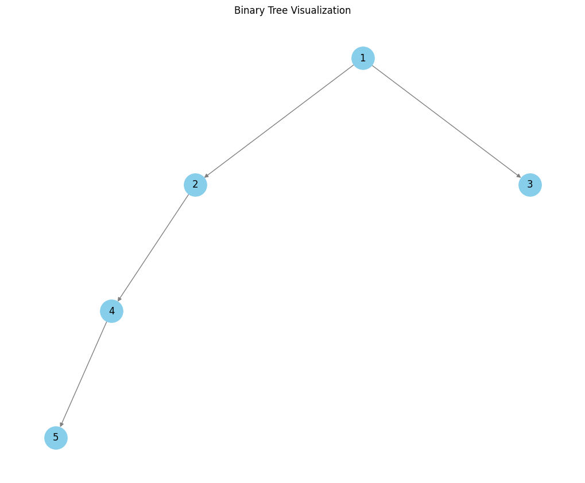
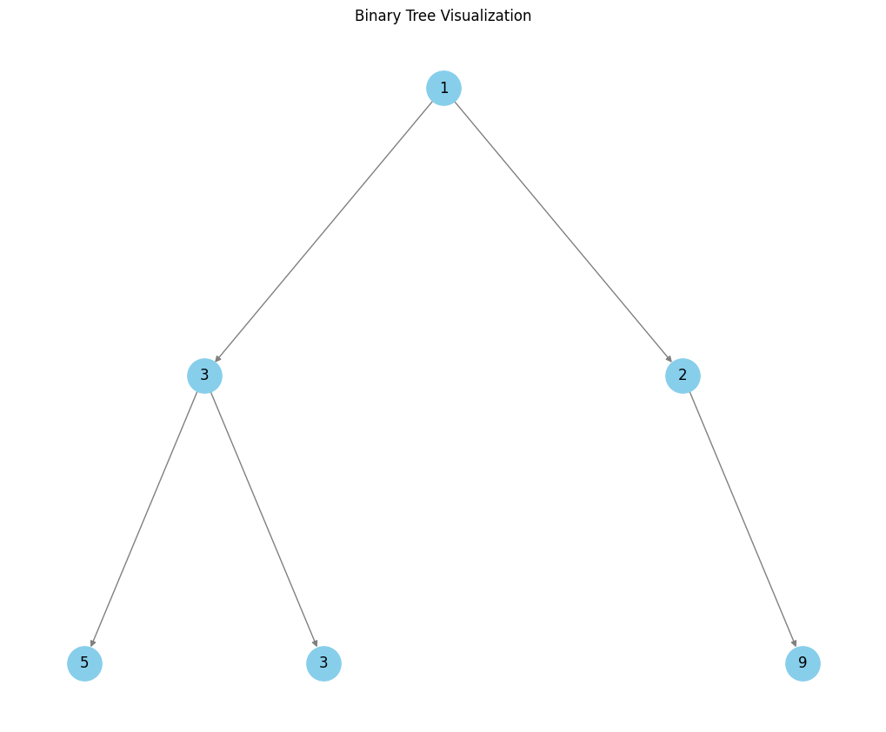
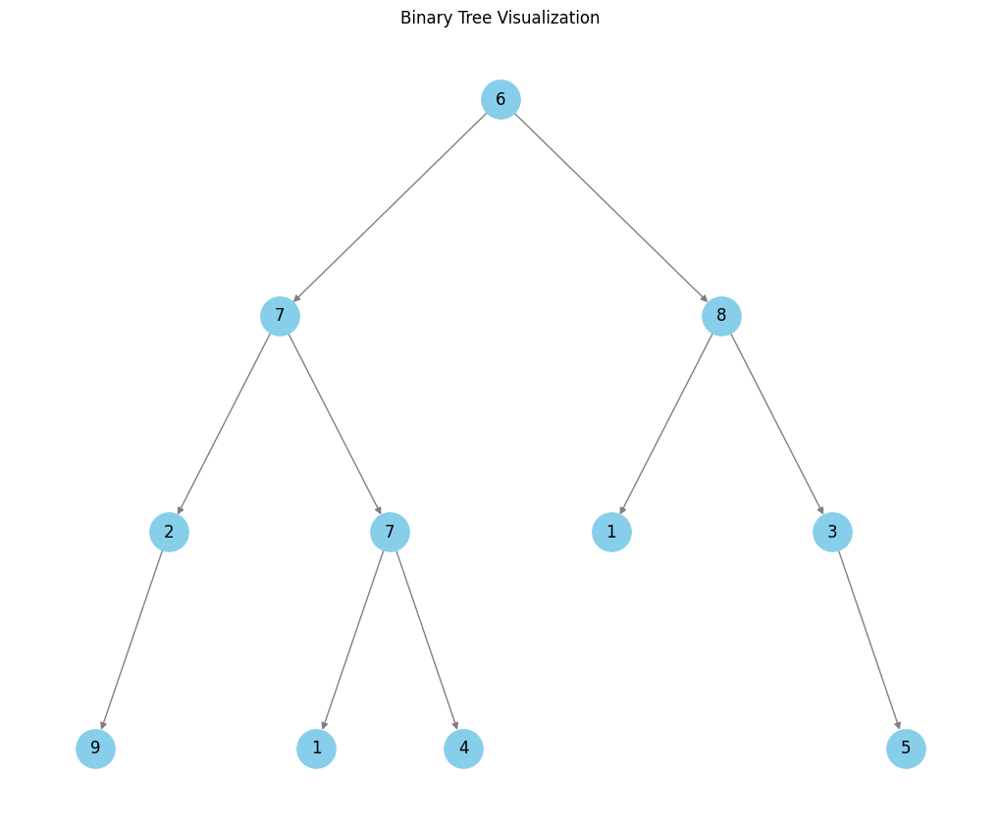
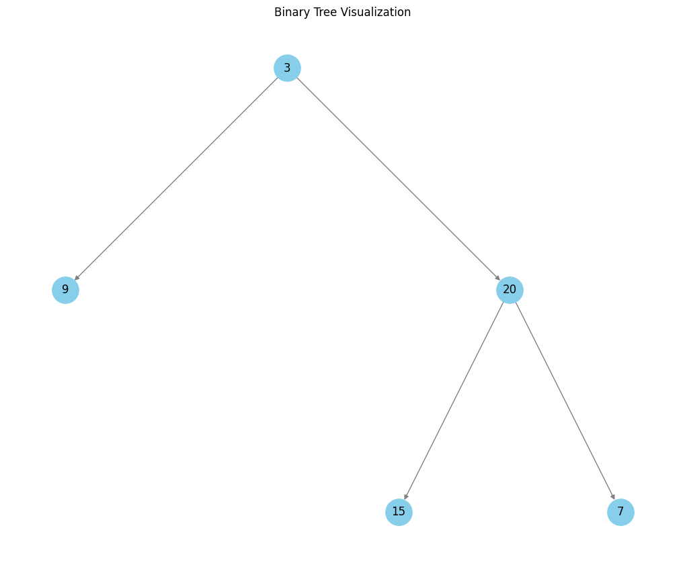

# Right Side View of Binary Tree

Given the `root` of a binary tree, find the value of the rightmost node at each level of the tree.

## Explanation

Consider the binary tree `[1, 2, 3, 4, None, None, None, 5]`:

<div style="text-align: center;">
    
</div>

The breadth-first search (BFS) algorithm explores each level, enqueuing children nodes from left to right and capturing the last node in the queue at each level.

<center>

| Level | Nodes at Level | Queue Before Processing          | Rightmost Node Added | Queue After Processing     |
|-------|----------------|---------------------------------|----------------------|----------------------------|
| 1     | 1              | `[1]`                           | `1`                  | `[2, 3]`                   |
| 2     | 2, 3           | `[2, 3]`                        | `3`                  | `[4]`                      |
| 3     | 4              | `[4]`                           | `4`                  | `[5]`                      |
| 4     | 5              | `[5]`                           | `5`                  | `[]` (Empty)               |

</center>

The rightmost nodes at each level are `[1, 3, 4, 5]`. These are the nodes that are visible when the tree is viewed from the right side.

## Time Complexity

The algorithm uses a breadth-first traversal:

- **Queue Operations:**

  - Every node is enqueued and dequeued exactly once.
  - Enqueue (`append`) and dequeue (`popleft`) operations are each $O(1)$.

- **Node Processing:**

  - Each node is processed exactly once: checked for left and right children.
  - Operations per node (enqueueing children, appending rightmost nodes) are $O(1)$.

Hence, the overall time complexity of the BFS algorithm is $O(n)$, where $n$ is the number of nodes in the binary tree.

## Space Complexity

The algorithm's space complexity is dominated by the maximum size of the queue at any point during traversal:

- **Worst Case (Complete Binary Tree):** Maximum queue size is at the last level, roughly $\frac{n}{2}$, resulting in $O(n)$ space complexity.

    A complete binary tree is a binary tree in which every level, except possibly the last, is completely filled, and all nodes in the last level are as far left as possible.

    In a complete (or nearly complete) binary tree, about half of its nodes can reside at the last level. To see why, consider a perfect binary tree with height $h$. Such a tree has exactly $2^{h+1}-1$ nodes in total, and its last level contains $2^h$ nodes. Since $2^h$ is roughly half of $2^{h+1}-1$, that last level alone can hold about half of the entire node count.

    ```
    # The queue may contain all nodes at the last level 2^2 = 4
          1
         / \
        2   3
       / \ / \
      4  5 6  7
    ```

- **Best Case (Skewed Tree):** Only one node is present at each level, giving an $O(1)$ queue size.

    ```
    # The queue may contain only one node at each level
          1
           \
            2
             \
              3
               \
                4
                 \
                  5
    ```

Therefore, the general space complexity is:

$$
O(w)
$$

where $w$ is the maximum width (number of nodes at the widest level) of the binary tree. In the worst case of a complete tree, $w$ can be proportional to $n$, making the space complexity $O(n)$.

---

# Find Largest Values in Each Tree Level

Given the `root` of a binary tree, find the largest value at each level of the tree.

## Explanation

Consider the binary tree `[1, 3, 2, 5, 3, None, 9]`:

<div style="text-align: center;">
    
</div>

The breadth-first search (BFS) algorithm explores each level, tracking the maximum value at each level.

<center>

| Level | Nodes at Level | Queue Before Processing | Current Max Value | Node Processing Steps | Queue After Processing |
|-------|----------------|-------------------------|-------------------|----------------------|------------------------|
| 1     | 1              | `[1]`                   | Initial: -maxsize | Node 1: Max = 1      | `[3, 2]`               |
| 2     | 3, 2           | `[3, 2]`                | Initial: -maxsize | Node 3: Max = 3<br>Node 2: Max = 3 | `[5, 3, 9]` |
| 3     | 5, 3, 9        | `[5, 3, 9]`             | Initial: -maxsize | Node 5: Max = 5<br>Node 3: Max = 5<br>Node 9: Max = 9 | `[]` (Empty) |

</center>

### Detailed Processing

- **Level 1:**
  - Process node 1 (root)
  - Update max value to 1
  - Enqueue children: 3 (left) and 2 (right)
  - Add 1 to result: `[1]`

- **Level 2:**
  - Process node 3
  - Update max value to 3
  - Enqueue children: 5 (left) and 3 (right)
  - Process node 2
  - Max value remains 3
  - Enqueue child: 9 (right)
  - Add 3 to result: `[1, 3]`

- **Level 3:**
  - Process node 5
  - Update max value to 5
  - Process node 3
  - Max value remains 5
  - Process node 9
  - Update max value to 9
  - Add 9 to result: `[1, 3, 9]`

The final result is `[1, 3, 9]`, representing the largest value at each level of the tree.

## Time Complexity

### Parameters

- $n$: Total number of nodes in the binary tree
- $h$: Height of the binary tree (number of levels)
- $n_i$: Number of nodes at level $i$ (where $1 \leq i \leq h$)

### Operation Costs

1. **Node Processing**: Each node is processed exactly once
   - Dequeue operation: $O(1)$ per node
   - Value comparison: $O(1)$ per node
   - Child existence check: $O(1)$ per node
   - Child enqueue: $O(1)$ per child node

2. **Level Management**: Operations performed once per level
   - Initialize max value: $O(1)$ per level
   - Calculate number of nodes: $O(1)$ per level
   - Append to result: $O(1)$ per level

### Total Time Complexity

$$T(n) = \sum_{i=1}^{h} \left( c_1 \cdot n_i + c_2 \right)$$

Where:

- $c_1$ represents constant time for per-node operations
- $c_2$ represents constant time for per-level operations

Since $\sum_{i=1}^{h} n_i = n$ (total nodes), this simplifies to:

$$
\begin{align*}
T(n) &= c_1 \sum_{i=1}^{h} n_i + \sum_{i=1}^{h} c_2 \\
&= c_1 \cdot n + h \cdot c_2 \\
&= O(c_1 \cdot n + c_2 \cdot h) \\
&= O(n + h)
\end{align*}
$$

### Bounds Relationship

For any binary tree:

- Best case (balanced): $h = O(\log n)$, giving $T(n) = O(n)$
- Worst case (skewed): $h = O(n)$, giving $T(n) = O(n)$

Therefore, while the precise complexity is $O(n + h)$, in asymptotic analysis this simplifies to $O(n)$ since $h$ is bounded by $n$ and the node processing dominates level management costs for large trees.

The explicit $O(n + h)$ notation is valuable as it captures the algorithm's sensitivity to both the total number of nodes and the tree's height.

## Space Complexity

### Parameters

- $n$: Total number of nodes in the binary tree
- $h$: Height of the binary tree (number of levels)
- $w$: Maximum width of the binary tree (maximum number of nodes at any level)

### Space Components

1. **Queue Storage**: The BFS queue stores nodes awaiting processing
   - At any point, the queue contains at most all nodes at a particular level
   - Maximum queue size equals the maximum width of the tree: $O(w)$

2. **Result Storage**: The output array stores one maximum value per level
   - Size of the output array equals the number of levels: $O(h)$

3. **Auxiliary Variables**: Constants and level tracking variables
   - Fixed number of variables regardless of input size: $O(1)$

### Total Space Complexity

$$S(n) = O(w + h + 1) = O(w + h)$$

### Tree Shape Analysis

The space complexity depends on the tree's shape:

- **Perfect/Complete Binary Tree:**

  - Maximum width occurs at the lowest level: $w = \lceil \frac{n}{2} \rceil$
  - Height is logarithmic: $h = O(\log n)$
  - Space complexity: $O(n + \log n) = O(n)$

  ```
       1
     /   \
    2     3
   / \   / \
  4   5 6   7
  ```

- **Skewed Tree:**

  - Maximum width is constant: $w = 1$
  - Height equals number of nodes: $h = n$
  - Space complexity: $O(1 + n) = O(n)$

  ```
  1
   \
    2
     \
      3
       \
        4
  ```

- **Balanced Non-Complete Tree:**

  - Maximum width can be up to $\lceil \frac{n}{2} \rceil$
  - Height is logarithmic: $h = O(\log n)$
  - Space complexity: $O(n + \log n) = O(n)$

### Bounds Relationship

For any binary tree structure:

- Width bound: $1 \leq w \leq n$
- Height bound: $\log n \leq h \leq n$

Therefore, the general space complexity is $O(w + h)$, which in worst-case scenarios simplifies to $O(n)$.

The $O(w + h)$ notation is valuable because it precisely captures how the space usage varies with different tree structures, even though asymptotically it's equivalent to $O(n)$.

---

# Deepest Leaves Sum

Given the `root` of a binary tree, return the sum of values of its deepest leaves.

## Explanation

Consider the binary tree `[6, 7, 8, 2, 7, 1, 3, 9, None, 1, 4, None, None, None, 5]`:

<div style="text-align: center;">
    
</div>

The breadth-first search (BFS) algorithm explores the tree level by level, keeping track of the sum of node values at each level. The deepest leaves are identified by being the last level of nodes processed in the BFS traversal.

### Level 1

| Step | Current Queue | Action | Running Sum | Result |
|------|---------------|--------|-------------|--------|
| 1    | [6]           | Dequeue node 6 | 0 + 6 = 6 | Sum = 6 |
| 2    | []            | Enqueue left child 7 | - | Queue = [7] |
| 3    | [7]           | Enqueue right child 8 | - | Queue = [7, 8] |

### Level 2

| Step | Current Queue | Action | Running Sum | Result |
|------|---------------|--------|-------------|--------|
| 1    | [7, 8]        | Dequeue node 7 | 0 + 7 = 7 | Sum = 7 |
| 2    | [8]           | Enqueue left child 2 | - | Queue = [8, 2] |
| 3    | [8, 2]        | Enqueue right child 7 | - | Queue = [8, 2, 7] |
| 4    | [8, 2, 7]     | Dequeue node 8 | 7 + 8 = 15 | Sum = 15 |
| 5    | [2, 7]        | Enqueue left child 1 | - | Queue = [2, 7, 1] |
| 6    | [2, 7, 1]     | Enqueue right child 3 | - | Queue = [2, 7, 1, 3] |

### Level 3

| Step | Current Queue | Action | Running Sum | Result |
|------|---------------|--------|-------------|--------|
| 1    | [2, 7, 1, 3]  | Dequeue node 2 | 0 + 2 = 2 | Sum = 2 |
| 2    | [7, 1, 3]     | Enqueue left child 9 | - | Queue = [7, 1, 3, 9] |
| 3    | [7, 1, 3, 9]  | Dequeue node 7 | 2 + 7 = 9 | Sum = 9 |
| 4    | [1, 3, 9]     | Enqueue left child 1 | - | Queue = [1, 3, 9, 1] |
| 5    | [1, 3, 9, 1]  | Enqueue right child 4 | - | Queue = [1, 3, 9, 1, 4] |
| 6    | [1, 3, 9, 1, 4] | Dequeue node 1 | 9 + 1 = 10 | Sum = 10 |
| 7    | [3, 9, 1, 4]  | Dequeue node 3 | 10 + 3 = 13 | Sum = 13 |
| 8    | [9, 1, 4]     | Enqueue right child 5 | - | Queue = [9, 1, 4, 5] |

### Level 4 (Deepest Level)

| Step | Current Queue | Action | Running Sum | Result |
|------|---------------|--------|-------------|--------|
| 1    | [9, 1, 4, 5]  | Dequeue node 9 | 0 + 9 = 9 | Sum = 9 |
| 2    | [1, 4, 5]     | Dequeue node 1 | 9 + 1 = 10 | Sum = 10 |
| 3    | [4, 5]        | Dequeue node 4 | 10 + 4 = 14 | Sum = 14 |
| 4    | [5]           | Dequeue node 5 | 14 + 5 = 19 | Sum = 19 |
| 5    | []            | Queue empty | - | Final Sum = 19 |

The deepest leaves sum for this binary tree is 19, representing the sum of all leaf nodes at the deepest level (level 4).

## Time Complexity

### Parameters

- $n$: Total number of nodes in the binary tree
- $h$: Height of the binary tree (number of levels)
- $n_i$: Number of nodes at level $i$ (where $1 \leq i \leq h$)

### Operation Costs

1. **Node Processing**: Each node is processed exactly once

    - Dequeue operation: $O(1)$ per node
    - Value addition `+`: $O(1)$ per node
    - Child existence check: $O(1)$ per node
    - Child enqueue: $O(1)$ per child node

2. **Level Management**: Operations performed once per level

   - Setting level sum to 0: $O(1)$ per level
   - Calculate number of nodes: $O(1)$ per level

### Total Time Complexity

Similar to all previous problems, the time complexity can be expressed as:

$$T(n) = \sum_{i=1}^{h} \left( c_1 \cdot n_i + c_2 \right)$$

Where:

- $c_1$ represents constant time for per-node operations
- $c_2$ represents constant time for per-level operations

Again, this asymptotically simplifies to $O(n)$.

## Space Complexity

The space complexity of the algorithm can be analyzed based on its memory requirements:

### Space Components

1. **Queue Storage**:

   - The queue stores nodes waiting to be processed at each level
   - Maximum queue size at any point equals the maximum width of the tree: $O(w)$

2. **Result Storage**:

   - Unlike previous problems that store values for each level, this algorithm only maintains a single sum variable that gets overwritten with each new level
   - This requires only $O(1)$ auxiliary space

3. **Control Variables**: Level counter and nodes-per-level counter: $O(1)$

### Total Space Complexity

$$S(n) = O(w + 1) = O(w)$$

Where $w$ represents the maximum width of the binary tree.

### Tree Shape Analysis

- **Perfect/Complete Binary Tree**: Maximum width at the lowest level is approximately $\frac{n}{2}$, giving $O(n)$ space
- **Skewed Tree**: Width is consistently 1, giving $O(1)$ space
- **Balanced Non-Complete Tree**: Width is bounded by $O(n)$ in the worst case

Since we only need to maintain the queue and a constant number of variables (regardless of height), the space complexity is more precisely $O(w)$ rather than $O(w + h)$ as seen in previous problems that required level-by-level result storage.

For asymptotic analysis, since $w$ is bounded by $n$, the worst-case space complexity simplifies to $O(n)$.

---

# Binary Tree Zigzag Level Order Traversal

Given the `root` of a binary tree, return the zigzag level order traversal of its nodes' values. (i.e., from left to right, then right to left for the next level and alternate between).

## Explanation

Consider the binary tree `[3, 9, 20, None, None, 15, 7]`:

<div style="text-align: center;">
    
</div>

The zig-zag traversal algorithm explores each level of the tree, alternating between left-to-right and right-to-left order. For even-indexed levels (starting at 0), nodes are processed left-to-right. For odd-indexed levels, nodes are processed right-to-left.

### Detailed Processing

<center>

| Level | Nodes at Level | Queue Before Processing | Current Deque | Node Processing | Queue After Level | Result |
|-------|----------------|-------------------------|---------------|-----------------|-------------------|--------|
| 0 (even) | 3 | `[3]` | `[]` | Node 3: Append to end → `[3]`<br>Enqueue left child 9<br>Enqueue right child 20 | `[9, 20]` | `[[3]]` |
| 1 (odd) | 9, 20 | `[9, 20]` | `[]` | Node 9: Append to front → `[9]`<br>No children<br>Node 20: Append to front → `[20, 9]`<br>Enqueue left child 15<br>Enqueue right child 7 | `[15, 7]` | `[[3], [20, 9]]` |
| 2 (even) | 15, 7 | `[15, 7]` | `[]` | Node 15: Append to end → `[15]`<br>No children<br>Node 7: Append to end → `[15, 7]`<br>No children | `[]` | `[[3], [20, 9], [15, 7]]` |

</center>

### Execution Steps

1. **Initialize**:
   - Create empty queue and add root node
   - Start with level = 0 (even)

2. **Level 0 (even order: left-to-right)**:
   - Process node 3
   - Append 3 to current level deque: `[3]`
   - Enqueue children: 9 (left) and 20 (right)
   - Queue becomes: `[9, 20]`
   - Add level result to output: `[[3]]`

3. **Level 1 (odd order: right-to-left)**:
   - Process node 9
   - Append 9 to front of current level deque: `[9]`
   - No children to enqueue
   - Process node 20
   - Append 20 to front of current level deque: `[20, 9]`
   - Enqueue children: 15 (left) and 7 (right)
   - Queue becomes: `[15, 7]`
   - Add level result to output: `[[3], [20, 9]]`

4. **Level 2 (even order: left-to-right)**:
   - Process node 15
   - Append 15 to current level deque: `[15]`
   - No children to enqueue
   - Process node 7
   - Append 7 to current level deque: `[15, 7]`
   - No children to enqueue
   - Queue becomes empty
   - Add level result to output: `[[3], [20, 9], [15, 7]]`

The final result is `[[3], [20, 9], [15, 7]]`, representing the zigzag traversal of the tree.

## Time Complexity

The algorithm performs a breadth-first traversal of the tree:

### Parameters

- $n$: Total number of nodes in the binary tree
- $h$: Height of the binary tree (number of levels)
- $n_i$: Number of nodes at level $i$ (where $0 \leq i < h$)

### Operation Costs

1. **Node Processing**: Each node is processed exactly once
   - Dequeue operation: $O(1)$ per node
   - Append/appendleft to deque: $O(1)$ per node
   - Child existence check: $O(1)$ per node
   - Child enqueue: $O(1)$ per child

2. **Level Management**: Operations performed once per level
   - Create new deque: $O(1)$ per level
   - Level counter increment: $O(1)$ per level
   - Add level result to output: $O(1)$ per level

Again, since $h$ is bounded by $n$ and the node processing dominates level management costs for large trees, the asymptotic time complexity simplifies to:

$$T(n) = O(n)$$

## Space Complexity

### Parameters

- $n$: Total number of nodes in the binary tree
- $h$: Height of the binary tree (number of levels)
- $w$: Maximum width of the binary tree (maximum number of nodes at any level)

### Space Components

1. **Queue Storage**:
   - The queue stores nodes waiting to be processed at each level
   - Maximum queue size equals the maximum width of the tree: $O(w)$

2. **Result Storage**:
   - The output stores one deque per level, with each deque containing node values for that level
   - Total space for results: $O(n)$ as each node value appears exactly once

3. **Auxiliary Variables**:
   - Level counter and temporary deques: $O(h)$

### Total Space Complexity

$$S(n) = O(w + n + h)$$

Since both $w$ and $h$ are bounded by $n$, the space complexity simplifies to:

$$S(n) = O(n)$$

### Tree Shape Analysis

The space complexity varies based on tree shape:

- **Complete Binary Tree**:
  - Width at the lowest level is approximately $\frac{n}{2}$
  - Queue size: $O(n)$
  - Result storage: $O(n)$
  - Space complexity: $O(n)$

- **Skewed Tree**:
  - Width is consistently 1
  - Queue size: $O(1)$
  - Result storage still requires $O(n)$ for all node values
  - Space complexity: $O(n)$

In all cases, the asymptotic space complexity remains $O(n)$.
