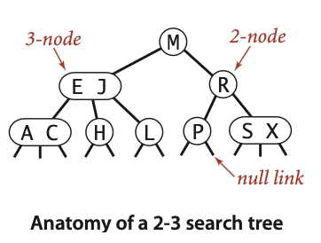
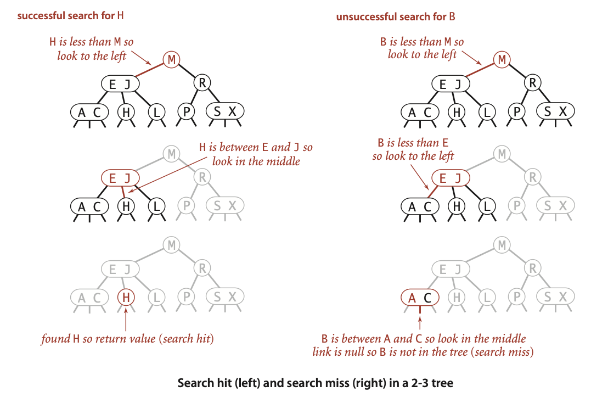
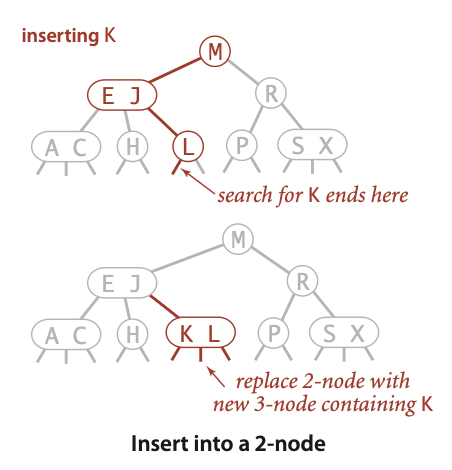
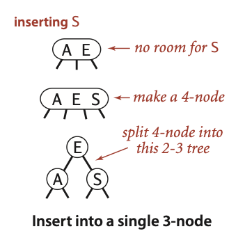
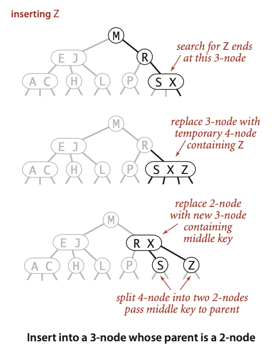
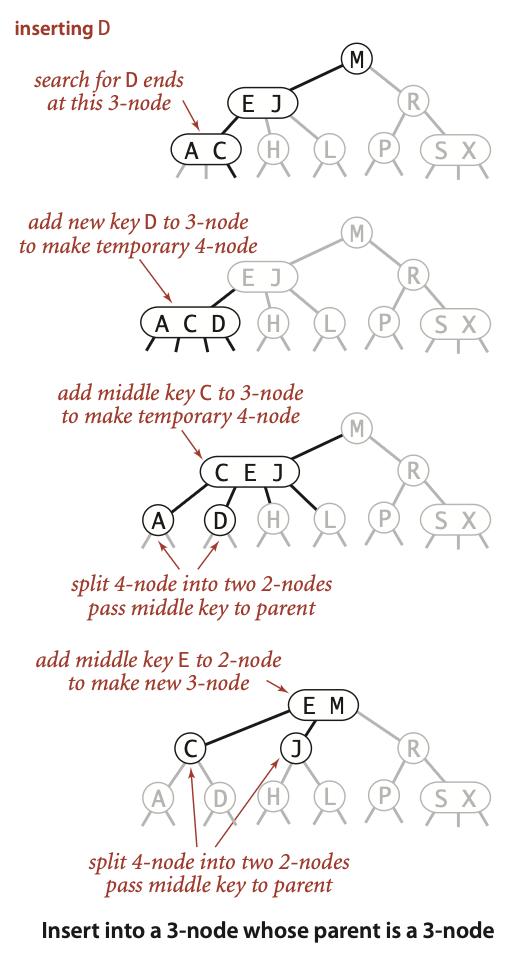
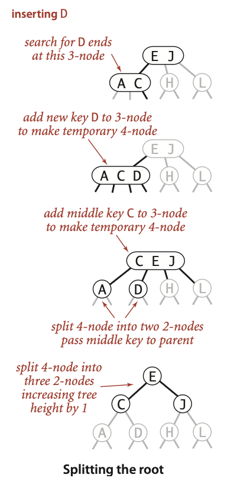
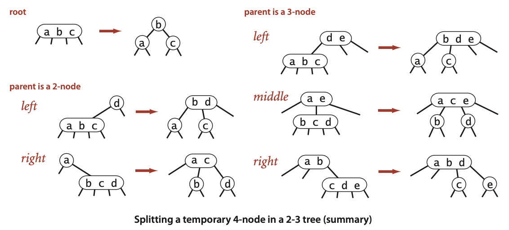
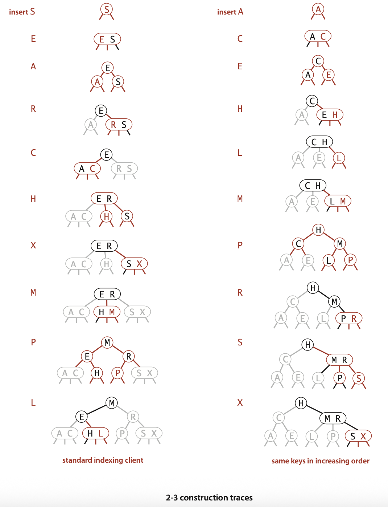

# Balanced Search Tree

# 2-3 Search Tree

| Node type  | Keys                   | Child links | Key-interval handled by each child                                                  |
| ---------- | ---------------------- | ----------- | ----------------------------------------------------------------------------------- |
| **2-node** | **1 key**  k         | **2**       | **Left:** keys < k  &  **Right:** keys > k                                          |
| **3-node** | **2 keys** $k_1 < k_2$ | **3**       | **Left:** keys < $k_1$ & **Middle:** $k_1$ < keys < $k_2$ & **Right:** keys > $k_2$ |

*Null links point to empty sub-trees.* A 2-3 tree is **perfectly balanced** when every root-to-null path has the same length (the tree’s height).

    

## Search

    

## Insert

### Insert 2-node

    

### Insert 3-node

#### Single 3-node

    

#### 3-node with 2-node parent

    

#### 3-node with 3-node parent

    

#### 3-node from insertion point to root

    

> A 2-3 tree’s height increases only in this single situation where the existing root is already a 3-node and, during an insertion, a key is promoted into it so that it becomes a temporary 4-node, forcing a split.

## Splitting a 4-node

Splitting a temporary 4-node in a 2-3 tree involves one of six transformations:

    

## Tree Construction

Unlike standard binary search trees, which grows from the root down, 2-3 trees grow from the leaves up. The tree is constructed by inserting keys into the leaves, and then splitting nodes as necessary to maintain balance.

    

## Logarithmic Guarantees for Search and Insert

The primary interest in 2-3 trees is in worst-case performance, as opposed to average-case performance for standard binary search trees.

> Search and insert operations in a 2-3 tree with $n$ keys are guaranteed to visit at most $\log(n)$ nodes.

Let

* $h$ = height of the tree (number of links on any root-to-leaf path, so a single node has $h=0$)
* $\lg x$ = $\log_2 x$
* $\log_3 x$ = logarithm base 3

### Capacity of a full 3-node tree

A **3-node** contains **2 keys** and, if it is an internal node, **3 children**.

For a tree whose every node is a 3-node:

* level $i$ ($0\le i\le h-1$) has $3^{i}$ internal nodes;
* level $h$ contains the leaves, also $3^{h}$ nodes (they still hold 2 keys each, but have no children)

Hence

$$
\begin{align*}
\text{number of nodes}&=\sum_{i=0}^{h-1} 3^{i}+3^{h} \\
              &=\frac{3^{h}-1}{2}+3^{h} \\
              &=\frac{3^h - 1 + 2 \cdot 3^h}{2} \\
              &=\frac{3 \cdot 3^h - 1}{2} \\
              &=\frac{3^{h+1}-1}{2} \qquad \text{Apply exponent rule:} \; a^b \cdot a^c=a^{b+c} \rightarrow 3^1 \cdot 3^h=3^{1+h}
\end{align*}
$$

Multiplying by 2 keys per node:

$$
2\cdot\frac{3^{h+1}-1}{2}=3^{h+1}-1
$$

So if $N$ keys fit in height $h$:

$$
N \le 3^{h+1}-1 \quad \Longleftrightarrow \quad h \ge \log_3(N+1)-1
$$

To see this:

$$
\begin{align*}
N &\le 3^{h+1}-1 \\
N+1 &\le 3^{h+1} \\
\log_3(N+1) &\le h+1 \\
\log_3(N+1)-1 &\le h
\end{align*}
$$

This is the **smallest possible height**, attained when the tree is all 3-nodes.

### Capacity of a full binary 2-node tree

A **2-node** contains **1 key** and, if it is internal, **2 children**.

If every node is a 2-node:

* internal nodes (levels $0$ to $h-1$): $2^{h}-1$
* leaves (level $h$): $2^{h}$

Total nodes:

$$
\begin{align*}
\text{number of nodes}&=2^{h}-1+2^{h} \\
                      &=2 \cdot 2^{h}-1 \\
                      &=2^{h+1}-1 \qquad \text{Apply exponent rule:} \;a^b \cdot a^c=a^{b+c} \rightarrow 2^1 \cdot 2^h=2^{1+h}
\end{align*}
$$

Each node has one key; to store $N$ keys we **must have**

$$
N \ge 2^{h+1}-1 \quad \Longleftrightarrow \quad h \le \lg(N+1)-1
$$

To see this:

$$
\begin{align*}
N &\ge 2^{h+1}-1 \\
N+1 &\ge 2^{h+1} \\
\lg(N+1) &\ge h+1 \\
\lg(N+1)-1 &\ge h
\end{align*}
$$

This gives the **largest possible height**, attained when the tree is all 2-nodes.

### Why the 3-node analysis yields a **lower** bound on $h$

* Each internal node of a 2-3 tree has **at most** 3 children.
* Replacing any 2-node on a root-to-leaf path by a 3-node **increases** the number of keys the tree can hold **without changing the height**.
* Therefore, for a fixed height $h$, the **maximum** number of keys possible is achieved when **every** node is a 3-node.
* To be able to store $N$ keys we must have

$$
N \le 3^{h+1}-1
$$

  hence

$$
h \ge \log_3(N+1)-1
$$

  This inequality gives the **smallest height permitted** by the structure; that is why it is a lower bound.

### Why the 2-node analysis yields an **upper** bound on $h$

* Each internal node of a 2-3 tree has **at least** 2 children.
* Replacing any 3-node on a root-to-leaf path by a 2-node **reduces** the number of keys the tree can hold while **keeping the height unchanged**.
* Consequently, for height $h$, the **minimum** number of keys that can possibly appear is when every node is a 2-node:

$$
2^{h+1}-1
$$

* If we have **only** $N$ keys, the height cannot exceed the value that would force the tree below this minimum, so

$$
N \ge 2^{h+1}-1 \Longrightarrow h \le \lg(N+1)-1
$$

  This is the **largest height** consistent with $N$, i.e. an upper bound.

### Combined bounds

Putting (1) and (2) together, every 2–3 tree satisfies

$$
\boxed{
\log_3(N+1)-1
\le
h
\le
\lg(N+1)-1
}
$$

or, using floors/ceilings for integer heights:

$$
\left\lceil\log_3(N+1)\right\rceil-1
\le
h
\le
\left\lceil\lg(N+1)\right\rceil-1
$$

### Asymptotics

> $\lg 3\approx 1.585 \Rightarrow \frac{1}{\lg 3}=\frac{1}{1.585} \approx 0.63093$

Because $\log_3 N=\frac{\lg N}{\lg 3}\approx 0.63093 \lg N$, we can rewrite the bounds on height as:

$$
0.63\lg N \lesssim h \lesssim \lg N
$$

Thus the height of any 2–3 tree with $N$ keys is bounded below by roughly $\lfloor\log_3 N\rfloor$ ($\approx0.63\lg N$) and above by $\lfloor\lg N\rfloor$.
