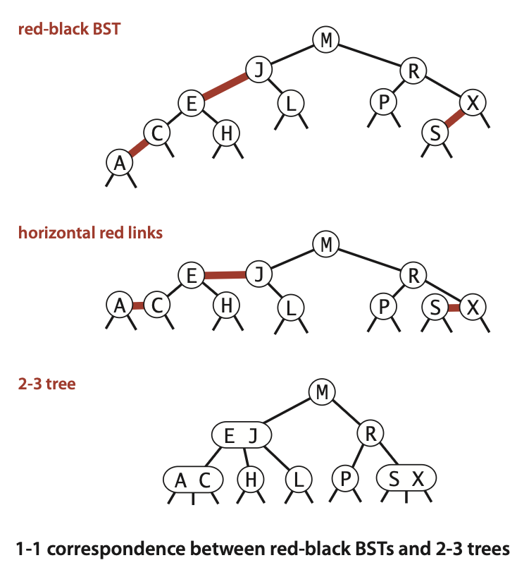
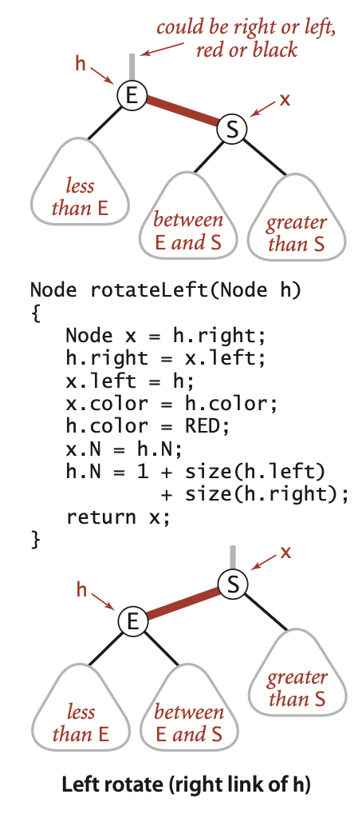
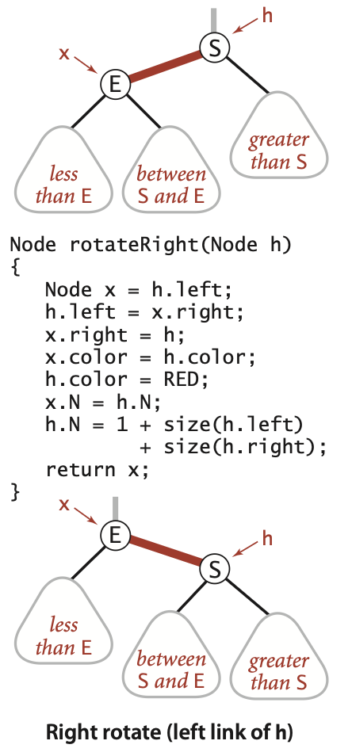
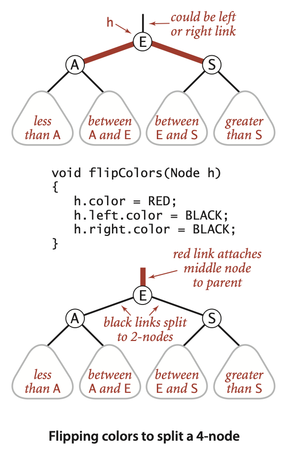
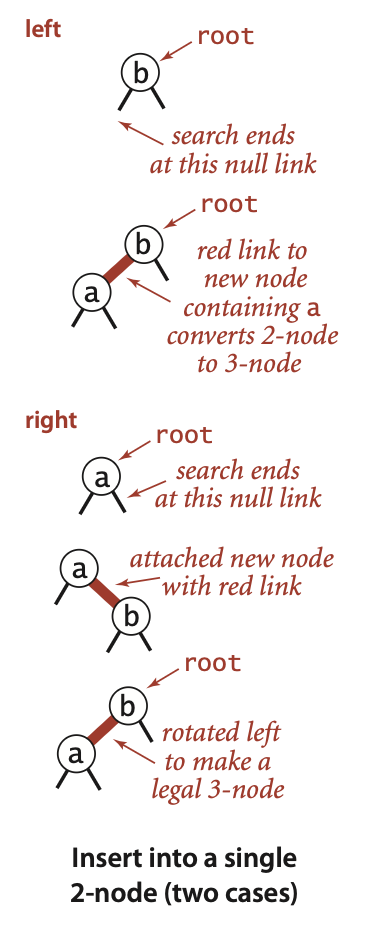
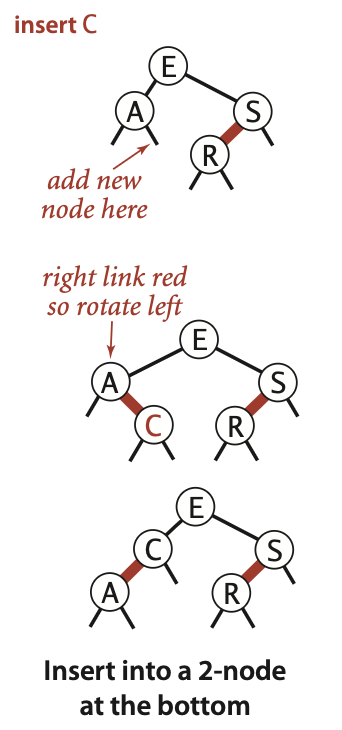
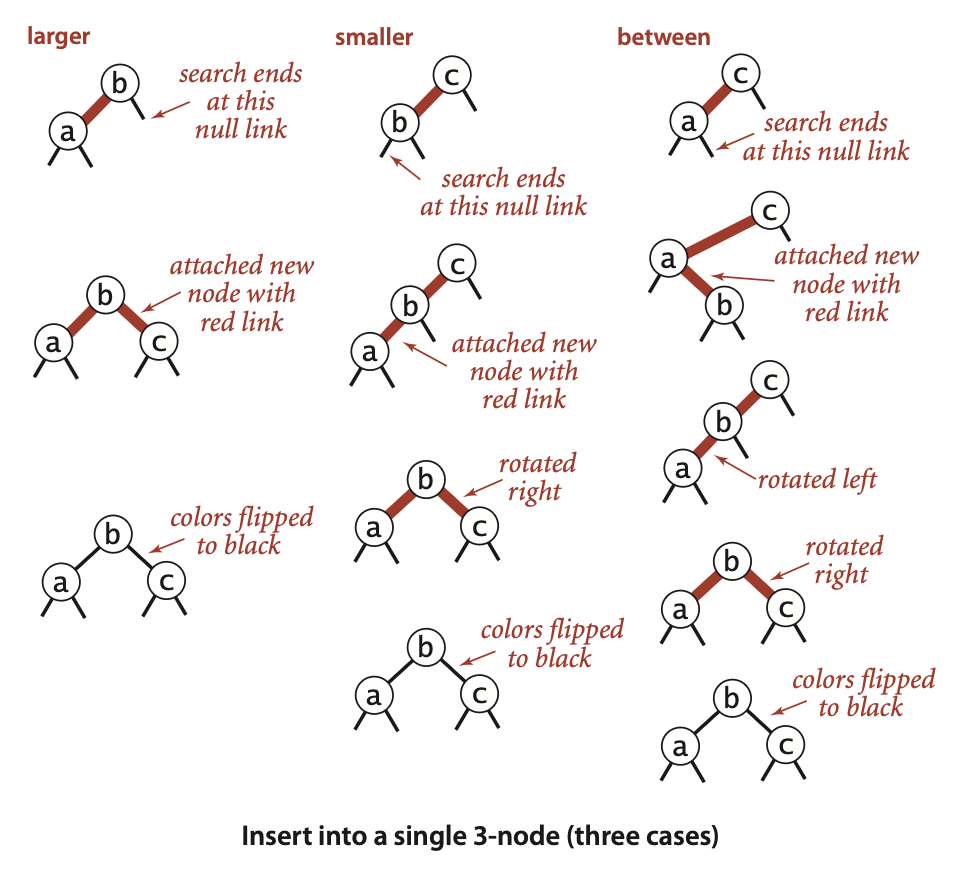
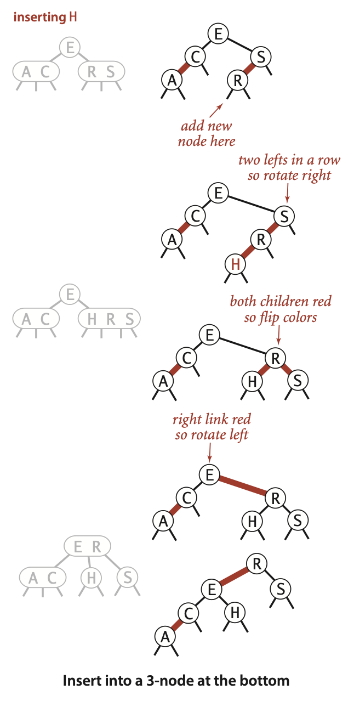
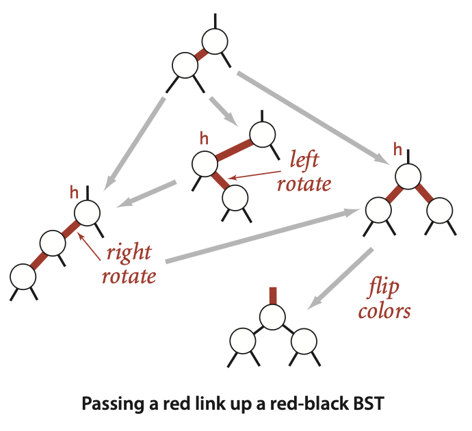

# Balanced Search Tree

# 2-3 Search Tree

| Node type  | Keys                   | Child links | Key-interval handled by each child                                                  |
| ---------- | ---------------------- | ----------- | ----------------------------------------------------------------------------------- |
| **2-node** | **1 key**  k         | **2**       | **Left:** keys < k  &  **Right:** keys > k                                          |
| **3-node** | **2 keys** $k_1 < k_2$ | **3**       | **Left:** keys < $k_1$ & **Middle:** $k_1$ < keys < $k_2$ & **Right:** keys > $k_2$ |

*Null links point to empty sub-trees.* A 2-3 tree is **perfectly balanced** when every root-to-null path has the same length (the tree’s height).

    

## Search

    

## Insert

### Insert 2-node

    

### Insert 3-node

#### Single 3-node

    

#### 3-node with 2-node parent

    

#### 3-node with 3-node parent

    

#### 3-node from insertion point to root

    

> A 2-3 tree’s height increases only in this single situation where the existing root is already a 3-node and, during an insertion, a key is promoted into it so that it becomes a temporary 4-node, forcing a split.

## Splitting a 4-node

Splitting a temporary 4-node in a 2-3 tree involves one of six transformations:

    

## Tree Construction

Unlike standard binary search trees, which grows from the root down, 2-3 trees grow from the leaves up. The tree is constructed by inserting keys into the leaves, and then splitting nodes as necessary to maintain balance.

    

## Logarithmic Guarantees for Search and Insert

The primary interest in 2-3 trees is in worst-case performance, as opposed to average-case performance for standard binary search trees.

> Search and insert operations in a 2-3 tree with $n$ keys are guaranteed to visit at most $\log(n)$ nodes.

Let

* $h$ = height of the tree (number of links on any root-to-leaf path, so a single node has $h=0$)
* $\lg x$ = $\log_2 x$
* $\log_3 x$ = logarithm base 3

### Capacity of a full 3-node tree

A **3-node** contains **2 keys** and, if it is an internal node, **3 children**.

For a tree whose every node is a 3-node:

* level $i$ ($0\le i\le h-1$) has $3^{i}$ internal nodes;
* level $h$ contains the leaves, also $3^{h}$ nodes (they still hold 2 keys each, but have no children)

Hence

$$
\begin{align*}
\text{number of nodes}&=\sum_{i=0}^{h-1} 3^{i}+3^{h} \\
              &=\frac{3^{h}-1}{2}+3^{h} \\
              &=\frac{3^h - 1 + 2 \cdot 3^h}{2} \\
              &=\frac{3 \cdot 3^h - 1}{2} \\
              &=\frac{3^{h+1}-1}{2} \qquad \text{Apply exponent rule:} \; a^b \cdot a^c=a^{b+c} \rightarrow 3^1 \cdot 3^h=3^{1+h}
\end{align*}
$$

Multiplying by 2 keys per node:

$$
2\cdot\frac{3^{h+1}-1}{2}=3^{h+1}-1
$$

So if $N$ keys fit in height $h$:

$$
N \le 3^{h+1}-1 \quad \Longleftrightarrow \quad h \ge \log_3(N+1)-1
$$

To see this:

$$
\begin{align*}
N &\le 3^{h+1}-1 \\
N+1 &\le 3^{h+1} \\
\log_3(N+1) &\le h+1 \\
\log_3(N+1)-1 &\le h
\end{align*}
$$

This is the **smallest possible height**, attained when the tree is all 3-nodes.

### Capacity of a full binary 2-node tree

A **2-node** contains **1 key** and, if it is internal, **2 children**.

If every node is a 2-node:

* internal nodes (levels $0$ to $h-1$): $2^{h}-1$
* leaves (level $h$): $2^{h}$

Total nodes:

$$
\begin{align*}
\text{number of nodes}&=2^{h}-1+2^{h} \\
                      &=2 \cdot 2^{h}-1 \\
                      &=2^{h+1}-1 \qquad \text{Apply exponent rule:} \;a^b \cdot a^c=a^{b+c} \rightarrow 2^1 \cdot 2^h=2^{1+h}
\end{align*}
$$

Each node has one key; to store $N$ keys we **must have**

$$
N \ge 2^{h+1}-1 \quad \Longleftrightarrow \quad h \le \lg(N+1)-1
$$

To see this:

$$
\begin{align*}
N &\ge 2^{h+1}-1 \\
N+1 &\ge 2^{h+1} \\
\lg(N+1) &\ge h+1 \\
\lg(N+1)-1 &\ge h
\end{align*}
$$

This gives the **largest possible height**, attained when the tree is all 2-nodes.

### Why the 3-node analysis yields a **lower** bound on $h$

* Each internal node of a 2-3 tree has **at most** 3 children.
* Replacing any 2-node on a root-to-leaf path by a 3-node **increases** the number of keys the tree can hold **without changing the height**.
* Therefore, for a fixed height $h$, the **maximum** number of keys possible is achieved when **every** node is a 3-node.
* To be able to store $N$ keys we must have

$$
N \le 3^{h+1}-1
$$

  hence

$$
h \ge \log_3(N+1)-1
$$

  This inequality gives the **smallest height permitted** by the structure; that is why it is a lower bound.

### Why the 2-node analysis yields an **upper** bound on $h$

* Each internal node of a 2-3 tree has **at least** 2 children.
* Replacing any 3-node on a root-to-leaf path by a 2-node **reduces** the number of keys the tree can hold while **keeping the height unchanged**.
* Consequently, for height $h$, the **minimum** number of keys that can possibly appear is when every node is a 2-node:

$$
2^{h+1}-1
$$

* If we have **only** $N$ keys, the height cannot exceed the value that would force the tree below this minimum, so

$$
N \ge 2^{h+1}-1 \Longrightarrow h \le \lg(N+1)-1
$$

  This is the **largest height** consistent with $N$, i.e. an upper bound.

### Combined bounds

Putting (1) and (2) together, every 2–3 tree satisfies

$$
\boxed{\log_3(N+1)-1 \le h \le \lg(N+1)-1}
$$

or, using floors/ceilings for integer heights:

$$
\left\lceil\log_3(N+1)\right\rceil-1 \le h \le \left\lceil\lg(N+1)\right\rceil-1
$$

### Asymptotics

> $\lg 3\approx 1.585 \Rightarrow \frac{1}{\lg 3}=\frac{1}{1.585} \approx 0.63093$

Because $\log_3 N=\frac{\lg N}{\lg 3}\approx 0.63093 \lg N$, we can rewrite the bounds on height as:

$$
0.63\lg N \lesssim h \lesssim \lg N
$$

Thus the height of any 2–3 tree with $N$ keys is bounded below by roughly $\lfloor\log_3 N\rfloor$ ($\approx0.63\lg N$) and above by $\lfloor\lg N\rfloor$.

---

# Red-Black Binary Search Tree

A **red-black binary search tree** is a representation for a 2-3 tree. The core idea is to encode 2-3 tree starting with standard binary search tree, adding extra information to encode 3-nodes.

We can define red-black binary search tree as a binary search tree with red and black links and satisfying the following restrictions:

1. Red links lean left

2. No node has two red links connected to it

3. The binary search tree has **perfect black balance**, i.e., every path from the root to a leaf has the same number of black links

A red-black binary search tree defined in this way has a 1-to-1 correspondence with a 2-3 tree.

    

## Rotations

### Left Rotation

When we have a *temporarily* right-leaning red link that needs to be rotated to lean to the left, this is called a left rotation.

    

### Right Rotation

Sometimes we need to rotate a left-leaning red link to lean to the right. This is called a right rotation.

    

## Color Flipping

Another operation we can perform is color flipping, which is used to maintain the red-black properties of the tree.

    

## Insert

### Insert into a single 2-node

    

### Insert into a 2-node at the bottom

    

### Insert into a 3-node (three cases)

    

### Insert into a 3-node at the bottom

    

### Summary of Insert

The 1-1 correspondence between 2-3 trees and red-black binary search trees during insertion can be maintained using the three simple operations: rotate, right rotate, and color flip.

* If the right child is red and the left child is black, rotate left.
* If both the left child and its left child are red, rotate right.
* If both children are red, flip colors.

    

## Red-Black Tree Construction

    

## Propositions

### Height Upper-Bound for Red-Black Binary Search Tree

> The height of a red-black BST with N nodes is no more than $2\lg(N)$

| Symbol    | Meaning                                                                                                                           |
| --------- | --------------------------------------------------------------------------------------------------------------------------------- |
| $h$     | *Ordinary height* – number of links on the longest root-to-null path                                                              |
| $b$     | *Black height* – number of **black** links on any root-to-null path (by perfect-black balance every such path has the same $b$) |
| $\lg x$ | $\log_2 x$                                                                                                                     |

#### 2. Each black link at least doubles the subtree size $\Longrightarrow b \le \lg(N+1)$

We prove by induction that a subtree whose root has **black-height** $t$ contains at least $2^{t}-1$ internal nodes.

**Claim.** Let $n(t)$ be the minimum possible number of internal nodes in any red-black subtree whose root has black-height $t$. Then

$$
n(t) = 2^{t} - 1, \qquad t \ge 0
$$

*Base t = 0.* A black-height of 0 means the root is the single shared black *nil* sentinel, so the subtree contributes  

$$
0 = 2^{0}-1
$$

internal nodes.

*Inductive hypothesis.* Assume that **every** subtree with black-height $t$ has at least  

$$
n(t) = 2^{t}-1
$$

internal nodes.

*Inductive step (black-height t + 1).*  Take a subtree whose root $r$ satisfies $bh(r)= t + 1$, where $bh(r)$ is the number of black nodes (excluding $r$) on any path from $r$ down to a leaf sentinel.

1. **Children’s black-heights.** Every internal node has two outgoing links (left and right). For a given child $c$ of $r$:

    | Parent colour    | What the RB rules say about each child          | How many of the *t + 1* black nodes are "used up" between `r` and the child?                                                                                                                                  | Resulting $bh(\text{child})$                                             |
    | ---------------- | ----------------------------------------------- | ------------------------------------------------------------------------------------------------------------------------------------------------------------------------------------------------------------- | ------------------------------------------------------------------------ |
    | **`r` is black** | No color restriction on a child                | 1) If the link `r -> c` is **black**, that link itself is counted, so one of the *t + 1* blacks is already used   2) If the link `r -> c` is **red**, the first black link comes **one step lower**; none have been used yet | Either way, exactly *t* black nodes still remain below `c`, so bh(c) = t |

   Thus **both** child subtrees of $r$ with $t + 1$ black nodes have black-height $t$.

2. **Lower bound for children.** By the inductive hypothesis each child subtree contains at least $n(t) = 2^{t}-1$ internal nodes.

3. **Add the root itself and multiply by 2.** The entire subtree contains at least $1 + 2n(t)$ internal nodes:

$$
1 + 2n(t) = 1 + 2(2^{t}-1) = 2^{t+1}-1 = n(t+1)
$$

By induction the claim holds for all $t \ge 0$; in particular, a black-height of $b$ forces at least $2^{b}-1$ internal nodes.

Letting $N$ be the total number of internal nodes in the tree,

$$
N \ge 2^{b}-1 \quad\Longrightarrow\quad b \le \lg(N+1)
$$

To see this:

$$
\begin{align*}
N &\ge 2^{b}-1 \\
N+1 &\ge 2^{b} \\
\lg(N+1) &\ge b
\end{align*}
$$

**Why “doubling” really happens**

The lower-bound sequence for the minimum number of internal nodes is

* level 0 (black-height 0) `2^0 - 1 = 0` nodes  
* level 1 (black-height 1) `2^1 - 1 = 1` node  
* level 2 (black-height 2) `2^2 - 1 = 3` nodes  
* level 3 (black-height 3) `2^3 - 1 = 7` nodes  

The recurrence behind these numbers is $2n(t)+1$. When the black-height increases from $t$ to $t + 1$, the minimal subtree size **doubles** the previous minimum and then adds 1. That is, one more mandatory black link forces at least a *doubling* of the minimal subtree size.

#### 3. Combine $h \le 2b$ and $b \le \lg(N+1)$

Substituting $b \le \lg(N+1)$ into $h \le 2b$ gives us the final result:

$$
\begin{align*}
h &\le 2b           && \text{At most one red per black on any path} \\
  &\le 2\lg(N+1)    && b\le\lg(N+1) \\
  &= 2\lg(N \cdot (1+\tfrac1N)) && N + 1 = N(1 + \frac{1}{N}) \\
  &= 2\Bigl[\lg N + \lg(1+\tfrac{1}{N})\Bigr] && \text{log-product rule} \\
  &= 2\lg N + 2\lg(1+\tfrac{1}{N}) \\
  &< 2\lg N + 2 && 0 < \lg(1+\tfrac{1}{N}) < 1
\end{align*}
$$

Removing the additive constant, the height $h$ of a red-black binary search tree with $N$ nodes is at most $2\lg(N)$.

### Average Height of Red-Black Binary Search Tree

> The average length of a path from the root to a node in a red-black binary search tree is $\sim 1.00\lg(N)$

The proof of this proposition is based on empirical data and simulations, even for trees built by inserting keys in increasing order.

### Logarithmic Guarantees for Worst-Case

> In a red- black binary search tree, search, insertion, finding minimum and maximum, floor, ceiling, rank, select, deleting minimum and maximum, deleting a node, and range counting operations are guaranteed to take logarithmic time in the worst case.

This follows directly from the two propositions:

> In a binary search tree, all operations take time proportional to the height of the tree, in the worst case

> The height of a red-black BST with N nodes is no more than $2\lg(N)$
