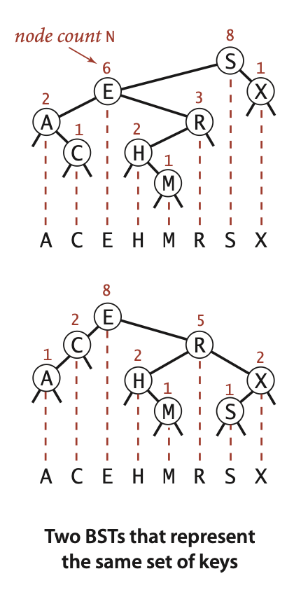
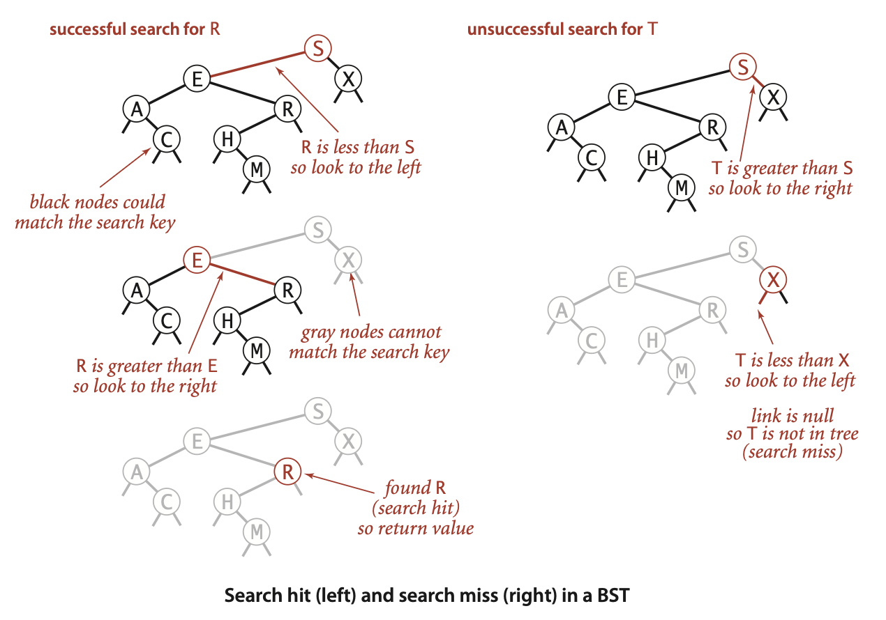
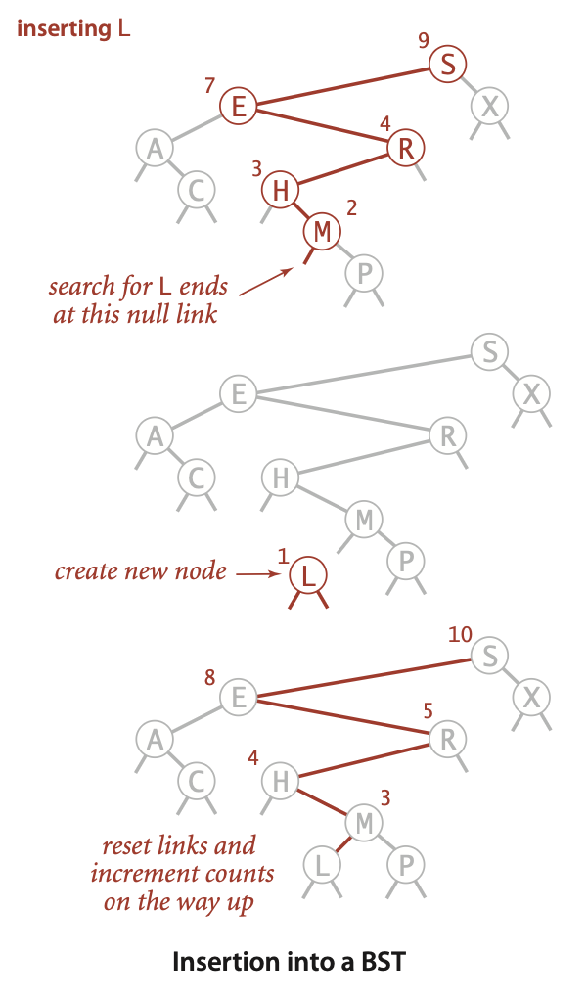
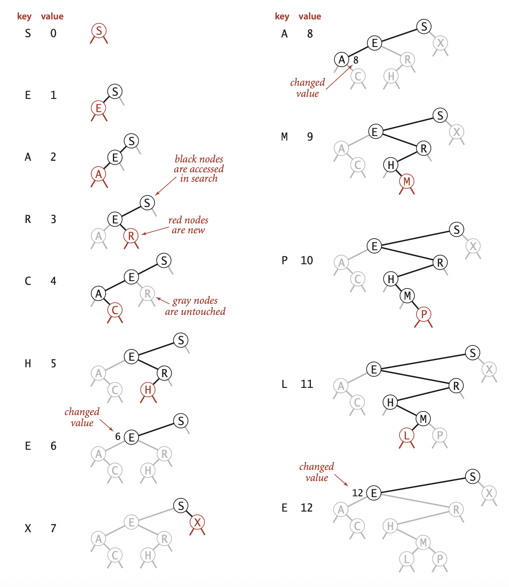
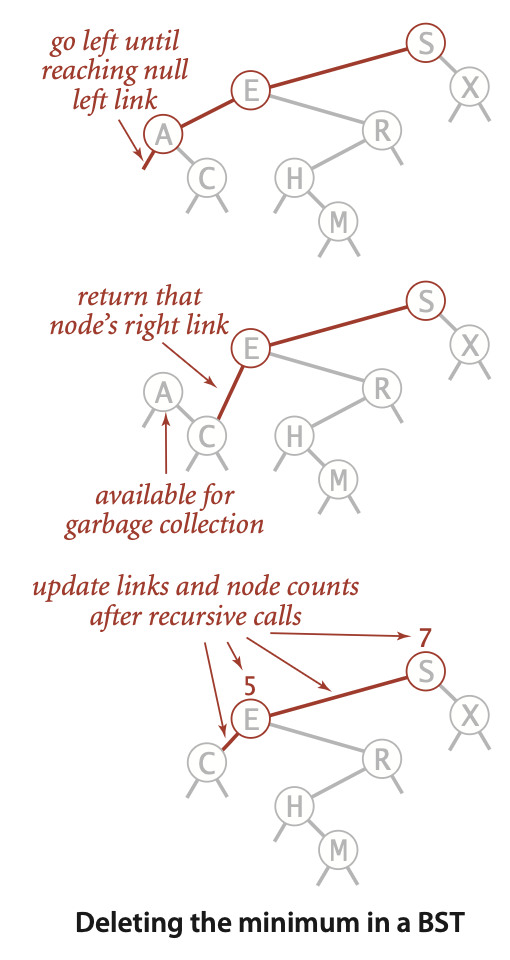
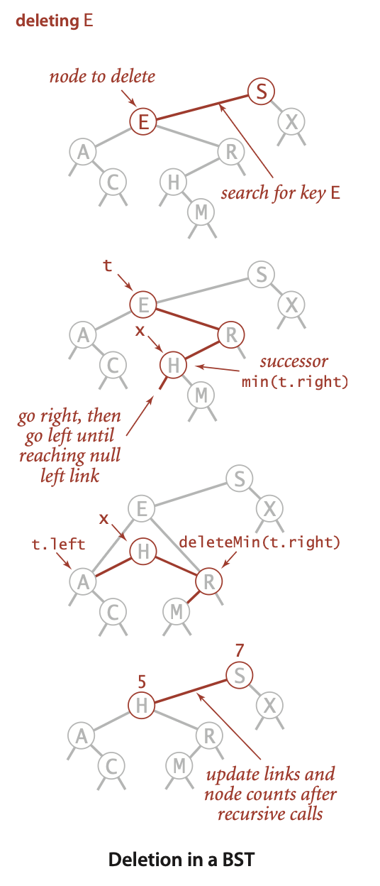
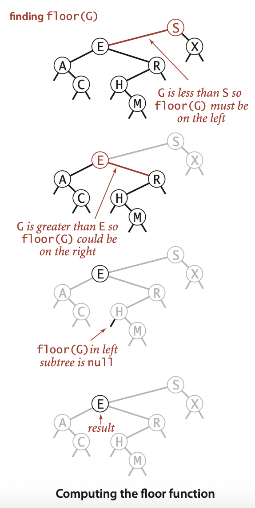
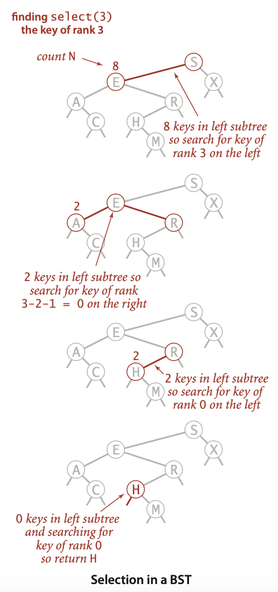

# Binary Search Trees (BST)

A **Binary Search Tree (BST)** is a binary tree that maintains the ordering property:

- For every node, all keys in the left subtree are **strictly less** than the node’s key.
- For every node, all keys in the right subtree are **strictly greater** than the node’s key.

## Core Properties

1. **Ordering (Search) Property** – defined above.
2. **Binary Structure** – each node has at most two children.
3. **Uniqueness** – classic BSTs assume unique keys.
4. **In‑order Traversal** – yields keys in ascending order.

### Representation

A binary search tree represents a set of keys (and associated values); the shape of the tree is determined by the order in which the keys are inserted. This means that the same set of keys can be represented by different trees.

Consider the following keys `[5, 3, 7, 2, 4, 6, 8]`; the sorted order of these keys is `[2, 3, 4, 5, 6, 7, 8]`. The following trees are all valid BSTs for this same set of keys:

    

Efficient performance of a basic binary search tree (BST) relies on the keys being sufficiently random, minimizing the likelihood of the tree developing many long, unbalanced paths.

## Size

The size of every node $x$ in a binary search tree is defined as follows:

$$
  \text{size}(x) = \text{size}(x.\text{left}) + \text{size}(x.\text{right}) + 1
$$

    

## Search

    

## Insert

    

## Construction

    

## Delete

**Delete Minimum**

    

**Delete**

The following example illustrates the deletion of a node with two children, known as the **Hibbard deletion**. The node to be deleted is replaced by its in-order successor (the smallest key in the right subtree) (or in-order predecessor, the largest key in the left subtree). This ensures that the BST properties are maintained after deletion.

- Save a link to the node to be deleted in `t`

- Set `x` to point to its successor `min(t.right)`

- Set the right link of `x` (which is supposed to point to the BST containing all the keys larger than `x.key`) to `deleteMin(t.right)`, the link to the BST containing all the keys that are larger than `x.key` after the deletion

- Set the left link of `x` (which was null) to `t.left` (all the keys that are less than both the deleted key and its successor)

    

## Floor and Ceiling

    

## Select and Rank

    

## Propositions

### Search and Insert

Searching for a key in a BST is done by comparing the key with the root node and recursively searching in either the left or right subtree, depending on whether the key is less than or greater than the root node's key.

> Search hits, in which a key is found in the tree, in a BST built from $n$ random keys require ~ $2\ln(n)$ (about $1.39\ln n$) comparisons on average.

Insertion in a BST is similar to searching: traverse the tree based on key comparisons until a null child position is found, and insert the new key there. Or, in the case of a duplicate key, update the value associated with the key (there are other strategies for handling duplicates but this is the simplest).

> Insertions and search misses in a BST built from $n$ random keys also require ~ $2\ln(n)$ (about $1.39\ln n$) comparisons on average.

Given a tree, its height determines the worst-case cost of all binary search tree operations except for range search, which has additional cost proportional to the number of keys returned.

> In a BST, all operations take time proportional to the height of the
tree, in the worst case. All of these methods go down one or two paths in the tree. The length of any path is no more than the height, by definition.

### Cost of Binary Search Tree vs. Binary Search

This means that we can expect the BST search cost for random keys to be about $39$ percent higher than that for binary search, which is $\ln(n)$ comparisons.

But this additional cost is worth it because the cost of inserting a new key is also logarithmic for BST. This is in contrast to binary search in an ordered array, in which case the number of array accesses required for insertion is **linear** in the number of keys in the array.

### Logarithm Bases: ln vs. log base 2

In **asymptotic** bounds (Θ‑ or O‑notation) we simply write **log n** (implicitly base 2, but any constant‐factor change of base is absorbed) because  

$$
  \log_a n = \frac{\ln(n)}{\ln(a)} = Θ(\ln(n))\quad\text{for any fixed }a>1.
$$

We can use $\ln(n)$ only when we need the **exact** constant factors that arise in precise analyses; for example, the expected number of comparisons in a random BST is  

$$
  E[\text{number of comparisons}] = 2\ln(n)
$$

because this derivation comes from continuous integrals yielding natural logarithms. In algorithm‑design discussions where we don’t care about that constant factor, we can revert to $Θ(log n)$, implying base 2.

## Operations and Asymptotic Complexities

Let *n* be the number of nodes, *h* the tree height ($h\approxΘ(log n)$ if balanced; $h=Θ(n - 1)=Θ(n)$ in the worst‑case degenerate tree):

> [Reed 2003](https://dl.acm.org/doi/10.1145/765568.765571) If $n$ distinct keys are inserted into a binary search tree in random order, the expected height of the tree is $h \approx 4.311\ln(n)$.

| Operation          | Time (expected)¹ | Time (worst)² | Aux. Space (recursion) |
|--------------------|------------------|---------------|------------------------|
| **Search**         | Θ(log *n*)       | Θ(*n*)        | Θ(*h*)                 |
| **Insert**         | Θ(log *n*)       | Θ(*n*)        | Θ(*h*)                 |
| **Delete***         | Θ(log *n*)      | Θ(*n*)        | Θ(*h*)                 |
| **Min/Max**        | Θ(log *n*)       | Θ(*n*)        | Θ(*h*)                 |
| **Floor/Ceiling**  | Θ(log *n*)       | Θ(*n*)        | Θ(*h*)                 |
| **Select**         | Θ(log *n*)       | Θ(*n*)        | Θ(*h*)                 |
| **Rank**           | Θ(log *n*)       | Θ(*n*)        | Θ(*h*)                 |

1. Expected cost for all operations in a **plain BST** when keys are inserted in *random order*.  
2. Worst‑case cost for all operations in a **plain BST** when the tree degenerates (e.g. sorted insertions).
3. Hibbard deletion keeps each *individual* delete in **O(log n)** on the current tree, but a long sequence of random insertions and Hibbard deletions is known to *unbalance* the tree. After roughly $Θ(n)$ mixed operations, the expected height degrades to $Θ(\sqrt{n})$, so the average cost of **search/insert/delete** likewise rises to $Θ(\sqrt{n})$.
