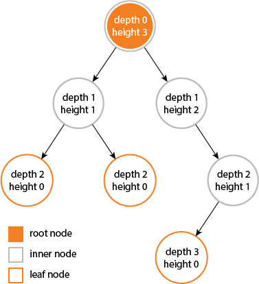

# Binary Search Trees (BST)

A **Binary Search Tree (BST)** is a binary tree that maintains the ordering property:

- For every node, all keys in the left subtree are **strictly less** than the node’s key.
- For every node, all keys in the right subtree are **strictly greater** than the node’s key.

> All logarithms below are base 2 by convention; in Θ‑notation, the base is immaterial.

---

## Core Properties

1. **Ordering (Search) Property** – defined above.
2. **Binary Structure** – each node has at most two children.
3. **Uniqueness** – classic BSTs assume unique keys.
4. **In‑order Traversal** – yields keys in ascending order.

### Representation

A binary search tree represents a set of keys (and associated values); the shape of the tree is determined by the order in which the keys are inserted. This means that the same set of keys can be represented by different trees.

Consider the following keys `[5, 3, 7, 2, 4, 6, 8]`; the sorted order of these keys is `[2, 3, 4, 5, 6, 7, 8]`. The following trees are all valid BSTs for this same set of keys:

    

Efficient performance of a basic binary search tree (BST) relies on the keys being sufficiently random, minimizing the likelihood of the tree developing many long, unbalanced paths.

## Propositions

### Search and Insert

Searching for a key in a BST is done by comparing the key with the root node and recursively searching in either the left or right subtree, depending on whether the key is less than or greater than the root node's key.

> Search hits, in which a key is found in the tree, in a BST built from $n$ random keys require ~ $2\ln n$ (about $1.39 \ln n$) comparisons on average.

Insertion in a BST is similar to searching: traverse the tree based on key comparisons until a null child position is found, and insert the new key there. Or, in the case of a duplicate key, update the value associated with the key (there are other strategies for handling duplicates but this is the simplest).

> Insertions and search misses in a BST built from $n$ random keys also require ~ $2\ln n$ (about $1.39 \ln n$) comparisons on average.

### Cost of BST vs. Binary Search

This means that we can expect the BST search cost for random keys to be about $39\%$ higher than that for binary search, which is $\ln n$ comparisons.

But this additional cost is worth it because the cost of inserting a new key is also logarithmic for BST. This is in contrast to binary search in an ordered array, in which case the number of array accesses required for insertion is **linear** in the number of keys in the array.

### Logarithm Bases: ln vs. log base 2

In **asymptotic** bounds (Θ‑ or O‑notation) we simply write **log n** (implicitly base 2, but any constant‐factor change of base is absorbed) because  

$$
  \log_a n = \frac{\ln n}{\ln a} = Θ(\ln n)\quad\text{for any fixed }a>1.
$$

We can use $\ln n$ only when we need the **exact** constant factors that arise in precise analyses; for example, the expected number of comparisons in a random BST is  

$$
  E[\text{number of comparisons}] = 2\ln n
$$

because this derivation comes from continuous integrals yielding natural logarithms. In algorithm‑design discussions where we don’t care about that constant factor, we can revert to $Θ(log n)$, implying base 2.

---

## Operations and Asymptotic Complexities

Let *n* be the number of nodes, *h* the tree height ($h\approxΘ(log n)$ if balanced; $h=Θ(n - 1)=Θ(n)$ in the worst‑case degenerate tree):

> [Reed 2003](https://dl.acm.org/doi/10.1145/765568.765571) If $n$ distinct keys are inserted into a binary search tree in random order, the expected height of the tree is $h \approx 4.311\ln n$.

| Operation          | Time (expected)¹ | Time (worst)² | Aux. Space (recursion) |
|--------------------|------------------|---------------|------------------------|
| **Search**         | Θ(log *n*)       | Θ(*n*)        | Θ(*h*)                 |
| **Insert**         | Θ(log *n*)       | Θ(*n*)        | Θ(*h*)                 |
| **Delete***         | Θ(log *n*)      | Θ(*n*)        | Θ(*h*)                 |
| **Min/Max**        | Θ(log *n*)       | Θ(*n*)        | Θ(*h*)                 |
| **Floor/Ceiling**  | Θ(log *n*)       | Θ(*n*)        | Θ(*h*)                 |
| **Select**         | Θ(log *n*)       | Θ(*n*)        | Θ(*h*)                 |
| **Rank**           | Θ(log *n*)       | Θ(*n*)        | Θ(*h*)                 |

1. Expected cost for all operations in a **plain BST** when keys are inserted in *random order*.  
2. Worst‑case cost for all operations in a **plain BST** when the tree degenerates (e.g. sorted insertions).
3. Hibbard deletion keeps each *individual* delete in **O(log n)** on the current tree, but a long sequence of random insertions and Hibbard deletions is known to *unbalance* the tree. After roughly $Θ(n)$ mixed operations, the expected height degrades to $Θ(\sqrt{n})$, so the average cost of **search/insert/delete** likewise rises to $Θ(\sqrt{n})$.

---

## Comparison with Other Data Structures

| Structure                      | Search       | Insert       | Delete       | Aux. Space stack | Maintains Order? |
|--------------------------------|--------------|--------------|--------------|------------------|------------------|
| **Self‑balancing BST** (AVL, RB‑tree, etc.)   | Θ(log n)     | Θ(log n)     | Θ(log n)         | Θ(log n) | ✔     |
| **Plain BST (average)**        | Θ(log n) | Θ(log n) | Θ(log n) | Θ(log n) | ✔ |
| **Plain BST (worst)**          | Θ(n) | Θ(n) | Θ(n) | Θ(n) | ✔ |
| **Array (unsorted)**           | Θ(n) | Θ(1) | Θ(n) | Θ(1) | ✖ |
| **Array (sorted)**             | Θ(log n) | Θ(n) | Θ(n) | Θ(1) | ✔ |
| **Hash Table***                | Θ(1) | Θ(1) | Θ(1) | Θ(1) | ✖ |
| **Linked List**                | Θ(n) | Θ(1) | Θ(n) | Θ(1) | ✖ |

\* Average‑case with a good hash function; worst‑case Θ(n).

---

## Height and Depth in Binary Trees

### Node

- **Depth of a Node:**

  - The **depth** of a node is defined as the number of edges from that node **up** to the root node of the tree.
  - The root node has a depth of `0`.

- **Height of a Node:**

  - The **height** of a node is the number of edges on the longest path from that node **down** to a leaf node.
  - A leaf node has a height of `0`.

### Tree

- **Height of a Tree:**

  - The height of a binary tree is equal to the height of its root node.
  - Alternatively, the height of a tree is equal to the depth of the deepest leaf node.

- **Diameter (Width) of a Tree:**

  - The diameter of a tree is the number of nodes on the longest path between any two leaf nodes.
  - The diameter reflects the "width" or maximum extent of the tree.

### Visual Representation

Consider the following binary tree illustration from [stackoverflow](https://stackoverflow.com/a/2603707/12923148):

    

In this diagram:

- The root node has a depth of `0` and height of `3`.
- The diameter (width) of this particular tree is `6` nodes.
