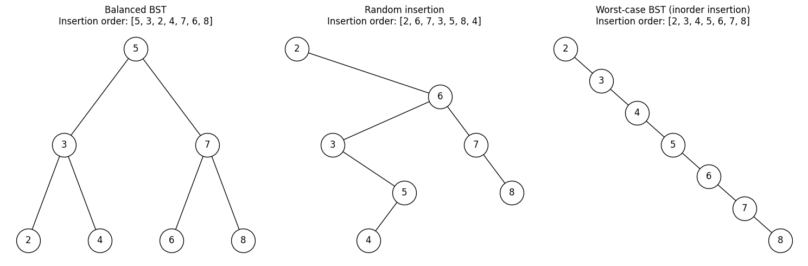

# Binary Search Trees (BST)

A **Binary Search Tree (BST)** is a binary tree that maintains the ordering property:

- For every node, all keys in the left subtree are **strictly less** than the node’s key.
- For every node, all keys in the right subtree are **strictly greater** than the node’s key.

> All logarithms below are base 2 by convention; in Θ‑notation the base is immaterial.

---

## Core Properties

1. **Ordering (Search) Property** – defined above.
2. **Binary Structure** – each node has at most two children.
3. **Uniqueness** – classic BSTs assume unique keys.
4. **In‑order Traversal** – yields keys in ascending order.

### Representation

A binary search tree represents a set of keys (and associated values); the shape fo the tree is determined by the order in which keys are inserted. This means that the same set of keys can be represented by different trees

Consider the following keys: `5, 3, 7, 2, 4, 6, 8`. The sorted order of these keys is `2, 3, 4, 5, 6, 7, 8`. The following trees are all valid BSTs for this set of keys:

    

Efficient performance of a basic binary search tree (BST) relies on the keys being sufficiently random, minimizing the likelihood of the tree developing many long, unbalanced paths.

## Propositions

> Search hits, in which the key is found in the tree, in a BST built from $n$ random keys require ~ $2\ln n$ (about $1.39 \ln n$) comparisons on average.

> Insertions and search misses in a BST built from $n$ random keys also require ~ $2\ln n$ (about $1.39 \ln n$) comparisons on average.

This means that we can expect the BST search cost for random keys to be about $39\%$ higher than that for binary search.

But this additional cost is worth it because the cost of inserting a new key is also logarithmic for BST. This is in contrast to binary search in an ordered array, in which case the number of array accesses required for insertion is linear in the number of keys in the array.

### Logarithm Bases: $\ln$ vs. $\log_2$

In **asymptotic** bounds (Θ‑ or O‑notation) we simply write **log n** (implicitly base 2, but any constant‐factor change of base is absorbed) because  

$$
  \log_a n = \frac{\ln n}{\ln a} = Θ(\ln n)\quad\text{for any fixed }a>1.
$$

Use $\ln n$ only when we need the **exact** constant factors that arise in precise analyses; for example, the expected number of comparisons in a random BST is  

$$
  E[\#\text{comparisons}] \;=\; 2\,\ln n
$$

since this derivation comes from continuous integrals yielding natural logarithms. In algorithm‑design discussions where we don’t care about that constant factor, revert to $Θ(log n)$.

---

## Operations and Asymptotic Complexities

Let *n* be the number of nodes, *h* the tree height ($h\approxΘ(log n)$ if balanced; $h=Θ(n - 1)=Θ(n)$ in the worst‑case degenerate tree):

> [Reed 2003](https://dl.acm.org/doi/10.1145/765568.765571) If $n$ distinct keys are inserted into a binary search tree in random order, the expected height of the tree is $h \approx 4.311\ln n$.

| Operation      | Time (expected)        | Time (worst)           | Aux. Space (recursion) |
|----------------|------------------------|------------------------|------------------------|
| **Search**     | Θ(log *n*)¹           | Θ(*n*)²               | Θ(*h*)                 |
| **Insert**     | Θ(log *n*)¹           | Θ(*n*)²               | Θ(*h*)                 |
| **Delete**     | Θ(log *n*)¹           | Θ(*n*)²               | Θ(*h*)                 |
| **Find Min/Max** | Θ(log *n*)          | Θ(*n*)                 | Θ(*h*)                 |
| **Rank**       | Θ(log *n*)                 | Θ(*n*)                 | Θ(*h*)                 |

1. Expected cost for all operations in a **plain BST** when keys are inserted in *random order*.  
2. Worst‑case cost for all operations in a **plain BST** when the tree degenerates (e.g. sorted insertions).

---

## Comparison with Other Data Structures

| Structure                      | Search       | Insert       | Delete       | Aux. Space        | Maintains Order |
|--------------------------------|--------------|--------------|--------------|-------------------|-----------------|
| **Self‑balancing BST**         | Θ(log n)     | Θ(log n)     | Θ(log n)     | Θ(log n) stack    | ✔               |
| **Plain BST (worst‑case)**     | Θ(n)         | Θ(n)         | Θ(n)         | Θ(n) stack        | ✔               |
| **Array (unsorted)**           | Θ(n)         | Θ(1)         | Θ(n)         | Θ(1)              | ✖               |
| **Array (sorted)**             | Θ(log n)     | Θ(n)         | Θ(n)         | Θ(1)              | ✔               |
| **Hash Table***                | Θ(1)         | Θ(1)         | Θ(1)         | Θ(1)              | ✖               |
| **Linked List**                | Θ(n)         | Θ(1)         | Θ(n)         | Θ(1)              | ✖               |

\* Average‑case with a good hash function; worst‑case Θ(n).
