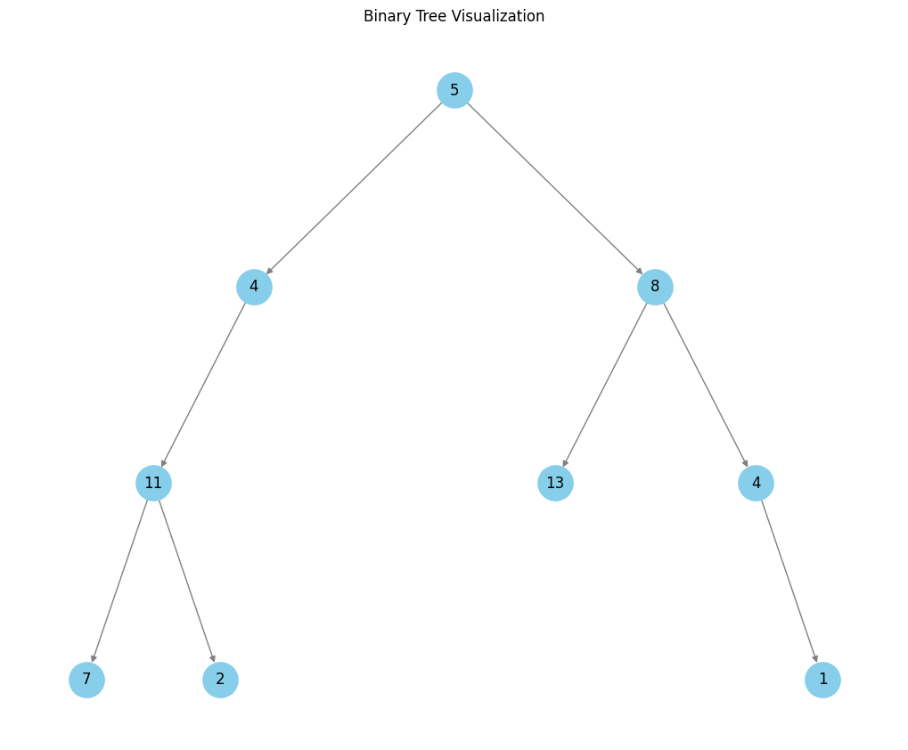

# Max Depth

Given a `root` node of a binary tree, return its maximum depth. A binary tree's maximum depth is the number of nodes along the longest path from the root node down to the farthest leaf node.

## Time Complexity

The `max_depth` function has a time complexity of `O(n)`, becuase the function visits each node in the tree exactly once. 

For each node, we perform $O(1)$ operations, i.e., checking for `None` or `nullptr`. 

## Space Complexity

The space complexity of the `max_depth` function is `O(n)`, where `n` is the number of nodes in the tree. This is because the function uses a recursive approach, which requires additional space on the call stack. The maximum depth of the call stack is equal to the height of the tree, which is `O(n)` in the worst case. 

If the tree is complete, i.e., all nodes have zero or two children, the space complexity is $O(\log n)$ as a best case scenario.

---

# Path Sum

Given the `root` of a binary tree and an integer `target`, return `true` if the tree has a root-to-leaf path such that adding up all the values along the path equals `target`; a leaf is a node with no children.

## Explanation

Consider the following binary tree with `target = 22`:

    

| Step | Node Value | Current Sum | Target | Action |
|------|------------|-------------|--------|--------|
| **Tree:** `[5, 4, 8, 11, None, 13, 4, 7, 2, None, None, None, 1]`, Target = 22 |
| 1    | 5          | 0           | 22     | `current sum (0) + node.data (5) = 5` |
| 2    | 4          | 5           | 22     | `current sum (5) + node.data (4) = 9` |
| 3    | 11         | 9           | 22     | `current sum (9) + node.data (11) = 20` |
| 4    | 7          | 20          | 22     | `We are at a leaf node, current sum (20) + node data (7) == target (22) is False` |
| 5    | 2          | 20          | 22     | `We are at a leaf node, current sum (20) + node data (2) == target (22) is True` |
|      | **Return** |             |        | `Path found, returning True` |
|      | **Explanation**         |        |        | `A path (5 -> 4 -> 11 -> 2) has a cumulative sum of 22, matching the target` |

## Time Complexity 

Each node in the binary tree is visited once as we perform a depth-first search traversal. For each node, the function:

* Check that the current `node` is not `None` or a `nullptr`, which is $O(1)$

* Check that the left and right children of the current node are none, both of which are ($O(1)$)

    - If a leaf is encountered, a sum operation is performend `curr_sum + node.data` and it is compared
      to `target`, again $O(1)$

    - If the current node is not a leaf, then `curr_sum += node.data`, which can be considered $O(1)$

In the worst case, where no path exists, and all nodes are visited, the overall time complexity of the search algorithm is $O(n)$, where $n$ is the total number of nodes in the binary tree.

## Space Complexity

The space complexity of the algorithm is influenced by the recursion stack depth, which depends on the height of the tree:

1. **Best and Average Case (Balanced Tree):** In a balanced binary tree, the height $h$ is $O(\log n)$. Thus, the recursive stack will hold up to $O(\log n)$ calls at any point, resulting in a space complexity of $O(\log n)$.
   
2. **Worst Case (Skewed Tree):** In an unbalanced, skewed tree (e.g., all nodes on one side), the height $h$ can be $O(n)$, leading to $O(n)$ recursive calls on the stack.

Hence, the overall space complexity is $O(h)$, where $h$ is the height of the tree, translating to:

   - $O(\log n)$ in the best and average case for a balanced tree
   - $O(n)$ in the worst case for a skewed tree

