# Max Depth

Given a `root` node of a binary tree, return its maximum depth. A binary tree's maximum depth is the number of nodes along the longest path from the root node down to the farthest leaf node.

## Time Complexity

The `max_depth` function has a time complexity of $O(n)$, becuase the function visits each node in the tree exactly once.

For each node, we perform $O(1)$ operations, i.e., checking for `None` or `nullptr`.

## Space Complexity

The space complexity of the `max_depth` function is $O(n)$, where $n$ is the number of nodes in the tree. This is because the function uses a recursive approach, which requires additional space on the call stack. The maximum depth of the call stack is equal to the height of the tree, which is $O(n)$ in the worst case.

If the tree is complete, i.e., all nodes have zero or two children, the space complexity is $O(\log_2 n)$ as a best case scenario.

---

# Path Sum

Given the `root` of a binary tree and an integer `target`, return `true` if the tree has a root-to-leaf path such that adding up all the values along the path equals `target`; a leaf is a node with no children.

## Explanation

Consider the following binary tree with `target = 22`:

<div style="text-align: center;">
    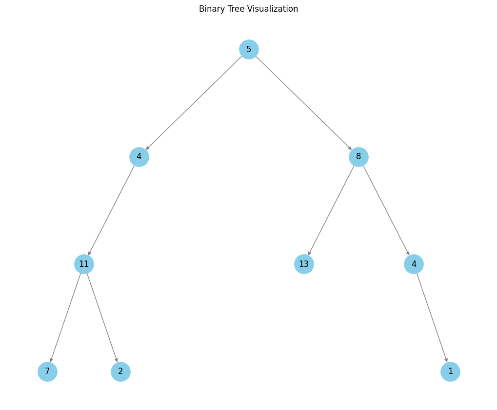
</div>

<center>

| Step | Node Value | Current Sum | Target | Action |
|------|------------|-------------|--------|--------|
| **Tree:** `[5, 4, 8, 11, None, 13, 4, 7, 2, None, None, None, 1]`, Target = 22 |
| 1    | 5          | 0           | 22     | `current sum (0) + node.data (5) = 5` |
| 2    | 4          | 5           | 22     | `current sum (5) + node.data (4) = 9` |
| 3    | 11         | 9           | 22     | `current sum (9) + node.data (11) = 20` |
| 4    | 7          | 20          | 22     | `We are at a leaf node, current sum (20) + node data (7) == target (22) is False` |
| 5    | 2          | 20          | 22     | `We are at a leaf node, current sum (20) + node data (2) == target (22) is True` |
|      | **Return** |             |        | `Path found, returning True` |
|      | **Explanation**         |        |        | `A path (5 -> 4 -> 11 -> 2) has a cumulative sum of 22, matching the target` |

</center>

## Time Complexity

Each node in the binary tree is visited once as we perform a depth-first search traversal. For each node, the function:

* Check that the current `node` is not `None` or a `nullptr`, which is $O(1)$

* Check that the left and right children of the current node are none, both of which are ($O(1)$)

  * If a leaf is encountered, a sum operation is performend `curr_sum + node.data` and it is compared
      to `target`, again $O(1)$

  * If the current node is not a leaf, then `curr_sum += node.data`, which can be considered $O(1)$

In the worst case, where no path exists, and all nodes are visited, the overall time complexity of the search algorithm is $O(n)$, where $n$ is the total number of nodes in the binary tree.

## Space Complexity

The space complexity of the algorithm is influenced by the recursion stack depth, which depends on the height of the tree:

1. **Best and Average Case (Balanced Tree):** In a balanced binary tree, the height $h$ is $O(\log_2 n)$. Thus, the recursive stack will hold up to $O(\log_2 n)$ calls at any point, resulting in a space complexity of $O(\log_2 n)$.

2. **Worst Case (Skewed Tree):** In an unbalanced, skewed tree (e.g., all nodes on one side), the height $h$ can be $O(n)$, leading to $O(n)$ recursive calls on the stack.

Hence, the overall space complexity is $O(h)$, where $h$ is the height of the tree, translating to:

* $O(\log_2 n)$ in the best and average case for a balanced tree
* $O(n)$ in the worst case for a skewed tree

---

# Count Good Nodes in Binary Tree

Given a binary tree `root`, a node `X` in the tree is considered good if the following condition is satisfied:

> From the root of the binary tree to node `X`, there is no node with a value greater than that of `X`.

Find the number of good nodes in the binary tree.

## Explanation

Consider the following binary tree:

<div style="text-align: center;">
    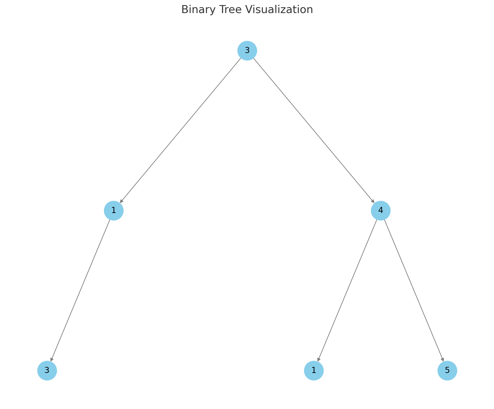
</div>

<center>

| Step | Node       | Max Value So Far | Decision                           | Number of Good Nodes |
|------|------------|------------------|------------------------------------|----------------------|
| 1    | 3 (root)   | -∞               | Good Node (3 ≥ -∞)                 | +1                   |
| 2    | 1 (left)   | 3                | Not a Good Node (1 < 3)            |                      |
| 3    | 3 (left of 1) | 3             | Good Node (3 ≥ 3)                  | +1                   |
| 4    | None       | N/A              | Empty Tree Node, returning 0       |                      |
| 5    | None       | N/A              | Empty Tree Node, returning 0       |                      |
| 6    | 4 (right)  | 3                | Good Node (4 ≥ 3)                  | +1                   |
| 7    | 1 (left of 4) | 4             | Not a Good Node (1 < 4)            |                      |
| 8    | None       | N/A              | Empty Tree Node, returning 0       |                      |
| 9    | None       | N/A              | Empty Tree Node, returning 0       |                      |
| 10   | 5 (right of 4) | 4            | Good Node (5 ≥ 4)                  | +1                   |

</center>

## Time Complexity

Each node in the binary tree is visited once, and the following operations are performed at each node:

* Check if the current node is not `None` or a `nullptr`, which can be considered $O(1)$

* Add the number of good nodes that have been found from the left and right subtrees so far, which is $O(1)$

* Check if the current node is a good node, incrementing the count if it is, which is $O(1)$

The implementation uses postorder traversal. The time complexity of the algorithm is $O(n)$, where $n$ is the total number of nodes in the binary tree.

## Space Complexity

The space complexity of the algorithm is again $O(h)$, where $h$ is $\log_2 n$ for a balanced tree and $n$ for a skewed tree.

---

# Same Tree

Given the roots of two binary trees `p` and `q`, check if they are the same or not.

Two binary trees are considered the same if they are structurally identical, and the nodes have the same value.

## Explanation

Consider the following binary trees:

<div style="text-align: center;">
    
</div>

<div style="text-align: center;">
    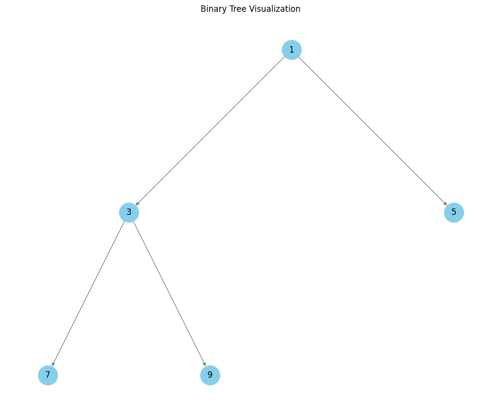
</div>

<center>

| Step | Node (Tree 1) | Node (Tree 2) | Action                                  | Result   | Recursiion Tree Depth |
|------|---------------|---------------|-----------------------------------------|----------|--------------|
| 1    | 1             | 1             | Comparing nodes (1 == 1). Proceed deeper. | -        | -            |
| 2    | 3             | 3             | Comparing nodes (3 == 3). Proceed deeper. | -        | -            |
| 3    | 7             | 7             | Comparing nodes (7 == 7). Proceed deeper. | -        | -            |
|      | None          | None          | Both children nodes of Tree 1 are `None`. Returning `True`.  | `True`   | Depth 3      |
|      | None          | None          | Both children nodes of Tree 2 are `None`. Returning `True`.  | `True`   | Depth 3      |
| 4    | -             | -             | Returning `True` for nodes (7, 7).        | `True`   | Depth 2      |
| 5    | 10            | 9             | Comparing nodes (10 != 9). Not equal. Returning `False`. | `False` | Depth 2      |
|      | None          | None          | Both children nodes of Tree 1 are `None`. Returning `True`.  | `True`   | Depth 3      |
|      | None          | None          | Both children nodes of Tree 2 are `None`. Returning `True`.  | `True`   | Depth 3      |
| 6    | -             | -             | Returning `False` for nodes (10, 9).      | `False`  | Depth 2      |
| 7    | -             | -             | Returning `False` for nodes (3, 3) since one of the children is `False`. | `False`  | Depth 1      |
| 8    | 5             | 5             | Comparing nodes (5 == 5). Proceed deeper. | -        | -            |
|      | None          | None          | Both children nodes of Tree 1 are `None`. Returning `True`.  | `True`   | Depth 3      |
|      | None          | None          | Both children nodes of Tree 2 are `None`. Returning `True`.  | `True`   | Depth 3      |
| 9    | -             | -             | Returning `True` for nodes (5, 5).        | `True`   | Depth 1      |
| 10   | -             | -             | Returning `False` for nodes (1, 1) since the left subtree returned `False`. | `False`  | Root         |

</center>

## Time Complexity

In any case, the algorithm visits each node in both trees once. All operations performed at each node (i.e., comparisons) can be considered $O(1)$. Thus, the overall time complexity of the algorithm is $O(n)$, where $n$ is the total number of nodes in the binary tree.

## Space Complexity

The space complexity of the algorithm is $O(h)$, where $h$ is $\log_2 n$ for a balanced tree and $n$ for a skewed tree.

---

# Lowest Common Ancestor

Given the `root` of a binary tree and two nodes `p` and `q`, find the lowest common ancestor (LCA) node of `p` and `q`. The lowest common ancestor is defined as the deepest node in the tree that has both `p` and `q` as descendants (where we allow a node to be a descendant of itself).

## Explanation

Consider the following binary tree with `p = 5` and `q = 1`:

<div style="text-align: center;">
    
</div>

<center>

| Step | Current Node | Action | Result | Call Stack Depth |
|------|--------------|--------|---------|-----------------|
| 1    | 3 (root)     | Compare with targets (3 ≠ 5 and 3 ≠ 1) | Explore both subtrees | 1 |
| 2    | 5            | Found first target (5 = 5) | Return node 5 | 2 |
| 3    | 6            | Compare with targets (6 ≠ 5 and 6 ≠ 1) | Return null (not found) | 3 |
| 4    | 2            | Compare with targets (2 ≠ 5 and 2 ≠ 1) | Return null (not found) | 3 |
| 5    | 7            | Compare with targets (7 ≠ 5 and 7 ≠ 1) | Return null (not found) | 4 |
| 6    | 4            | Compare with targets (4 ≠ 5 and 4 ≠ 1) | Return null (not found) | 4 |
| 7    | 1            | Found second target (1 = 1) | Return node 1 | 2 |
| 8    | 0            | Compare with targets (0 ≠ 5 and 0 ≠ 1) | Return null (not found) | 3 |
| 9    | 8            | Compare with targets (8 ≠ 5 and 8 ≠ 1) | Return null (not found) | 3 |
| Final | 3           | Both subtrees returned nodes, this is LCA | Return node 3 | 1 |

</center>

## Time Complexity

The `lowestCommonAncestor` function has a time complexity of $O(n)$, where $n$ is the number of nodes in the binary tree. This is because:

* Each node is visited exactly once during the **postorder** traversal
* At each node, we perform $O(1)$ operations:
  * Checking if the node is null
  * Comparing the node's value with target values
  * Making recursive calls
  * Evaluating the results from subtrees

## Space Complexity

The space complexity of the algorithm is again $O(h)$, where $h$ is $\log_2 n$ for a balanced tree and $n$ for a skewed tree.

---

# Minimum Depth of Binary Tree

Given a binary tree `root`, return its minimum depth.

The minimum depth is the number of nodes along the shortest path from the root node down to the nearest leaf node.

A leaf node is a node with no children.

## Explanation

Consider the following binary tree:

<div style="text-align: center;">
    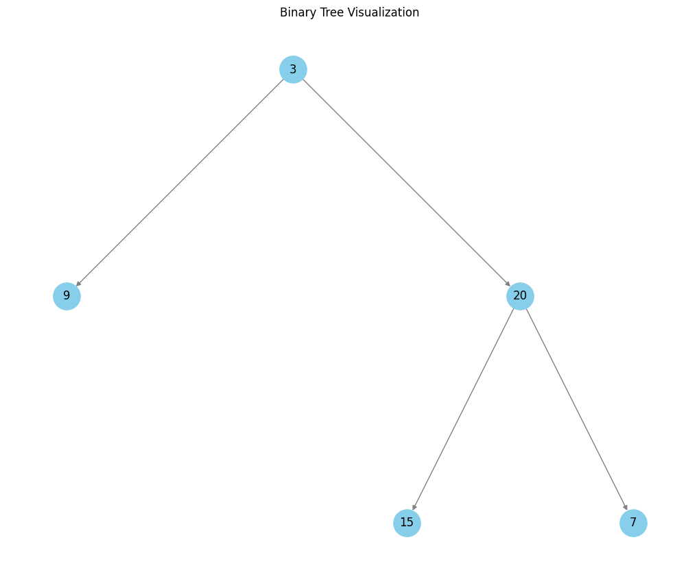
</div>

<center>

| Step | Current Node | Action | Current Path | Minimum Depth |
|------|--------------|--------|--------------|---------------|
| 1    | 3           | Root node, check both children | [3] | - |
| 2    | 9           | Leaf node found (no children) | [3, 9] | 2 |
| 3    | 20          | Has both children, continue | [3, 20] | - |
| 4    | 15          | Leaf node found | [3, 20, 15] | 3 |
| 5    | 7           | Leaf node found | [3, 20, 7] | 3 |
| Final | - | Return minimum found (2) | [3, 9] | 2 |
| **Explanation** | The shortest path from root to leaf is [3, 9], with a depth of 2 nodes | | | |

</center>

## Time Complexity

The overall time complexity of $O(n)$, where $n$ is the number of nodes in the binary tree.

* Each node is visited exactly once during the traversal

* At each node, we perform $O(1)$ operations:
  * Checking if the node is null
  * Checking if left/right children exist
  * Making recursive calls
  * Computing minimum between left and right depths

## Space Complexity

The space complexity is $O(h)$, where $h$ is the height of the tree. In the worst case, the tree is skewed, and the height is equal to the number of nodes $n$, leading to a space complexity of $O(n)$.

The modern C++ implementation using `std::optional` adds a small constant space overhead per recursive call, but this doesn't change the overall space complexity.

## Implementation Notes

The C++ implementation offers several advantages:

1. **Type Safety:** Using `std::optional` makes null handling explicit and type-safe
2. **Clear Intent:** The code clearly distinguishes between "no child" (`std::nullopt`) and "child with depth" cases
3. **Exception Safety:** `value_or()` provides a safe fallback for null cases

---

# Maximum Ancestor Difference in a Binary Tree

Given the `root` of a binary tree, calculate the **maximum difference** between the values of ancestor and descendant nodes.

An ancestor is any node along the path from the root to a given node (excluding the node itself). The descendant nodes are all nodes that fall under the subtree rooted at the ancestor node.

## Explanation

Consider the following binary tree `[8, 3, 10, 1, 6, None, 14, None, None, 4, 7, None, 13]`:

<div style="text-align: center;">
    
</div>

The function calculates the difference between the maximum and minimum node values along any path in the tree and returns the maximum of these differences.

<center>

| Step | Current Node                  | Current `(max, min)` | Updated `(max, min)`                          | Left Subtree Diff | Right Subtree Diff | Result at Node | Call Stack Depth          |
|------|-------------------------------|-----------------------|-----------------------------------------------|-------------------|--------------------|----------------|---------------------------|
| 1    | 8 (root)                     | (-∞, ∞)              | (8, 8), since 8 is smaller than ∞ and larger than -∞ | -                 | -                  | -              | 1                         |
| 2    | &nbsp;&nbsp;3                | (8, 8)               | (8, 3), min is updated from 8 to 3            | -                 | -                  | -              | 2 (left subtree of root)  |
| 3    | &nbsp;&nbsp;&nbsp;&nbsp;1 (leaf)   | (8, 3)               | (8, 1), min is updated from 3 to 1            | 7                 | 7                  | 7              | 3                         |
| 4    | &nbsp;&nbsp;&nbsp;&nbsp;6    | (8, 3)               | (8, 3), no updates                            | -                 | -                  | -              | 3                         |
| 5    | &nbsp;&nbsp;&nbsp;&nbsp;&nbsp;&nbsp;&nbsp;&nbsp;4 (leaf) | (8, 3)               | (8, 3), no updates                            | 5                 | 5                  | 5              | 4                         |
| 6    | &nbsp;&nbsp;&nbsp;&nbsp;&nbsp;&nbsp;&nbsp;&nbsp;7 (leaf) | (8, 3)               | (8, 3), no updates                            | 5                 | 5                  | 5              | 4                         |
| 7    | &nbsp;&nbsp;&nbsp;&nbsp;-                             | (8, 3)               | (8, 3), no updates                            | 5                 | 5                  | 5              | 3                         |
|      | The left subtree gives a maximum difference of 7      | -                   | -                                             | -                 | -                  | -              | -                         |
| 8    | &nbsp;&nbsp;10               | (8, 8)               | (10, 8), max is updated from 8 to 10          | 2                 | -                  | -              | 2 (right subtree of root) |
| 9    | &nbsp;&nbsp;&nbsp;&nbsp;14   | (10, 8)              | (14, 8), max is updated from 10 to 14         | 6                 | 6                  | 6              | 3                         |
| 10   | &nbsp;&nbsp;&nbsp;&nbsp;&nbsp;&nbsp;&nbsp;&nbsp;13 (leaf) | (14, 8)              | (14, 8), no updates                          | 6                 | 6                  | 6              | 4                         |
| 11   | &nbsp;&nbsp;&nbsp;&nbsp;-                             | (14, 8)              | (14, 8)                                       | 6                 | 6                  | 6              | 3                         |
|      | The right subtree gives a maximum difference of 6     | -                   | -                                             | -                 | -                  | -              | -                         |
| Final| -                             | -                    | -                                             | 7                 | 6                  | **7**          | Root                      |

</center>

* **Starting at the root (Node 8)**:

  * `(max, min)` are initialized to `(-∞, ∞)`.

  * **Left Subtree (Node 3)**:

    * Updates `(max, min)` to `(8, 3)`.
    * Traverses its children (Nodes 1 and 6).

      * **Left-Left Subtree (Node 1)**:

        * Updates `(max, min)` to `(8, 1)`.
        * As it is a leaf, calculates `|8 - 1| = 7`.

      * **Left-Right Subtree (Node 6)**:

        * Updates `(max, min)` to `(8, 3)`.
        * Traverses its children (Nodes 4 and 7).

          * **Left-Right-Left Subtree (Node 4)**:

            * Updates `(max, min)` to `(8, 3)`.
            * As it is a leaf, calculates `|8 - 3| = 5`.

          * **Left-Right-Right Subtree (Node 7)**:

            * Updates `(max, min)` to `(8, 3)`.
            * As it is a leaf, calculates `|8 - 3| = 5`.

  * **Right Subtree (Node 10)**:

    * Updates `(max, min)` to `(10, 8)`.
    * Traverses its child (Node 14).

      * **Right-Right Subtree (Node 14)**:
        * Updates `(max, min)` to `(14, 8)`.
        * Traverses its child (Node 13).

          * **Right-Right-Left Subtree (Node 13)**:
            * Updates `(max, min)` to `(14, 8)`.
            * As it is a leaf, calculates `|14 - 8| = 6`.

* **Final Calculation**:

  * The left subtree gives a maximum difference of **7**.
  * The right subtree gives a maximum difference of **6**.
  * The overall maximum difference is **7**.

---

## Time Complexity

The algorithm maintains some states (i.e., the `min` and `max`) going down the tree (pre-order) and computes the maximum differences of left and right subtrees on the way back up (post-order). Each node is visited exactly once, and the following operations are performed at each node:

* Checking if the node is not `None` or `nullptr`, which can be considered $O(1)$
* Per node operations (updating `max` and `min`), which can also be considered $O(1)$

Hence, the overall time complexity of the algorithm is $O(n)$, where $n$ is the number of nodes in the binary tree.

---

## Space Complexity

The space complexity of the algorithm is again $O(h)$, where $h$ is $\log_2 n$ for a balanced tree and $n$ for a skewed tree.

---

# Diameter of Binary Tree

Given the `root` of a binary tree, return the length of the diameter of the tree.

The *diameter* of a binary tree is the length of the longest path between any two nodes in a tree. This path may or may not pass through the `root`.

The length of a path between two nodes is represented by the number of edges between them.

---

## Explanation

Consider the following binary tree `[, 7, 9, None, 7, None, 8, 9, 10, 233, 17, None, 23]`:

<div style="text-align: center;">
    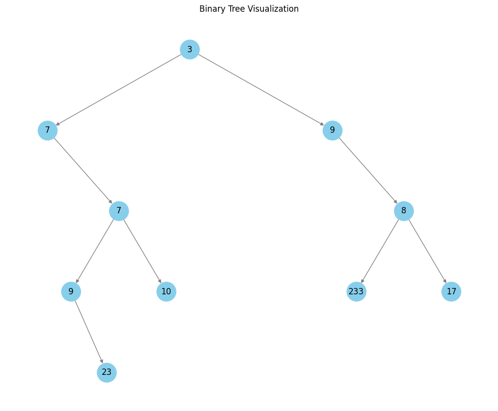
</div>

<center>

| Step | Current Node | Action                                       | Left Subtree Height | Right Subtree Height | Current Diameter (Equation) | Previous Diameter | Updated Diameter (Equation)            | Height Returned (Equation)            | Call Stack Depth |
|------|--------------|----------------------------------------------|---------------------|----------------------|-----------------------------|-------------------|----------------------------------------|----------------------------------------|-----------------|
| 1    | 3 (root)     | Starting diameter calculation.               | -                   | -                    | -                           | -                 | -                                      | -                                      | 1               |
| 2    | 7            | Processing left child of 3.                  | -                   | -                    | -                           | -                 | -                                      | -                                      | 2               |
| 3    | None         | Reached a leaf node (left child of 7).       | 0                   | -                    | -                           | -                 | -                                      | `0`                                    | 3               |
| 4    | 7            | Processing right child of 7.                 | -                   | -                    | -                           | -                 | -                                      | -                                      | 3               |
| 5    | 9            | Processing left child of 7.                  | -                   | -                    | -                           | -                 | -                                      | -                                      | 4               |
| 6    | None         | Reached a leaf node (left child of 9).       | 0                   | -                    | -                           | -                 | -                                      | `0`                                    | 5               |
| 7    | 23           | Processing right child of 9.                 | -                   | -                    | -                           | -                 | -                                      | -                                      | 5               |
| 8    | None         | Reached a leaf node (left child of 23).      | 0                   | -                    | -                           | -                 | -                                      | `0`                                    | 6               |
| 9    | None         | Reached a leaf node (right child of 23).     | 0                   | 0                    | `0 + 0 = 0`                 | `0`               | `max(0, 0) = 0`                        | `max(0, 0) + 1 = 1`                    | 6               |
| 10   | 9            | Returning from 23. Updating heights.         | 1                   | -                    | -                           | -                 | -                                      | -                                      | 5               |
| 11   | 9            | Returning from 9. Calculating diameter.      | 0                   | 1                    | `0 + 1 = 1`                 | `0`               | `max(0, 1) = 1`                        | `max(0, 1) + 1 = 2`                    | 4               |
| 12   | 10           | Processing right child of 7.                 | -                   | -                    | -                           | -                 | -                                      | -                                      | 5               |
| 13   | None         | Reached a leaf node (left child of 10).      | 0                   | -                    | -                           | -                 | -                                      | `0`                                    | 6               |
| 14   | None         | Reached a leaf node (right child of 10).     | 0                   | 0                    | `0 + 0 = 0`                 | `1`               | `max(1, 0) = 1`                        | `max(0, 0) + 1 = 1`                    | 6               |
| 15   | 7            | Returning to 7 after processing 10.          | 2                   | 1                    | `2 + 1 = 3`                 | `1`               | `max(1, 3) = 3`                        | `max(2, 1) + 1 = 3`                    | 2               |
| 16   | 7            | Returning to root (3) after processing 7.    | 4                   | -                    | -                           | -                 | -                                      | `max(4, 3) + 1 = 4`                    | 1               |
| 17   | 9            | Processing right child of 3.                 | -                   | -                    | -                           | -                 | -                                      | -                                      | 2               |
| 18   | 8            | Processing left child of 9.                  | -                   | -                    | -                           | -                 | -                                      | -                                      | 3               |
| 19   | 233          | Processing left child of 8.                  | -                   | -                    | -                           | -                 | -                                      | -                                      | 4               |
| 20   | None         | Reached a leaf node (left child of 233).     | 0                   | -                    | -                           | -                 | -                                      | `0`                                    | 5               |
| 21   | None         | Reached a leaf node (right child of 233).    | 0                   | 0                    | `0 + 0 = 0`                 | `3`               | `max(3, 0) = 3`                        | `max(0, 0) + 1 = 1`                    | 5               |
| 22   | 17           | Processing right child of 8.                 | -                   | -                    | -                           | -                 | -                                      | -                                      | 4               |
| 23   | None         | Reached a leaf node (left child of 17).      | 0                   | -                    | -                           | -                 | -                                      | `0`                                    | 5               |
| 24   | None         | Reached a leaf node (right child of 17).     | 0                   | 0                    | `0 + 0 = 0`                 | `3`               | `max(3, 0) = 3`                        | `max(0, 0) + 1 = 1`                    | 5               |
| 25   | 8            | Returning from 17 to 8. Updating heights.    | 1                   | 1                    | `1 + 1 = 2`                 | `3`               | `max(3, 2) = 3`                        | `max(1, 1) + 1 = 2`                    | 3               |
| 26   | 3 (root)     | Final update to diameter.                    | 4                   | 3                    | `4 + 3 = 7`                 | `3`               | `max(3, 7) = 7`                        | `max(4, 3) + 1 = 5`                    | 1               |

</center>

---

## Time Complexity

The algorithm visits each node exactly once, and the following operations are performed at each node:

* Checking if the node is not `None` or `nullptr`, which can be considered $O(1)$
* Per node operations (calculating and updating diameters and heights), which can all be considered $O(1)$

Hence, the overall time complexity of the algorithm is $O(n)$, where $n$ is the number of nodes in the binary tree.

---

## Space Complexity

The space complexity of the algorithm is again $O(h)$, where $h$ is $\log_2 n$ for a balanced tree and $n$ for a skewed tree.

---

# Leaf-Similar Trees

Consider all the leaves of a binary tree, from left to right order, the values of those leaves form a leaf value sequence.

Two binary trees are considered **leaf-similar** if their leaf value sequence is the same.

## Explanation

Consider the following binary trees:

<div style="text-align: center;">
    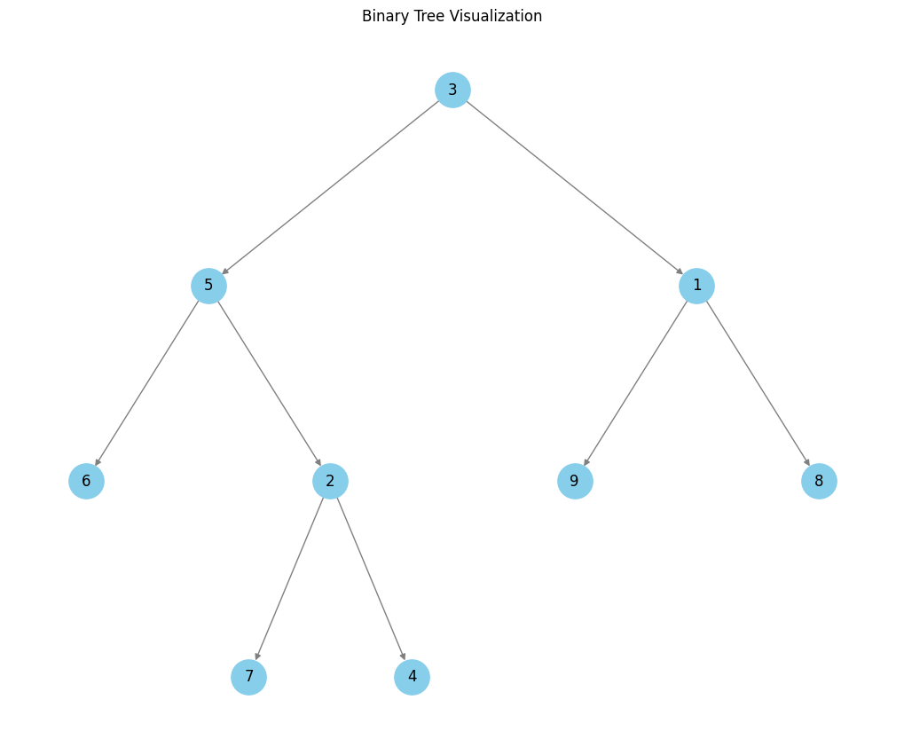
</div>

<div style="text-align: center;">
    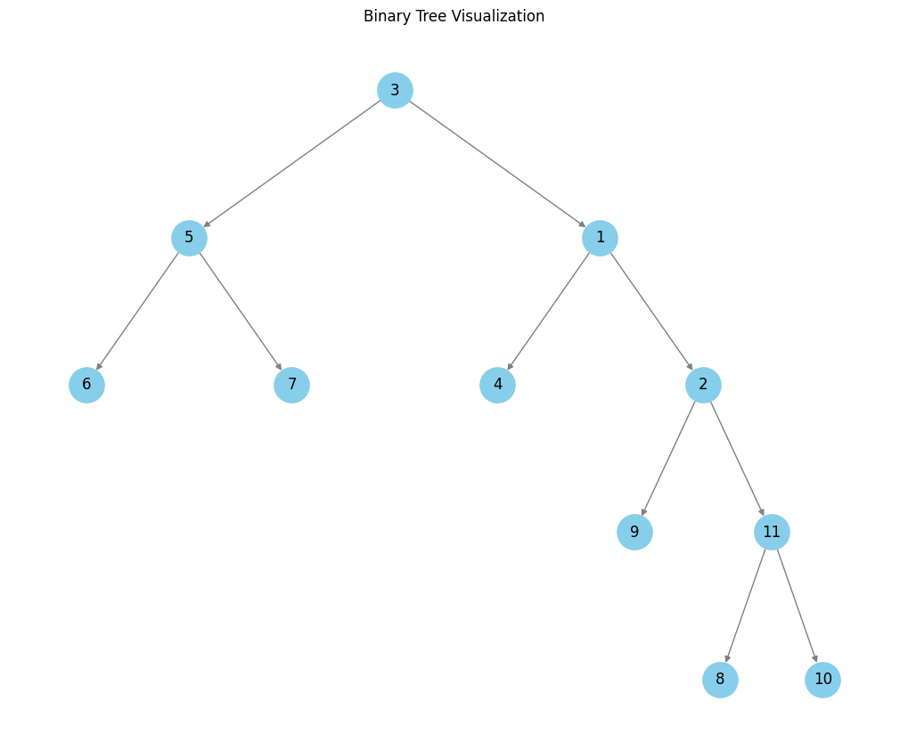
</div>

<center>

| **Step** | **Mode**    | **Node Value** | **Queue State Before** | **Queue State After** | **Action**                            | **Similar Flag** |
|----------|-------------|----------------|-------------------------|------------------------|----------------------------------------|--------------------|
| 1        | Enqueue     | 6              | `[]`                    | `[6]`                 | Enqueued leaf node 6                   | True               |
| 2        | Enqueue     | 7              | `[6]`                   | `[6, 7]`              | Enqueued leaf node 7                   | True               |
| 3        | Enqueue     | 4              | `[6, 7]`                | `[6, 7, 4]`           | Enqueued leaf node 4                   | True               |
| 4        | Enqueue     | 9              | `[6, 7, 4]`             | `[6, 7, 4, 9]`        | Enqueued leaf node 9                   | True               |
| 5        | Enqueue     | 8              | `[6, 7, 4, 9]`          | `[6, 7, 4, 9, 8]`     | Enqueued leaf node 8                   | True               |
| 6        | Dequeue     | 6              | `[6, 7, 4, 9, 8]`       | `[7, 4, 9, 8]`        | Matched and dequeued 6                 | True               |
| 7        | Dequeue     | 7              | `[7, 4, 9, 8]`          | `[4, 9, 8]`           | Matched and dequeued 7                 | True               |
| 8        | Dequeue     | 4              | `[4, 9, 8]`             | `[9, 8]`              | Matched and dequeued 4                 | True               |
| 9        | Dequeue     | 9              | `[9, 8]`                | `[8]`                 | Matched and dequeued 9                 | True               |
| 10       | Dequeue     | 8              | `[8]`                   | `[]`                  | Matched and dequeued 8                 | True               |
| 11       | Dequeue     | 10             | `[]`                    | `[]`                  | **Mismatch found! Queue is empty. This means that one tree has more leaf nodes and the trees cannot be leaf-similar**    | **False**          |

</center>

### C++ Implementation

The C++ implementation uses a **recursive lambda function** to perform a depth-first search (DFS) on the binary trees.

```cpp
std::function<bool(TreeNode::ptr &, bool)> depthFirstSearch = [&internalDeque](TreeNode::ptr &node, bool enqueueMode) -> bool
```

* **Purpose**:
  [std::function](https://en.cppreference.com/w/cpp/utility/functional/function) is a polymorphic, type-safe wrapper for callable objects. It is used here to define a lambda function that supports recursion. Without `std::function`, a lambda cannot refer to itself recursively.

* **Type Signature**:

  1. **`std::function<bool(TreeNode::ptr &, bool)>`**:
    A type-safe wrapper for the recursive lambda.

  2. **`depthFirstSearch`**:
    The variable holding the lambda function.

  3. **`[&internalDeque, &depthFirstSearch]`**:
    Captures `internalDeque` and itself by reference for modification within the lambda and recursive calls.

  4. **`(TreeNode::ptr &node, bool enqueueMode)`**:
    The parameter list defining inputs for each recursive call.

  5. **`-> bool`**:
    Specifies the lambda’s return type.

* **Why `std::function` is Required**:
  Normally, a lambda cannot refer to itself because its type is anonymous. `std::function` provides an explicit, named type that allows recursive calls to the lambda.

---

## Time Complexity

For each tree, the algorithm visits each leaf node once, and the following operations are performed at each node:

* Checking if the node is not `None` or `nullptr`, which can be considered $O(1)$
* If the left and right children are `None`, the node is a leaf:

  * If the `mode` is `Enqueue`, the leaf node is added to the queue, which is $O(1)$

  * If the `mode` is `Dequeue`:

    * Check if the internal queue is non-empty and that the current node data matches the front of the queue, both of which are $O(1)$

      * If the conditions are met, the front of the queue is dequeued, which is $O(1)$

      * If the conditions are not met, set the `similar` flag to `False`

Let $n$ and $m$ be the number of nodes in the two trees. The overall time complexity of the algorithm is $O(n + m)$.

---

## Space Complexity

For a balanced binary tree, the number of leaf nodes is $ O(\frac{n}{2})$ and $ O(\frac{m}{2})$ for the two respective trees.

This implementation uses a single `std::deque` (in C++) and `collections.deque` (in Python) to store the leaf nodes.

In the worst-case scenario, the space complexity is $ O(\max(\frac{n}{2}, \frac{m}{2})) $. This can be simplified to $ O(\max(n, m)) $, as the constant factor $\frac{1}{2}$ does not affect the asymptotic complexity.

---

# Invert Binary Tree

Given the `root` of a binary tree, invert the tree, i.e., swap the left and right children of all nodes.

## Explanation

Consider the following binary tree:

<div style="text-align: center;">
    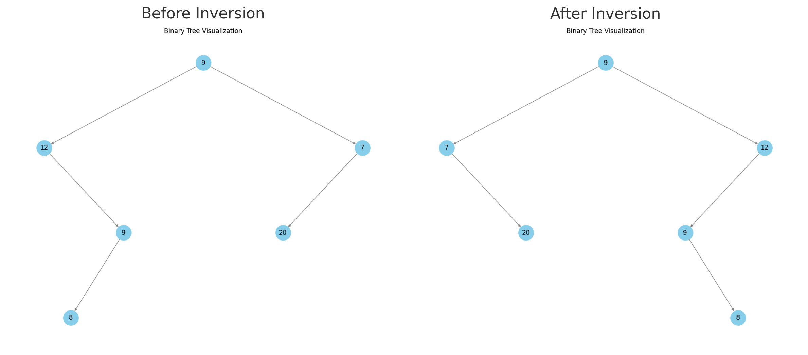
</div>

The implementations uses **post-order** traversal to invert the binary tree:

<center>

| Step | Depth | Current Node | Left Subtree Before      | Right Subtree Before     | Action                                                                                   | Left Subtree After      | Right Subtree After     |
|------|-------|--------------|--------------------------|--------------------------|------------------------------------------------------------------------------------------|--------------------------|--------------------------|
| 1    | 0     | 9 (root)     | 12                       | 7                        | Visiting root. Recursively inverting left and right subtrees.                            | -                        | -                       |
| 2    | 1     | 12           | None                     | 9                        | Visiting left child of root. Recursively inverting left and right.                       | -                        | -                     |
| 3    | 2     | None         | -                        | -                        | Reached a leaf node. Returning None.                                                     | -                        | -                        |
| 4    | 2     | 9            | 8                        | None                     | Visiting node. Recursively inverting left and right.                                     | -                     | -                        |
| 5    | 3     | 8            | None                     | None                     | Visiting node. Recursively inverting left and right.                                     | -                     | -                    |
| 6    | 4     | None         | -                        | -                        | Reached a leaf node. Returning None.                                                     | -                        | -                        |
| 7    | 4     | None         | -                        | -                        | Reached a leaf node. Returning None.                                                     | -                        | -                        |
| 8    | 3     | 8            | None                     | None                     | Swapping left and right.                                                                 | None                     | None                     |
| 9    | 2     | 9            | 8                        | None                     | Swapping left and right.                                                                 | None                     | 8                        |
| 10   | 1     | 12           | None                     | 9                        | Swapping left and right.                                                                 | 9                        | None                     |
| 11   | 1     | 7            | 20                       | None                     | Visiting right child of root. Recursively inverting left and right.                      | -                     | -                       |
| 12   | 2     | 20           | None                     | None                     | Visiting node. Recursively inverting left and right.                                     | -                     | -                     |
| 13   | 3     | None         | -                        | -                        | Reached a leaf node. Returning None.                                                     | -                        | -                        |
| 14   | 3     | None         | -                        | -                        | Reached a leaf node. Returning None.                                                     | -                        | -                        |
| 15   | 2     | 20           | None                     | None                     | Swapping left and right.                                                                 | None                     | None                     |
| 16   | 1     | 7            | 20                       | None                     | Swapping left and right.                                                                 | None                     | 20                       |
| 17   | 0     | 9 (root)     | 12                       | 7                        | Swapping left and right.                                                                 | 7                        | 12                       |

</center>

Due to the **post-order** traversal, the left and right subtrees are inverted from the bottom up.

---

## Time Complexity

The algorithm visits each node exactly once, and the following operations are performed at each node:

* Checking if the node is not `None` or `nullptr`, which can be considered $O(1)$

* Swap the left and right children of the current node, which can also be considered $O(1)$

Hence, the overall time complexity of the algorithm is $O(n)$, where $n$ is the number of nodes in the binary tree.

---

## Space Complexity

The space complexity of the algorithm is $O(h)$, where $h$ is $\log_2 n$ for a balanced tree and $n$ for a skewed tree.

---

# Symmetric Tree

Given the `root` of a binary tree, check whether the tree is symmetric around its center.

A binary tree is symmetric if the left subtree is a mirror reflection of the right subtree at the root.

## Explanation

Consider the following binary tree:

<div style="text-align: center;">
    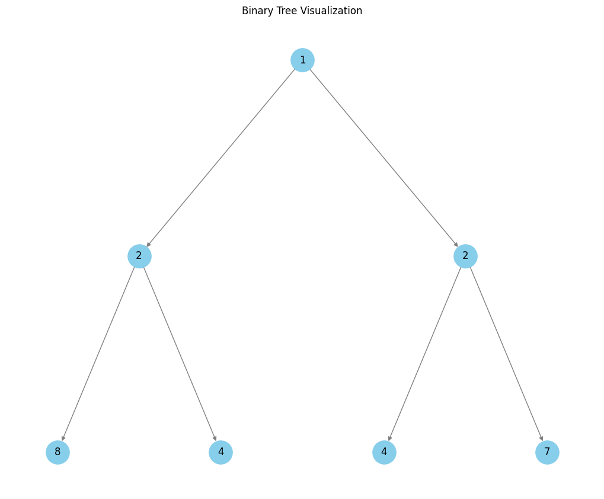
</div>

<center>

| Step | Recursion Depth | Node 1       | Node 2       | Action                                   | Result        |
|------|-----------------|--------------|--------------|------------------------------------------|---------------|
| 1    | 0               | 1            | 1            | Comparing root nodes                    | Proceed       |
| 2    | 1               | 2            | 2            | Comparing left and right children       | Proceed       |
| 3    | 2               | 8            | 7            | Values do not match                     | **False**     |
| 4    | 2               | 4            | 4            | Comparing left and right children       | Proceed       |
| 5    | 3               | None         | None         | Both nodes are `None`                   | **True**      |
| 6    | 3               | None         | None         | Both nodes are `None`                   | **True**      |
| 7    | 2               | -            | -            | Left subtree comparison result: `True` | Return False  |
| 8    | 1               | 2            | 2            | Comparing left and right children       | Proceed       |
| 9    | 2               | 4            | 4            | Comparing left and right children       | Proceed       |
| 10   | 3               | None         | None         | Both nodes are `None`                   | **True**      |
| 11   | 3               | None         | None         | Both nodes are `None`                   | **True**      |
| 12   | 2               | 7            | 8            | Values do not match                     | **False**     |
| 13   | 1               | -            | -            | Right subtree comparison result: `False`| Return False  |
| Final| 0               | -            | -            | Tree is not symmetric                   | **False**     |

</center>

1. The algorithm starts by comparing the root node `1` with itself at depth `0`.
2. It then compares the left and right children of the root node (`2` and `2`) at depth `1`.
3. At depth `2`, the left subtree's left child (`8`) is compared to the right subtree's right child (`7`). Since the values do not match, the algorithm immediately returns `False` for this branch.
4. It then continues to compare the left subtree's right child (`4`) with the right subtree's left child (`4`). Both subtrees are symmetric for this branch, resulting in `True`.
5. At depth `1`, it proceeds to the right subtree of the root and performs similar comparisons. However, the subtree's values also mismatch (`7` vs `8`), resulting in `False`.
6. Since one of the branches returned `False`, the overall result is that the tree is **not symmetric**.

---

## Time Complexity

The algorithm visits each node exactly once, and the following operations are performed at each node:

1. Check if both nodes are not `None` or `nullptr`, which can be considered $O(1)$

2. Check if one of the nodes is `None` or `nullptr`, which can also be considered $O(1)$

3. Compare the values of the two nodes, which can be considered $O(1)$

Because two nodes are passed and processed at each recursive step simultaneously, the time complexity of the algorithm is $O(n)$, where $n$ is the number of nodes in the binary tree.

---

## Space Complexity

The space complexity of the algorithm is $O(h)$, where $h$ is $\log_2 n$ for a balanced tree and $n$ for a skewed tree.

---

# Path Sum II

Given the `root` of a binary tree and an integer `target`, return all **root-to-leaf** paths where the sum of the node values in the path equals `target`. Each path should be returned as a list of the node values, not node references.

A **root-to-leaf** path is a path starting from the root and ending at any leaf node. A leaf is a node with no children.

## Explanation

Consider the following binary tree:

<div style="text-align: center;">
    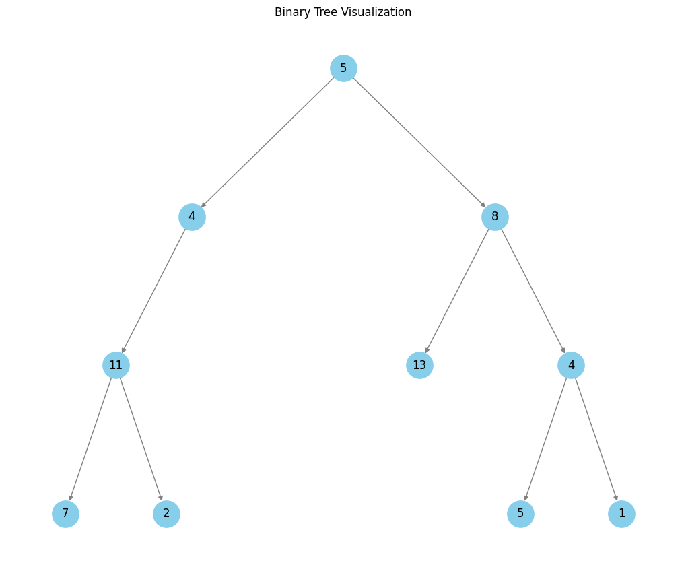
</div>

<center>

| **Step** | **Depth** | **Node Value** | **Current Path**       | **Current Sum** | **Action**                                                                                   | **Output**                  |
|----------|-----------|----------------|------------------------|-----------------|----------------------------------------------------------------------------------------------|-----------------------------|
| 1        | 0         | 5              | `[]`                  | `0`             | Start at root, add 5 to path                                                                 | -                           |
| 2        | 1         | 4              | `[5]`                 | `5`             | Move to left child, add 4 to path                                                            | -                           |
| 3        | 2         | 11             | `[5, 4]`              | `9`             | Move to left child, add 11 to path                                                           | -                           |
| 4        | 3         | 7              | `[5, 4, 11]`          | `20`            | Move to left child, sum becomes 27 (not target), backtrack                                   | -                           |
| 5        | 3         | 2              | `[5, 4, 11]`          | `20`            | Move to right child, sum becomes 22 (matches target), add path `[5, 4, 11, 2]`              | `[[5, 4, 11, 2]]`          |
| 6        | 2         | None           | `[5, 4]`              | `9`             | No right child, backtrack                                                                    | -                           |
| 7        | 1         | None           | `[5]`                 | `5`             | No right child, backtrack                                                                    | -                           |
| 8        | 1         | 8              | `[5]`                 | `5`             | Move to right child, add 8 to path                                                           | -                           |
| 9        | 2         | 13             | `[5, 8]`              | `13`            | Move to left child, sum becomes 26 (not target), backtrack                                   | -                           |
| 10       | 2         | 4              | `[5, 8]`              | `13`            | Move to right child, add 4 to path                                                           | -                           |
| 11       | 3         | 5              | `[5, 8, 4]`           | `17`            | Move to left child, sum becomes 22 (matches target), add path `[5, 8, 4, 5]`                | `[[5, 4, 11, 2], [5, 8, 4, 5]]` |
| 12       | 3         | 1              | `[5, 8, 4]`           | `17`            | Move to right child, sum becomes 18 (not target), backtrack                                  | -                           |
| 13       | 2         | None           | `[5, 8]`              | `13`            | No right child, backtrack                                                                    | -                           |
| 14       | 1         | None           | `[5]`                 | `5`             | No right child, backtrack                                                                    | -                           |
| 15       | 0         | None           | `[]`                  | `0`             | Back to root, traversal complete                                                            | `[[5, 4, 11, 2], [5, 8, 4, 5]]` |

</center>

---

## Time Complexity

### Work Per Node

1. **Basic DFS Checks / Updates**  
   * Checking for `nullptr` or `None` nodes, updating the running sum, appending/popping a node value to the current path, etc., are all $O(1)$ work *per node*.  
   * Over $n$ nodes, this accumulates to $O(n)$.

2. **Copying the Path at a Leaf**  
   * When the current path is appended to the list of “valid paths,” it is copied. If the path length is $h$ at that moment (where $h$ can be up to the tree’s height), then this copy takes $O(h)$ time.

Hence, the total cost is roughly:

$$
  O(n) \;+\; \bigl(\text{number of leaves}\bigr) \;\times\; \bigl(\text{cost of copying each path}\bigr)
$$

### Why $O(n^2)$ in the Worst Case

A well‐known “worst‐case” time‐complexity statement for **root‐to‐leaf** path‐sum problems is $O(n^2)$. The usual rationale is:

* Up to $O(n)$ leaf‐to‐root paths (if the tree branches a lot).
* Each path can be up to length $O(n)$ (if the tree is very tall).
* Therefore, in a completely unconstrained scenario, one might end up doing $O(n)$ copies of length $O(n)$ each $\Rightarrow O(n^2)$.

However, that simple $O(n^2)$ rule of thumb conflates two extremes that cannot both happen simultaneously in a strict binary tree with a fixed $n$.

### Balanced vs. Skewed Binary Trees

1. **Balanced Binary Tree**  
   * Height $h = O(\log n)$.  
   * Leaf count $L = O(n)$ (in a perfectly full tree, $L \approx n/2$).  
   * Copying each path takes $O(h) = O(\log n)$.  
   * Total cost of copying = $L \times O(h) = O(n \log n)$.  
   * Plus the $O(n)$ from visiting nodes = $O(n \log n)$ overall.

2. **Completely Skewed (“Linked‐List”) Tree**  
   * Height $h \approx n$.  
   * Number of leaves $L = 1$ (just the bottom node is a leaf).  
   * One path copy of length $n$ = $O(n)$.  
   * Plus the $O(n)$ from visiting nodes = $O(n)$ overall.

Hence, if the discussion is strictly about a binary tree and only about root‐to‐leaf paths, the maximum total cost is $O(n \log n)$ (the balanced shape) rather than $O(n^2)$. The skewed shape yields fewer leaves, so less path‐copy overhead—only $O(n)$.

* Many references simply take a worst‐case stance that “each path can be $O(n)$ long, and there can be $O(n)$ such paths,” leading to $O(n^2)$. Strictly speaking, for a binary tree of size $n$, the tree cannot achieve both extremes at once. Nonetheless, that $O(n^2)$ claim is still used as an upper bound—since $\max(n,\,n\log n)$ is still $\le n^2$.

* In more general trees (with branching factor > 2), the situation can lead to many leaves and large path length at the same time, so $O(n^2)$ (or worse) is possible.

### Bottom Line

* For a binary tree of $n$ nodes, the copying‐paths step is bounded by $O(n \log n)$ in the genuinely “worst” shape (balanced).  
* A purely skewed binary tree has only 1 leaf, giving $O(n)$ total.  
* The common $O(n^2)$ statement is a looser upper bound that some authors/solutions cite (especially when not restricting branching to 2) or simply as a “safe” bound without dissecting balanced vs. skewed configurations.

Hence, for a binary tree, the most precise statement is:

> **Time Complexity** = $O(n + L \cdot h)$.  
>
> * $n$ is the total number of nodes (for the DFS itself).  
> * $L$ is the number of leaves.  
> * $h$ is the height of the tree.

And in a binary tree of size $n$, the following always hold:  

* $L \le O(n)$  
* $h \le n$ but they trade off:

  * Balanced $\to$ $L = O(n)$, $h = O(\log n)$ $\Rightarrow O(n\log n)$.
  * Skewed $\to$ $L = 1$, $h \approx n$ $\Rightarrow O(n)$.
  
  The analysis does not truly reach $O(n^2)$ in a strict binary tree scenario.

---

## Space Complexity

1. **Call Stack:** Depth‐first traversal uses up to $O(h)$ space on the call stack, where $h$ is the tree height.  
2. **Current Path:** Storing the current path also costs $O(h)$.  
3. **Output Storage:** Collecting valid paths can require up to $O(L \times h)$ space, where $L$ is the number of leaves.

* **Balanced Binary Tree:** $h = O(\log n)$ and $L = O(n)$ $\Rightarrow O(n \log n)$ space for all paths.  
* **Skewed Tree:** $h = n$ and $L = 1$ $\Rightarrow O(n)$ total space.

Hence overall additional space beyond the input tree is $O(h + L \times h)$. For a binary tree of $n$ nodes, this is at most $O(n \log n)$ in a balanced case and $O(n)$ in a skewed case.

---

# Path Sum III

Given the `root` of a binary tree and an integer `target`, return the number of paths in the tree such that the sum of the node values in the path equals `target`.

The path does not need to start or end at the root or a leaf but must go downwards (traveling only from parent nodes to child nodes).

## Explanation

Consider the following binary tree with a target sum of `22`:

<div style="text-align: center;">
    
</div>

<center>

| Depth | Node Value | Current Sum Calculation | Current Sum == Target (22) | (Current Sum - Target) in Map? | Count Updated | Hash Map Before | Hash Map After |
|-------|------------|------------------------|-----------------------|-----------------------------|---------------|----------------|---------------|
| 0     | 5         | 0 + 5 = 5               | False                 | -17 in map? False           | No            | {}             | {5: 1}       |
|       |           |                          |                        |                              |               |                |               |
| 1     | 4         | 5 + 4 = 9               | False                 | -13 in map? False           | No            | {5: 1}         | {5: 1, 9: 1} |
|       |           |                          |                        |                              |               |                |               |
| 2     | 11        | 9 + 11 = 20             | False                 | -2 in map? False            | No            | {5: 1, 9: 1}   | {5: 1, 9: 1, 20: 1} |
|       |           |                          |                        |                              |               |                |               |
| 3     | 7         | 20 + 7 = 27             | False                 | 5 in map? True              | **+1**        | {5: 1, 9: 1, 20: 1} | {5: 1, 9: 1, 20: 1, 27: 1} |
|       |           |                          |                        |                              |               |                |               |
| 4     | NULL      | -                        | -                     | -                           | -             | -              | -             |
| 4     | NULL      | -                        | -                     | -                           | -             | -              | -             |
|       |           |                          |                        |                              |               |                |               |
| 3     | Backtrack | 27 - 7 = 20             | -                     | -                           | -             | {5: 1, 9: 1, 20: 1, 27: 1} | {5: 1, 9: 1, 20: 1} |
|       |           |                          |                        |                              |               |                |               |
| 3     | 2         | 20 + 2 = 22             | **True**               | 0 in map? False             | **+1**        | {5: 1, 9: 1, 20: 1} | {5: 1, 9: 1, 20: 1, 22: 1} |
|       |           |                          |                        |                              |               |                |               |
| 4     | NULL      | -                        | -                     | -                           | -             | -              | -             |
| 4     | NULL      | -                        | -                     | -                           | -             | -              | -             |
|       |           |                          |                        |                              |               |                |               |
| 3     | Backtrack | 22 - 2 = 20             | -                     | -                           | -             | {5: 1, 9: 1, 20: 1, 22: 1} | {5: 1, 9: 1, 20: 1} |
|       |           |                          |                        |                              |               |                |               |
| 2     | Backtrack | 20 - 11 = 9             | -                     | -                           | -             | {5: 1, 9: 1, 20: 1} | {5: 1, 9: 1} |
|       |           |                          |                        |                              |               |                |               |
| 1     | Backtrack | 9 - 4 = 5               | -                     | -                           | -             | {5: 1, 9: 1}   | {5: 1} |
|       |           |                          |                        |                              |               |                |               |
| 1     | 8         | 5 + 8 = 13              | False                 | -9 in map? False            | No            | {5: 1}         | {5: 1, 13: 1} |
|       |           |                          |                        |                              |               |                |               |
| 2     | 13        | 13 + 13 = 26            | False                 | 4 in map? False             | No            | {5: 1, 13: 1}  | {5: 1, 13: 1, 26: 1} |
|       |           |                          |                        |                              |               |                |               |
| 3     | NULL      | -                        | -                     | -                           | -             | -              | -             |
| 3     | NULL      | -                        | -                     | -                           | -             | -              | -             |
|       |           |                          |                        |                              |               |                |               |
| 2     | Backtrack | 26 - 13 = 13            | -                     | -                           | -             | {5: 1, 13: 1, 26: 1} | {5: 1, 13: 1} |
|       |           |                          |                        |                              |               |                |               |
| 2     | 4         | 13 + 4 = 17             | False                 | -5 in map? False            | No            | {5: 1, 13: 1}  | {5: 1, 13: 1, 17: 1} |
|       |           |                          |                        |                              |               |                |               |
| 3     | 5         | 17 + 5 = 22             | **True**               | 0 in map? False             | **+1**        | {5: 1, 13: 1, 17: 1} | {5: 1, 13: 1, 17: 1, 22: 1} |
|       |           |                          |                        |                              |               |                |               |
| 4     | NULL      | -                        | -                     | -                           | -             | -              | -             |
| 4     | NULL      | -                        | -                     | -                           | -             | -              | -             |
|       |           |                          |                        |                              |               |                |               |
| 3     | Backtrack | 22 - 5 = 17             | -                     | -                           | -             | {5: 1, 13: 1, 17: 1, 22: 1} | {5: 1, 13: 1, 17: 1} |
|       |           |                          |                        |                              |               |                |               |
| 3     | 1         | 17 + 1 = 18             | False                 | -4 in map? False            | No            | {5: 1, 13: 1, 17: 1} | {5: 1, 13: 1, 17: 1, 18: 1} |
|       |           |                          |                        |                              |               |                |               |
| 4     | NULL      | -                        | -                     | -                           | -             | -              | -             |
| 4     | NULL      | -                        | -                     | -                           | -             | -              | -             |
|       |           |                          |                        |                              |               |                |               |
| 3     | Backtrack | 18 - 1 = 17             | -                     | -                           | -             | {5: 1, 13: 1, 17: 1, 18: 1} | {5: 1, 13: 1, 17: 1} |

</center>

---

## Time Complexity

1. **Depth-First Search (DFS)**  
   The solution performs a DFS over all nodes in the tree. Each node is visited exactly once, contributing $O(n)$ for $n$ total nodes.

2. **Prefix-Sum Hash Map Operations**: For each node:
   * We calculate the new running sum in $O(1)$.
   * Check if $(\text{current\_sum} == \text{target})$ in $O(1)$.
   * We query the hash map for $(\text{current\_sum} - \text{target})$ in $O(1)$.
   * We update the hash map by incrementing or decrementing frequencies in $O(1)$.

3. **Backtracking**: After exploring a node’s children, we perform the following operations on the way back up the recursion stack:
   * Decrement the node’s contribution to the running sum in $O(1)$.
   * Adjust the hash map’s frequency count in $O(1)$.
   * Subtract the node’s contribution from the current path in $O(1)$.

Since each of the steps above takes $O(1)$ time per node and we process $n$ nodes, the overall time complexity is $O(n)$.

---

## Space Complexity

1. **Hash Map**: In the worst case (e.g., a path with strictly increasing partial sums), the hash map can store up to $O(n)$ distinct prefix sums.

2. **Call Stack**: The recursion depth can be $O(n)$ in the worst case of a skewed (completely unbalanced) tree. In a balanced tree, it would be $O(\log n)$. We express the worst-case height as $O(n)$.

Hence, adding hash map storage $O(n)$ and recursion stack $O(n)$, the total auxiliary space in the worst case is $O(n + n) = O(2n) = O(n)$.

---

# Delete Leaves With a Given Value

Given the `root` of a binary tree and an integer `target`, delete all leaf nodes with a value equal to `target`.

After deleting the leaf nodes with the target value, if the resulting tree is empty, return `None`.

## Explanation

Consider the following binary tree with a target value of `2`:

<div style="text-align: center;">
    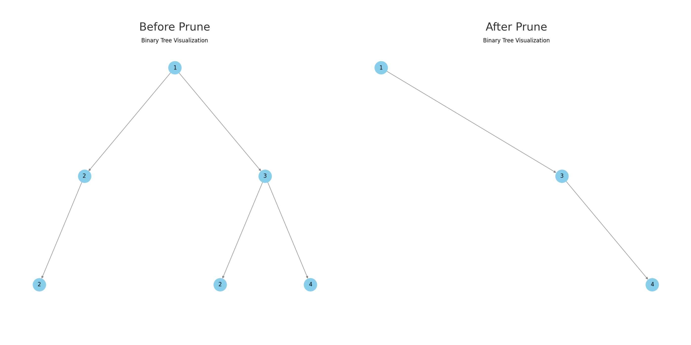
</div>

1. **Steps 1–7 (Left Subtree of Root):**  
   * **Step 1:** We start at the root (node **1** at depth 0).  
   * **Step 2:** The DFS moves to the left child (node **2** at depth 1).  
   * **Steps 3–7:** In the left subtree of node **2** (node **2** at depth 2), both children are `None` (steps 4–5). Since this node is a leaf and its value equals the target (2), it is pruned (step 7).

2. **Steps 8–10 (Back to Node at Depth 1):**  
   * The right child of the node at depth 1 is `None` (step 8).  
   * After processing both children, node **2** at depth 1 becomes a leaf (step 9) and, since its value equals 2, it too is pruned (step 10).

3. **Steps 11–16 (Right Subtree – Left Branch):**  
   * **Step 11:** The DFS now visits the right subtree of the root; node **3** at depth 1 is processed.  
   * **Steps 12–16:** The left child of node **3** is node **2** at depth 2. Its children are both `None` (steps 13–14), so it is pruned (steps 15–16) because its value equals 2.

4. **Steps 17–21 (Right Subtree – Right Branch):**  
   * **Step 17:** The DFS processes the right child of node **3**, which is node **4** at depth 2.  
   * **Steps 18–19:** Both children of node **4** are `None` (steps 18–19).  
   * **Step 20:** After processing its children, node **4** is identified as a leaf but its value does not equal the target, so it is kept (step 21).

5. **Steps 22–25 (Finishing the Root):**  
   * **Step 22:** Returning to node **3** (depth 1), its children have been processed (left pruned, right kept).  
   * **Step 23:** Node **3** is not a leaf, so it is kept.  
   * **Steps 24–25:** Back at the root (node **1**), after processing its children (left pruned, right preserved), node **1** is kept.

<center>

| Step | Depth | Node Value | Action                           | Result                              |
|------|-------|------------|----------------------------------|-------------------------------------|
| 1    | 0     | 1          | Visit root node                       | Processing children                 |
| 2    | 1     | 2          | Visit node                       | Processing children                 |
| 3    | 2     | 2          | Visit node                       | Processing children                 |
| 4    | 3     | None       | Skip (None node)                 | Return None                         |
| 5    | 3     | None       | Skip (None node)                 | Return None                         |
| 6    | 2     | 2          | After processing children        | Left: None, Right: None              |
| 7    | 2     | 2          | Leaf with target 2               | Prune (Return None)                 |
| 8    | 2     | None       | (Right child of node 2)          | Skip (None node), Return None       |
| 9    | 1     | 2          | After processing children        | Left: None, Right: None              |
| 10   | 1     | 2          | Leaf with target 2               | Prune (Return None)                 |
| 11   | 1     | 3          | Visit node                       | Processing children                 |
| 12   | 2     | 2          | Visit node                       | Processing children                 |
| 13   | 3     | None       | Skip (None node)                 | Return None                         |
| 14   | 3     | None       | Skip (None node)                 | Return None                         |
| 15   | 2     | 2          | After processing children        | Left: None, Right: None              |
| 16   | 2     | 2          | Leaf with target 2               | Prune (Return None)                 |
| 17   | 2     | 4          | Visit node                       | Processing children                 |
| 18   | 3     | None       | Skip (None node)                 | Return None                         |
| 19   | 3     | None       | Skip (None node)                 | Return None                         |
| 20   | 2     | 4          | After processing children        | Left: None, Right: None              |
| 21   | 2     | 4          | Not a target leaf                | Keep node                           |
| 22   | 1     | 3          | After processing children        | Left: None, Right: 4                 |
| 23   | 1     | 3          | Not a target leaf                | Keep node                           |
| 24   | 0     | 1          | After processing children        | Left: None, Right: 3                 |
| 25   | 0     | 1          | Not a target leaf                | Keep node                           |

</center>

---

## Time Complexity

The overall time complexity of the algorithm is $O(n)$, where $n$ is the number of nodes in the binary tree. The algorithm visits each node exactly once and performs the following operations at each node:

1. Check if the node is not `None` or `nullptr`, which can be considered $O(1)$

2. Check if the node is a leaf and has the target value, which can all be considered $O(1)$

---

## Space Complexity

The space complexity of the algorithm is $O(h)$, where $h$ is $\log_2 n$ for a balanced tree and $n$ for a skewed tree.

---

# Longest ZigZag Path in a Binary Tree

Given the `root` of a binary tree, the goal is to determine the length of the longest ZigZag path contained in that tree. A **ZigZag path** is defined as follows:

1. **Start:** Choose any node in the binary tree and pick an initial direction (either left or right).
2. **Alternate:** If the current move is in a given direction, the next move must be in the opposite direction (i.e., after moving left, one must move right, and vice versa).
3. **Terminate:** Continue this alternating process until no further move is possible.
4. **Measure:** The length of the path is the number of nodes visited minus one (so a single node has a length of 0).

The solution uses a recursive depth-first search (DFS) that, at each node, computes the longest ZigZag path that can be achieved if the path reached that node via a left turn and similarly if it reached via a right turn.

---

## Explanation

The depth-first search (DFS) works as follows:

* **Base Case:**
  * If the node is `None` or `nullptr`, the function returns `{"turn_left": -1, "turn_right": -1}` or `(-1, -1)`.
  * This choice of `-1` ensures that when the parent's computation adds 1 (to account for the edge from the parent to a child), a leaf node will yield a path length of `0`.

* **Recursive Case:**

  * For a non-null node, the function recurses on both the left and right children:

    * Depth first search on the left child
    * Depth first search on the right child

  * **Path Extension:**

    * When moving **left** from the current node, the path is continued by taking the right-turn value from the left child:

      $$
      \text{left max len} = \text{max len if the next move was to turn right} + 1
      $$

    * Similarly, when moving **right**, it uses the left-turn value from the right child:

      $$
      \texttt{right max len} = \text{max len if the next move was to turn left} + 1
      $$

  * **Global Update:**

    * A global or instance attribute (`max len`) is maintained and updated with the maximum value among the current node’s computed `left_len` and `right_len`.

  * **Return Value:**

    * Each depth first search function returns a dictionary or tuple with the computed `left_len` and `right_len` values

Consider a simplified binary tree as follows:

<div style="text-align: center;">
    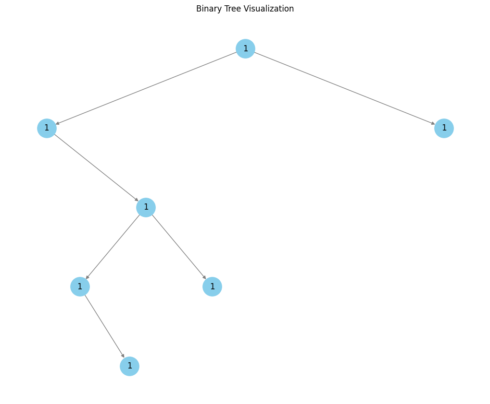
</div>

<center>

| **Depth** | **Current Node** | **Operation** | **Calculation / Returned Value** | **Global Max Update** |
|-----------|------------------|---------------|----------------------------------|-----------------------|
| **0**     | **Root (1)**     | Start DFS and traverse **left subtree** | – | – |
| **1**     | Left Child (1)   | Traverse left child (None: base case) | Returns `{L: -1, R: -1}` | – |
| **1**     | Left Child (1)   | Traverse **right subtree** (continue DFS) | – | – |
| **2**     | Node (1)         | Traverse left child (None: base case) | Returns `{L: -1, R: -1}` | – |
| **2**     | Node (1)         | Traverse **right subtree** (continue DFS) | – | – |
| **3**     | Node (1)         | Traverse left child (None: base case) | Returns `{L: -1, R: -1}` | – |
| **3**     | Node (1)         | Traverse **right subtree** (continue DFS) | – | – |
| **4**     | Node (1)         | Traverse left child (None: base case) | Returns `{L: -1, R: -1}` | – |
| **4**     | Node (1)         | Traverse right child (None: base case) | Returns `{L: -1, R: -1}` | – |
| **4**     | Node (1)         | **Calculate at leaf node** | <ul><li>Left: `-1 + 1 = 0`</li><li>Right: `-1 + 1 = 0`</li></ul> Returns `{L: 0, R: 0}` | Global Max = **0** |
| **3**     | Node (1)         | **Backtrack & calculate** at this node | <ul><li>Left: `-1 + 1 = 0`</li><li>Right: `0 + 1 = 1`</li></ul> Returns `{L: 0, R: 1}` | Global Max = **1** |
| **2**     | Node (1)         | **Traverse right subtree’s children** (both are base cases) | Each returns `{L: -1, R: -1}` | – |
| **2**     | Node (1)         | **Calculate at this node** after right subtree calls | <ul><li>Left (from left child): already computed</li><li>Right: `-1 + 1 = 0`</li></ul> (For this branch, the calculation continues below) | – |
| **2**     | Node (1)         | **Combine results** from left and right calls:  | <ul><li>From left subtree: value `1` (for a turn that alternates from left)</li><li>New Left: `1 + 1 = 2`</li><li>New Right: `0 + 1 = 1`</li></ul> Returns `{L: 2, R: 1}` | Global Max = **2** |
| **1**     | Left Child (1)   | **Backtrack & calculate** at this node using results from both subtrees | <ul><li>Left: `-1 + 1 = 0`</li><li>Right: `2 + 1 = 3`</li></ul> Returns `{L: 0, R: 3}` | Global Max = **3** |
| **0**     | **Root (1)**     | Now, traverse **right subtree** of the root | (Similar DFS steps occur on the right; base cases return `{L: -1, R: -1}` and calculations yield `{L: 0, R: 0}` for those nodes.) | Global Max remains **3** |
| **0**     | **Root (1)**     | **Final calculation at the root** combining both subtrees | <ul><li>Left: from left subtree, `3 + 1 = 4`</li><li>Right: from right subtree, `0 + 1 = 1`</li></ul> Returns `{L: 4, R: 1}` | Global Max updated to **4** |

</center>

---

## Time Complexity

* **Traversal:** The DFS visits each node exactly once.
* **Per-Node Operations:** At each node, only a constant number of operations is performed (retrieving dictionary values, arithmetic additions, comparisons, and updating the global maximum).

Thus, the overall time complexity is $O(n)$, where $n$ is the number of nodes in the binary tree.

---

## Space Complexity

* **Call Stack:** The depth of the recursion is at most the height $h$ of the tree.
  * **Worst Case (Skewed Tree):** $h = O(n)$
  * **Average/Best Case (Balanced Tree):** $h = O(\log n)$
* **Auxiliary Space:** Only a constant amount of extra space is used per recursive call such as a dictionary or tuple to store the computed values.

Therefore, the space complexity is $O(h)$, where $h$ is the height of the tree.
