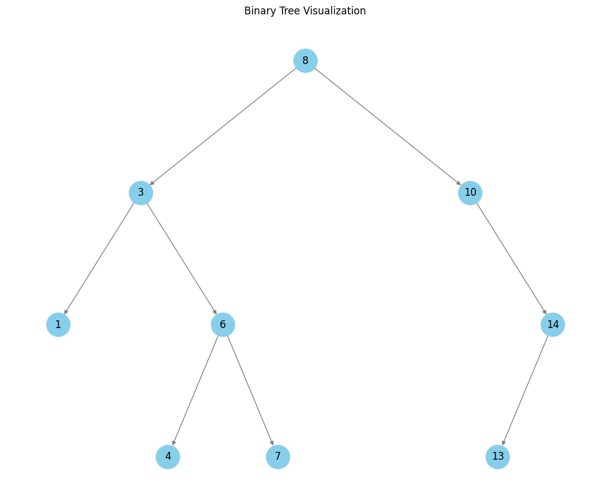

# Max Depth

Given a `root` node of a binary tree, return its maximum depth. A binary tree's maximum depth is the number of nodes along the longest path from the root node down to the farthest leaf node.

## Time Complexity

The `max_depth` function has a time complexity of $O(n)$, becuase the function visits each node in the tree exactly once.

For each node, we perform $O(1)$ operations, i.e., checking for `None` or `nullptr`.

## Space Complexity

The space complexity of the `max_depth` function is $O(n)$, where $n$ is the number of nodes in the tree. This is because the function uses a recursive approach, which requires additional space on the call stack. The maximum depth of the call stack is equal to the height of the tree, which is $O(n)$ in the worst case.

If the tree is complete, i.e., all nodes have zero or two children, the space complexity is $O(\log_2 n)$ as a best case scenario.

---

# Path Sum

Given the `root` of a binary tree and an integer `target`, return `true` if the tree has a root-to-leaf path such that adding up all the values along the path equals `target`; a leaf is a node with no children.

## Explanation

Consider the following binary tree with `target = 22`:

<div style="text-align: center;">
    
</div>

<center>

| Step | Node Value | Current Sum | Target | Action |
|------|------------|-------------|--------|--------|
| **Tree:** `[5, 4, 8, 11, None, 13, 4, 7, 2, None, None, None, 1]`, Target = 22 |
| 1    | 5          | 0           | 22     | `current sum (0) + node.data (5) = 5` |
| 2    | 4          | 5           | 22     | `current sum (5) + node.data (4) = 9` |
| 3    | 11         | 9           | 22     | `current sum (9) + node.data (11) = 20` |
| 4    | 7          | 20          | 22     | `We are at a leaf node, current sum (20) + node data (7) == target (22) is False` |
| 5    | 2          | 20          | 22     | `We are at a leaf node, current sum (20) + node data (2) == target (22) is True` |
|      | **Return** |             |        | `Path found, returning True` |
|      | **Explanation**         |        |        | `A path (5 -> 4 -> 11 -> 2) has a cumulative sum of 22, matching the target` |

</center>

## Time Complexity

Each node in the binary tree is visited once as we perform a depth-first search traversal. For each node, the function:

* Check that the current `node` is not `None` or a `nullptr`, which is $O(1)$

* Check that the left and right children of the current node are none, both of which are ($O(1)$)

  * If a leaf is encountered, a sum operation is performend `curr_sum + node.data` and it is compared
      to `target`, again $O(1)$

  * If the current node is not a leaf, then `curr_sum += node.data`, which can be considered $O(1)$

In the worst case, where no path exists, and all nodes are visited, the overall time complexity of the search algorithm is $O(n)$, where $n$ is the total number of nodes in the binary tree.

## Space Complexity

The space complexity of the algorithm is influenced by the recursion stack depth, which depends on the height of the tree:

1. **Best and Average Case (Balanced Tree):** In a balanced binary tree, the height $h$ is $O(\log_2 n)$. Thus, the recursive stack will hold up to $O(\log_2 n)$ calls at any point, resulting in a space complexity of $O(\log_2 n)$.

2. **Worst Case (Skewed Tree):** In an unbalanced, skewed tree (e.g., all nodes on one side), the height $h$ can be $O(n)$, leading to $O(n)$ recursive calls on the stack.

Hence, the overall space complexity is $O(h)$, where $h$ is the height of the tree, translating to:

* $O(\log_2 n)$ in the best and average case for a balanced tree
* $O(n)$ in the worst case for a skewed tree

---

# Count Good Nodes in Binary Tree

Given a binary tree `root`, a node `X` in the tree is considered good if the following condition is satisfied:

> From the root of the binary tree to node `X`, there is no node with a value greater than that of `X`.

Find the number of good nodes in the binary tree.

## Explanation

Consider the following binary tree:

<div style="text-align: center;">
    
</div>

<center>

| Step | Node       | Max Value So Far | Decision                           | Number of Good Nodes |
|------|------------|------------------|------------------------------------|----------------------|
| 1    | 3 (root)   | -∞               | Good Node (3 ≥ -∞)                 | +1                   |
| 2    | 1 (left)   | 3                | Not a Good Node (1 < 3)            |                      |
| 3    | 3 (left of 1) | 3             | Good Node (3 ≥ 3)                  | +1                   |
| 4    | None       | N/A              | Empty Tree Node, returning 0       |                      |
| 5    | None       | N/A              | Empty Tree Node, returning 0       |                      |
| 6    | 4 (right)  | 3                | Good Node (4 ≥ 3)                  | +1                   |
| 7    | 1 (left of 4) | 4             | Not a Good Node (1 < 4)            |                      |
| 8    | None       | N/A              | Empty Tree Node, returning 0       |                      |
| 9    | None       | N/A              | Empty Tree Node, returning 0       |                      |
| 10   | 5 (right of 4) | 4            | Good Node (5 ≥ 4)                  | +1                   |

</center>

## Time Complexity

Each node in the binary tree is visited once, and the following operations are performed at each node:

* Check if the current node is not `None` or a `nullptr`, which can be considered $O(1)$

* Add the number of good nodes that have been found from the left and right subtrees so far, which is $O(1)$

* Check if the current node is a good node, incrementing the count if it is, which is $O(1)$

The implementation uses postorder traversal. The time complexity of the algorithm is $O(n)$, where $n$ is the total number of nodes in the binary tree.

## Space Complexity

The space complexity of the algorithm is again $O(h)$, where $h$ is $\log_2 n$ for a balanced tree and $n$ for a skewed tree.

---

# Same Tree

Given the roots of two binary trees `p` and `q`, check if they are the same or not.

Two binary trees are considered the same if they are structurally identical, and the nodes have the same value.

## Explanation

Consider the following binary trees:

<div style="text-align: center;">
    
</div>

<div style="text-align: center;">
    
</div>

<center>

| Step | Node (Tree 1) | Node (Tree 2) | Action                                  | Result   | Recursiion Tree Depth |
|------|---------------|---------------|-----------------------------------------|----------|--------------|
| 1    | 1             | 1             | Comparing nodes (1 == 1). Proceed deeper. | -        | -            |
| 2    | 3             | 3             | Comparing nodes (3 == 3). Proceed deeper. | -        | -            |
| 3    | 7             | 7             | Comparing nodes (7 == 7). Proceed deeper. | -        | -            |
|      | None          | None          | Both children nodes of Tree 1 are `None`. Returning `True`.  | `True`   | Depth 3      |
|      | None          | None          | Both children nodes of Tree 2 are `None`. Returning `True`.  | `True`   | Depth 3      |
| 4    | -             | -             | Returning `True` for nodes (7, 7).        | `True`   | Depth 2      |
| 5    | 10            | 9             | Comparing nodes (10 != 9). Not equal. Returning `False`. | `False` | Depth 2      |
|      | None          | None          | Both children nodes of Tree 1 are `None`. Returning `True`.  | `True`   | Depth 3      |
|      | None          | None          | Both children nodes of Tree 2 are `None`. Returning `True`.  | `True`   | Depth 3      |
| 6    | -             | -             | Returning `False` for nodes (10, 9).      | `False`  | Depth 2      |
| 7    | -             | -             | Returning `False` for nodes (3, 3) since one of the children is `False`. | `False`  | Depth 1      |
| 8    | 5             | 5             | Comparing nodes (5 == 5). Proceed deeper. | -        | -            |
|      | None          | None          | Both children nodes of Tree 1 are `None`. Returning `True`.  | `True`   | Depth 3      |
|      | None          | None          | Both children nodes of Tree 2 are `None`. Returning `True`.  | `True`   | Depth 3      |
| 9    | -             | -             | Returning `True` for nodes (5, 5).        | `True`   | Depth 1      |
| 10   | -             | -             | Returning `False` for nodes (1, 1) since the left subtree returned `False`. | `False`  | Root         |

</center>

## Time Complexity

In any case, the algorithm visits each node in both trees once. All operations performed at each node (i.e., comparisons) can be considered $O(1)$. Thus, the overall time complexity of the algorithm is $O(n)$, where $n$ is the total number of nodes in the binary tree.

## Space Complexity

The space complexity of the algorithm is $O(h)$, where $h$ is $\log_2 n$ for a balanced tree and $n$ for a skewed tree.

---

# Lowest Common Ancestor

Given the `root` of a binary tree and two nodes `p` and `q`, find the lowest common ancestor (LCA) node of `p` and `q`. The lowest common ancestor is defined as the deepest node in the tree that has both `p` and `q` as descendants (where we allow a node to be a descendant of itself).

## Explanation

Consider the following binary tree with `p = 5` and `q = 1`:

<div style="text-align: center;">
    
</div>

<center>

| Step | Current Node | Action | Result | Call Stack Depth |
|------|--------------|--------|---------|-----------------|
| 1    | 3 (root)     | Compare with targets (3 ≠ 5 and 3 ≠ 1) | Explore both subtrees | 1 |
| 2    | 5            | Found first target (5 = 5) | Return node 5 | 2 |
| 3    | 6            | Compare with targets (6 ≠ 5 and 6 ≠ 1) | Return null (not found) | 3 |
| 4    | 2            | Compare with targets (2 ≠ 5 and 2 ≠ 1) | Return null (not found) | 3 |
| 5    | 7            | Compare with targets (7 ≠ 5 and 7 ≠ 1) | Return null (not found) | 4 |
| 6    | 4            | Compare with targets (4 ≠ 5 and 4 ≠ 1) | Return null (not found) | 4 |
| 7    | 1            | Found second target (1 = 1) | Return node 1 | 2 |
| 8    | 0            | Compare with targets (0 ≠ 5 and 0 ≠ 1) | Return null (not found) | 3 |
| 9    | 8            | Compare with targets (8 ≠ 5 and 8 ≠ 1) | Return null (not found) | 3 |
| Final | 3           | Both subtrees returned nodes, this is LCA | Return node 3 | 1 |

</center>

## Time Complexity

The `lowestCommonAncestor` function has a time complexity of $O(n)$, where $n$ is the number of nodes in the binary tree. This is because:

* Each node is visited exactly once during the **postorder** traversal
* At each node, we perform $O(1)$ operations:
  * Checking if the node is null
  * Comparing the node's value with target values
  * Making recursive calls
  * Evaluating the results from subtrees

## Space Complexity

The space complexity of the algorithm is again $O(h)$, where $h$ is $\log_2 n$ for a balanced tree and $n$ for a skewed tree.

---

# Minimum Depth of Binary Tree

Given a binary tree `root`, return its minimum depth.

The minimum depth is the number of nodes along the shortest path from the root node down to the nearest leaf node.

A leaf node is a node with no children.

## Explanation

Consider the following binary tree:

<div style="text-align: center;">
    
</div>

<center>

| Step | Current Node | Action | Current Path | Minimum Depth |
|------|--------------|--------|--------------|---------------|
| 1    | 3           | Root node, check both children | [3] | - |
| 2    | 9           | Leaf node found (no children) | [3, 9] | 2 |
| 3    | 20          | Has both children, continue | [3, 20] | - |
| 4    | 15          | Leaf node found | [3, 20, 15] | 3 |
| 5    | 7           | Leaf node found | [3, 20, 7] | 3 |
| Final | - | Return minimum found (2) | [3, 9] | 2 |
| **Explanation** | The shortest path from root to leaf is [3, 9], with a depth of 2 nodes | | | |

</center>

## Time Complexity

The overall time complexity of $O(n)$, where $n$ is the number of nodes in the binary tree.

* Each node is visited exactly once during the traversal

* At each node, we perform $O(1)$ operations:
  * Checking if the node is null
  * Checking if left/right children exist
  * Making recursive calls
  * Computing minimum between left and right depths

## Space Complexity

The space complexity is $O(h)$, where $h$ is the height of the tree. In the worst case, the tree is skewed, and the height is equal to the number of nodes $n$, leading to a space complexity of $O(n)$.

The modern C++ implementation using `std::optional` adds a small constant space overhead per recursive call, but this doesn't change the overall space complexity.

## Implementation Notes

The C++ implementation offers several advantages:

1. **Type Safety:** Using `std::optional` makes null handling explicit and type-safe
2. **Clear Intent:** The code clearly distinguishes between "no child" (`std::nullopt`) and "child with depth" cases
3. **Exception Safety:** `value_or()` provides a safe fallback for null cases

---

# Maximum Ancestor Difference in a Binary Tree

Given the `root` of a binary tree, calculate the **maximum difference** between the values of ancestor and descendant nodes.

An ancestor is any node along the path from the root to a given node (excluding the node itself). The descendant nodes are all nodes that fall under the subtree rooted at the ancestor node.

## Explanation

Consider the following binary tree `[8, 3, 10, 1, 6, None, 14, None, None, 4, 7, None, 13]`:

<div style="text-align: center;">
    
</div>

The function calculates the difference between the maximum and minimum node values along any path in the tree and returns the maximum of these differences.

<center>

| Step | Current Node                  | Current `(max, min)` | Updated `(max, min)`                          | Left Subtree Diff | Right Subtree Diff | Result at Node | Call Stack Depth          |
|------|-------------------------------|-----------------------|-----------------------------------------------|-------------------|--------------------|----------------|---------------------------|
| 1    | 8 (root)                     | (-∞, ∞)              | (8, 8), since 8 is smaller than ∞ and larger than -∞ | -                 | -                  | -              | 1                         |
| 2    | &nbsp;&nbsp;3                | (8, 8)               | (8, 3), min is updated from 8 to 3            | -                 | -                  | -              | 2 (left subtree of root)  |
| 3    | &nbsp;&nbsp;&nbsp;&nbsp;1 (leaf)   | (8, 3)               | (8, 1), min is updated from 3 to 1            | 7                 | 7                  | 7              | 3                         |
| 4    | &nbsp;&nbsp;&nbsp;&nbsp;6    | (8, 3)               | (8, 3), no updates                            | -                 | -                  | -              | 3                         |
| 5    | &nbsp;&nbsp;&nbsp;&nbsp;&nbsp;&nbsp;&nbsp;&nbsp;4 (leaf) | (8, 3)               | (8, 3), no updates                            | 5                 | 5                  | 5              | 4                         |
| 6    | &nbsp;&nbsp;&nbsp;&nbsp;&nbsp;&nbsp;&nbsp;&nbsp;7 (leaf) | (8, 3)               | (8, 3), no updates                            | 5                 | 5                  | 5              | 4                         |
| 7    | &nbsp;&nbsp;&nbsp;&nbsp;-                             | (8, 3)               | (8, 3), no updates                            | 5                 | 5                  | 5              | 3                         |
|      | The left subtree gives a maximum difference of 7      | -                   | -                                             | -                 | -                  | -              | -                         |
| 8    | &nbsp;&nbsp;10               | (8, 8)               | (10, 8), max is updated from 8 to 10          | 2                 | -                  | -              | 2 (right subtree of root) |
| 9    | &nbsp;&nbsp;&nbsp;&nbsp;14   | (10, 8)              | (14, 8), max is updated from 10 to 14         | 6                 | 6                  | 6              | 3                         |
| 10   | &nbsp;&nbsp;&nbsp;&nbsp;&nbsp;&nbsp;&nbsp;&nbsp;13 (leaf) | (14, 8)              | (14, 8), no updates                          | 6                 | 6                  | 6              | 4                         |
| 11   | &nbsp;&nbsp;&nbsp;&nbsp;-                             | (14, 8)              | (14, 8)                                       | 6                 | 6                  | 6              | 3                         |
|      | The right subtree gives a maximum difference of 6     | -                   | -                                             | -                 | -                  | -              | -                         |
| Final| -                             | -                    | -                                             | 7                 | 6                  | **7**          | Root                      |

</center>

* **Starting at the root (Node 8)**:

  * `(max, min)` are initialized to `(-∞, ∞)`.

  * **Left Subtree (Node 3)**:

    * Updates `(max, min)` to `(8, 3)`.
    * Traverses its children (Nodes 1 and 6).

      * **Left-Left Subtree (Node 1)**:

        * Updates `(max, min)` to `(8, 1)`.
        * As it is a leaf, calculates `|8 - 1| = 7`.

      * **Left-Right Subtree (Node 6)**:

        * Updates `(max, min)` to `(8, 3)`.
        * Traverses its children (Nodes 4 and 7).

          * **Left-Right-Left Subtree (Node 4)**:

            * Updates `(max, min)` to `(8, 3)`.
            * As it is a leaf, calculates `|8 - 3| = 5`.

          * **Left-Right-Right Subtree (Node 7)**:

            * Updates `(max, min)` to `(8, 3)`.
            * As it is a leaf, calculates `|8 - 3| = 5`.

  * **Right Subtree (Node 10)**:

    * Updates `(max, min)` to `(10, 8)`.
    * Traverses its child (Node 14).

      * **Right-Right Subtree (Node 14)**:
        * Updates `(max, min)` to `(14, 8)`.
        * Traverses its child (Node 13).

          * **Right-Right-Left Subtree (Node 13)**:
            * Updates `(max, min)` to `(14, 8)`.
            * As it is a leaf, calculates `|14 - 8| = 6`.

* **Final Calculation**:

  * The left subtree gives a maximum difference of **7**.
  * The right subtree gives a maximum difference of **6**.
  * The overall maximum difference is **7**.

---

## Time Complexity

The algorithm maintains some states (i.e., the `min` and `max`) going down the tree (pre-order) and computes the maximum differences of left and right subtrees on the way back up (post-order). Each node is visited exactly once, and the following operations are performed at each node:

* Checking if the node is not `None` or `nullptr`, which can be considered $O(1)$
* Per node operations (updating `max` and `min`), which can also be considered $O(1)$

Hence, the overall time complexity of the algorithm is $O(n)$, where $n$ is the number of nodes in the binary tree.

---

## Space Complexity

The space complexity of the algorithm is again $O(h)$, where $h$ is $\log_2 n$ for a balanced tree and $n$ for a skewed tree.

---

# Diameter of Binary Tree

Given the `root` of a binary tree, return the length of the diameter of the tree.

The *diameter* of a binary tree is the length of the longest path between any two nodes in a tree. This path may or may not pass through the `root`.

The length of a path between two nodes is represented by the number of edges between them.

---

## Explanation

Consider the following binary tree `[, 7, 9, None, 7, None, 8, 9, 10, 233, 17, None, 23]`:

<div style="text-align: center;">
    
</div>

<center>

| Step | Current Node | Action                                       | Left Subtree Height | Right Subtree Height | Current Diameter (Equation) | Previous Diameter | Updated Diameter (Equation)            | Height Returned (Equation)            | Call Stack Depth |
|------|--------------|----------------------------------------------|---------------------|----------------------|-----------------------------|-------------------|----------------------------------------|----------------------------------------|-----------------|
| 1    | 3 (root)     | Starting diameter calculation.               | -                   | -                    | -                           | -                 | -                                      | -                                      | 1               |
| 2    | 7            | Processing left child of 3.                  | -                   | -                    | -                           | -                 | -                                      | -                                      | 2               |
| 3    | None         | Reached a leaf node (left child of 7).       | 0                   | -                    | -                           | -                 | -                                      | `0`                                    | 3               |
| 4    | 7            | Processing right child of 7.                 | -                   | -                    | -                           | -                 | -                                      | -                                      | 3               |
| 5    | 9            | Processing left child of 7.                  | -                   | -                    | -                           | -                 | -                                      | -                                      | 4               |
| 6    | None         | Reached a leaf node (left child of 9).       | 0                   | -                    | -                           | -                 | -                                      | `0`                                    | 5               |
| 7    | 23           | Processing right child of 9.                 | -                   | -                    | -                           | -                 | -                                      | -                                      | 5               |
| 8    | None         | Reached a leaf node (left child of 23).      | 0                   | -                    | -                           | -                 | -                                      | `0`                                    | 6               |
| 9    | None         | Reached a leaf node (right child of 23).     | 0                   | 0                    | `0 + 0 = 0`                 | `0`               | `max(0, 0) = 0`                        | `max(0, 0) + 1 = 1`                    | 6               |
| 10   | 9            | Returning from 23. Updating heights.         | 1                   | -                    | -                           | -                 | -                                      | -                                      | 5               |
| 11   | 9            | Returning from 9. Calculating diameter.      | 0                   | 1                    | `0 + 1 = 1`                 | `0`               | `max(0, 1) = 1`                        | `max(0, 1) + 1 = 2`                    | 4               |
| 12   | 10           | Processing right child of 7.                 | -                   | -                    | -                           | -                 | -                                      | -                                      | 5               |
| 13   | None         | Reached a leaf node (left child of 10).      | 0                   | -                    | -                           | -                 | -                                      | `0`                                    | 6               |
| 14   | None         | Reached a leaf node (right child of 10).     | 0                   | 0                    | `0 + 0 = 0`                 | `1`               | `max(1, 0) = 1`                        | `max(0, 0) + 1 = 1`                    | 6               |
| 15   | 7            | Returning to 7 after processing 10.          | 2                   | 1                    | `2 + 1 = 3`                 | `1`               | `max(1, 3) = 3`                        | `max(2, 1) + 1 = 3`                    | 2               |
| 16   | 7            | Returning to root (3) after processing 7.    | 4                   | -                    | -                           | -                 | -                                      | `max(4, 3) + 1 = 4`                    | 1               |
| 17   | 9            | Processing right child of 3.                 | -                   | -                    | -                           | -                 | -                                      | -                                      | 2               |
| 18   | 8            | Processing left child of 9.                  | -                   | -                    | -                           | -                 | -                                      | -                                      | 3               |
| 19   | 233          | Processing left child of 8.                  | -                   | -                    | -                           | -                 | -                                      | -                                      | 4               |
| 20   | None         | Reached a leaf node (left child of 233).     | 0                   | -                    | -                           | -                 | -                                      | `0`                                    | 5               |
| 21   | None         | Reached a leaf node (right child of 233).    | 0                   | 0                    | `0 + 0 = 0`                 | `3`               | `max(3, 0) = 3`                        | `max(0, 0) + 1 = 1`                    | 5               |
| 22   | 17           | Processing right child of 8.                 | -                   | -                    | -                           | -                 | -                                      | -                                      | 4               |
| 23   | None         | Reached a leaf node (left child of 17).      | 0                   | -                    | -                           | -                 | -                                      | `0`                                    | 5               |
| 24   | None         | Reached a leaf node (right child of 17).     | 0                   | 0                    | `0 + 0 = 0`                 | `3`               | `max(3, 0) = 3`                        | `max(0, 0) + 1 = 1`                    | 5               |
| 25   | 8            | Returning from 17 to 8. Updating heights.    | 1                   | 1                    | `1 + 1 = 2`                 | `3`               | `max(3, 2) = 3`                        | `max(1, 1) + 1 = 2`                    | 3               |
| 26   | 3 (root)     | Final update to diameter.                    | 4                   | 3                    | `4 + 3 = 7`                 | `3`               | `max(3, 7) = 7`                        | `max(4, 3) + 1 = 5`                    | 1               |

</center>

---

## Time Complexity

The algorithm visits each node exactly once, and the following operations are performed at each node:

* Checking if the node is not `None` or `nullptr`, which can be considered $O(1)$
* Per node operations (calculating and updating diameters and heights), which can all be considered $O(1)$

Hence, the overall time complexity of the algorithm is $O(n)$, where $n$ is the number of nodes in the binary tree.

---

## Space Complexity

The space complexity of the algorithm is again $O(h)$, where $h$ is $\log_2 n$ for a balanced tree and $n$ for a skewed tree.

---

# Leaf-Similar Trees

Consider all the leaves of a binary tree, from left to right order, the values of those leaves form a leaf value sequence.

Two binary trees are considered **leaf-similar** if their leaf value sequence is the same.

## Explanation

Consider the following binary trees:

<div style="text-align: center;">
    
</div>

<div style="text-align: center;">
    
</div>

<center>

| **Step** | **Mode**    | **Node Value** | **Queue State Before** | **Queue State After** | **Action**                            | **Similar Flag** |
|----------|-------------|----------------|-------------------------|------------------------|----------------------------------------|--------------------|
| 1        | Enqueue     | 6              | `[]`                    | `[6]`                 | Enqueued leaf node 6                   | True               |
| 2        | Enqueue     | 7              | `[6]`                   | `[6, 7]`              | Enqueued leaf node 7                   | True               |
| 3        | Enqueue     | 4              | `[6, 7]`                | `[6, 7, 4]`           | Enqueued leaf node 4                   | True               |
| 4        | Enqueue     | 9              | `[6, 7, 4]`             | `[6, 7, 4, 9]`        | Enqueued leaf node 9                   | True               |
| 5        | Enqueue     | 8              | `[6, 7, 4, 9]`          | `[6, 7, 4, 9, 8]`     | Enqueued leaf node 8                   | True               |
| 6        | Dequeue     | 6              | `[6, 7, 4, 9, 8]`       | `[7, 4, 9, 8]`        | Matched and dequeued 6                 | True               |
| 7        | Dequeue     | 7              | `[7, 4, 9, 8]`          | `[4, 9, 8]`           | Matched and dequeued 7                 | True               |
| 8        | Dequeue     | 4              | `[4, 9, 8]`             | `[9, 8]`              | Matched and dequeued 4                 | True               |
| 9        | Dequeue     | 9              | `[9, 8]`                | `[8]`                 | Matched and dequeued 9                 | True               |
| 10       | Dequeue     | 8              | `[8]`                   | `[]`                  | Matched and dequeued 8                 | True               |
| 11       | Dequeue     | 10             | `[]`                    | `[]`                  | **Mismatch found! Queue is empty. This means that one tree has more leaf nodes and the trees cannot be leaf-similar**    | **False**          |

</center>

### C++ Implementation

The C++ implementation uses a **recursive lambda function** to perform a depth-first search (DFS) on the binary trees.

```cpp
std::function<bool(TreeNode::ptr &, bool)> depthFirstSearch = [&internalDeque](TreeNode::ptr &node, bool enqueueMode) -> bool
```

* **Purpose**:
  [std::function](https://en.cppreference.com/w/cpp/utility/functional/function) is a polymorphic, type-safe wrapper for callable objects. It is used here to define a lambda function that supports recursion. Without `std::function`, a lambda cannot refer to itself recursively.

* **Type Signature**:

  1. **`std::function<bool(TreeNode::ptr &, bool)>`**:
    A type-safe wrapper for the recursive lambda.

  2. **`depthFirstSearch`**:
    The variable holding the lambda function.

  3. **`[&internalDeque, &depthFirstSearch]`**:
    Captures `internalDeque` and itself by reference for modification within the lambda and recursive calls.

  4. **`(TreeNode::ptr &node, bool enqueueMode)`**:
    The parameter list defining inputs for each recursive call.

  5. **`-> bool`**:
    Specifies the lambda’s return type.

* **Why `std::function` is Required**:
  Normally, a lambda cannot refer to itself because its type is anonymous. `std::function` provides an explicit, named type that allows recursive calls to the lambda.

---

## Time Complexity

For each tree, the algorithm visits each leaf node once, and the following operations are performed at each node:

* Checking if the node is not `None` or `nullptr`, which can be considered $O(1)$
* If the left and right children are `None`, the node is a leaf:

  * If the `mode` is `Enqueue`, the leaf node is added to the queue, which is $O(1)$

  * If the `mode` is `Dequeue`:

    * Check if the internal queue is non-empty and that the current node data matches the front of the queue, both of which are $O(1)$

      * If the conditions are met, the front of the queue is dequeued, which is $O(1)$

      * If the conditions are not met, set the `similar` flag to `False`

Let $n$ and $m$ be the number of nodes in the two trees. The overall time complexity of the algorithm is $O(n + m)$.

---

## Space Complexity

For a balanced binary tree, the number of leaf nodes is $ O(\frac{n}{2})$ and $ O(\frac{m}{2})$ for the two respective trees.

This implementation uses a single `std::deque` (in C++) and `collections.deque` (in Python) to store the leaf nodes.

In the worst-case scenario, the space complexity is $ O(\max(\frac{n}{2}, \frac{m}{2})) $. This can be simplified to $ O(\max(n, m)) $, as the constant factor $\frac{1}{2}$ does not affect the asymptotic complexity.

---

# Invert Binary Tree

Given the `root` of a binary tree, invert the tree, i.e., swap the left and right children of all nodes.

## Explanation

Consider the following binary tree:

<div style="text-align: center;">
    
</div>

The implementations uses **post-order** traversal to invert the binary tree:

<center>

| Step | Depth | Current Node | Left Subtree Before      | Right Subtree Before     | Action                                                                                   | Left Subtree After      | Right Subtree After     |
|------|-------|--------------|--------------------------|--------------------------|------------------------------------------------------------------------------------------|--------------------------|--------------------------|
| 1    | 0     | 9 (root)     | 12                       | 7                        | Visiting root. Recursively inverting left and right subtrees.                            | -                        | -                       |
| 2    | 1     | 12           | None                     | 9                        | Visiting left child of root. Recursively inverting left and right.                       | -                        | -                     |
| 3    | 2     | None         | -                        | -                        | Reached a leaf node. Returning None.                                                     | -                        | -                        |
| 4    | 2     | 9            | 8                        | None                     | Visiting node. Recursively inverting left and right.                                     | -                     | -                        |
| 5    | 3     | 8            | None                     | None                     | Visiting node. Recursively inverting left and right.                                     | -                     | -                    |
| 6    | 4     | None         | -                        | -                        | Reached a leaf node. Returning None.                                                     | -                        | -                        |
| 7    | 4     | None         | -                        | -                        | Reached a leaf node. Returning None.                                                     | -                        | -                        |
| 8    | 3     | 8            | None                     | None                     | Swapping left and right.                                                                 | None                     | None                     |
| 9    | 2     | 9            | 8                        | None                     | Swapping left and right.                                                                 | None                     | 8                        |
| 10   | 1     | 12           | None                     | 9                        | Swapping left and right.                                                                 | 9                        | None                     |
| 11   | 1     | 7            | 20                       | None                     | Visiting right child of root. Recursively inverting left and right.                      | -                     | -                       |
| 12   | 2     | 20           | None                     | None                     | Visiting node. Recursively inverting left and right.                                     | -                     | -                     |
| 13   | 3     | None         | -                        | -                        | Reached a leaf node. Returning None.                                                     | -                        | -                        |
| 14   | 3     | None         | -                        | -                        | Reached a leaf node. Returning None.                                                     | -                        | -                        |
| 15   | 2     | 20           | None                     | None                     | Swapping left and right.                                                                 | None                     | None                     |
| 16   | 1     | 7            | 20                       | None                     | Swapping left and right.                                                                 | None                     | 20                       |
| 17   | 0     | 9 (root)     | 12                       | 7                        | Swapping left and right.                                                                 | 7                        | 12                       |

</center>

Due to the **post-order** traversal, the left and right subtrees are inverted from the bottom up.

---

## Time Complexity

The algorithm visits each node exactly once, and the following operations are performed at each node:

* Checking if the node is not `None` or `nullptr`, which can be considered $O(1)$

* Swap the left and right children of the current node, which can also be considered $O(1)$

Hence, the overall time complexity of the algorithm is $O(n)$, where $n$ is the number of nodes in the binary tree.

---

## Space Complexity

The space complexity of the algorithm is $O(h)$, where $h$ is $\log_2 n$ for a balanced tree and $n$ for a skewed tree.

---

# Symmetric Tree

Given the `root` of a binary tree, check whether the tree is symmetric around its center.

A binary tree is symmetric if the left subtree is a mirror reflection of the right subtree at the root.

## Explanation

Consider the following binary tree:

<div style="text-align: center;">
    
</div>

<center>

| Step | Recursion Depth | Node 1       | Node 2       | Action                                   | Result        |
|------|-----------------|--------------|--------------|------------------------------------------|---------------|
| 1    | 0               | 1            | 1            | Comparing root nodes                    | Proceed       |
| 2    | 1               | 2            | 2            | Comparing left and right children       | Proceed       |
| 3    | 2               | 8            | 7            | Values do not match                     | **False**     |
| 4    | 2               | 4            | 4            | Comparing left and right children       | Proceed       |
| 5    | 3               | None         | None         | Both nodes are `None`                   | **True**      |
| 6    | 3               | None         | None         | Both nodes are `None`                   | **True**      |
| 7    | 2               | -            | -            | Left subtree comparison result: `True` | Return False  |
| 8    | 1               | 2            | 2            | Comparing left and right children       | Proceed       |
| 9    | 2               | 4            | 4            | Comparing left and right children       | Proceed       |
| 10   | 3               | None         | None         | Both nodes are `None`                   | **True**      |
| 11   | 3               | None         | None         | Both nodes are `None`                   | **True**      |
| 12   | 2               | 7            | 8            | Values do not match                     | **False**     |
| 13   | 1               | -            | -            | Right subtree comparison result: `False`| Return False  |
| Final| 0               | -            | -            | Tree is not symmetric                   | **False**     |

</center>

1. The algorithm starts by comparing the root node `1` with itself at depth `0`.
2. It then compares the left and right children of the root node (`2` and `2`) at depth `1`.
3. At depth `2`, the left subtree's left child (`8`) is compared to the right subtree's right child (`7`). Since the values do not match, the algorithm immediately returns `False` for this branch.
4. It then continues to compare the left subtree's right child (`4`) with the right subtree's left child (`4`). Both subtrees are symmetric for this branch, resulting in `True`.
5. At depth `1`, it proceeds to the right subtree of the root and performs similar comparisons. However, the subtree's values also mismatch (`7` vs `8`), resulting in `False`.
6. Since one of the branches returned `False`, the overall result is that the tree is **not symmetric**.

---

## Time Complexity

The algorithm visits each node exactly once, and the following operations are performed at each node:

1. Check if both nodes are not `None` or `nullptr`, which can be considered $O(1)$

2. Check if one of the nodes is `None` or `nullptr`, which can also be considered $O(1)$

3. Compare the values of the two nodes, which can be considered $O(1)$

Because two nodes are passed and processed at each recursive step simultaneously, the time complexity of the algorithm is $O(n)$, where $n$ is the number of nodes in the binary tree.

---

## Space Complexity

The space complexity of the algorithm is $O(h)$, where $h$ is $\log_2 n$ for a balanced tree and $n$ for a skewed tree.
